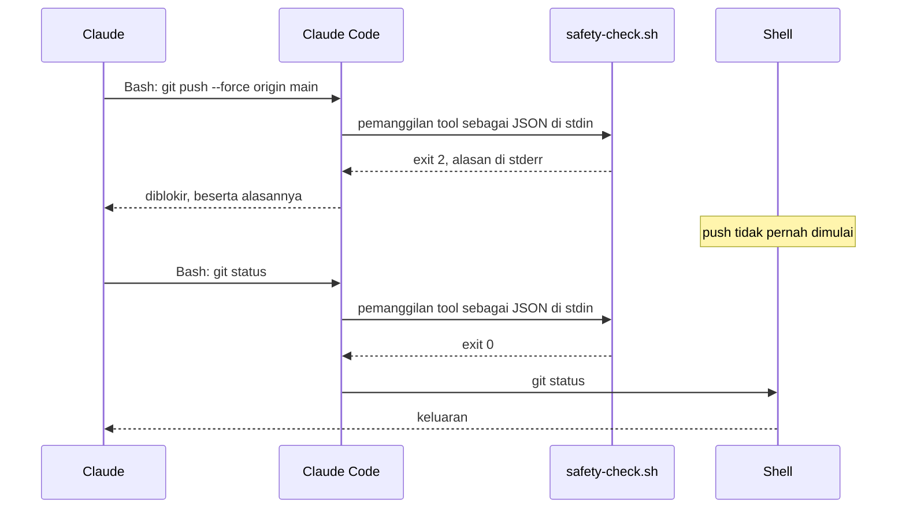
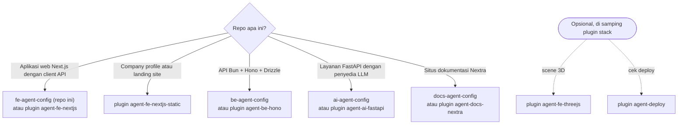
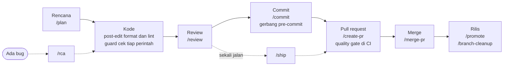
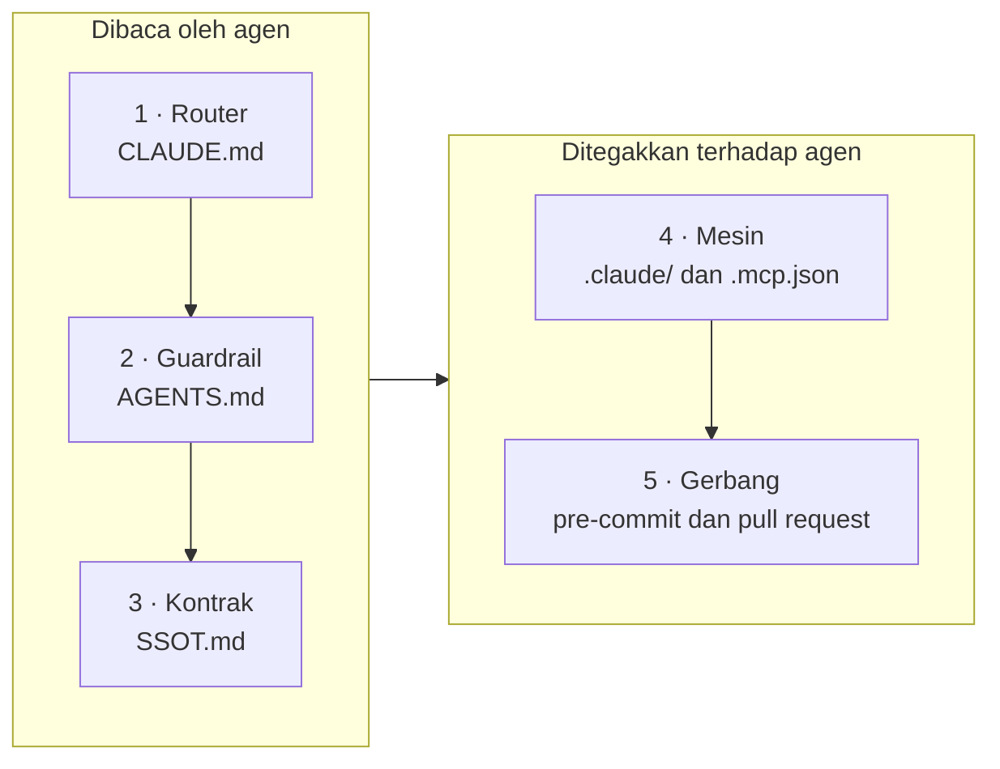

[English](README.md) | **Bahasa Indonesia**

<p align="center">
  <picture>
    <source media="(prefers-color-scheme: dark)" srcset="docs/assets/banner-fe-dark.svg">
    <source media="(prefers-color-scheme: light)" srcset="docs/assets/banner-fe-light.svg">
    
  </picture>
</p>

# fe-agent-config

[](LICENSE)
[](#cicd)
[](#persyaratan)
[](#lebih-suka-plugin)

Lapisan Claude Code untuk frontend Next.js: aturan yang dibaca agen, hook yang menolak, slash
command untuk alur kerja harian, dan gerbang yang menggagalkan commit. Tanpa kode aplikasi. Anda
menyalinnya ke repo Anda, dan sejak itu setiap file menjadi milik Anda untuk dibaca dan diubah.

> [!TIP]
> **Ringkasnya.** Salin tujuh folder dan beberapa file ke repo Next.js Anda
> ([Mulai cepat](#mulai-cepat)). Sejak itu Claude Code tidak bisa force-push ke `dev` atau `prod`,
> mengedit client API hasil generate dengan tangan, membaca file `.env*` ke dalam chat, atau
> menulis ke database produksi sampai *Anda sendiri* membuka kuncinya. Setiap penolakan menyebut
> apa yang sebaiknya dilakukan. Delapan belas slash command membawa pekerjaan dari `/plan` sampai
> `/merge-pr`, dan sebelum setiap commit sebuah gerbang memilih dari 26 cek sesuai apa yang Anda
> stage. Hook berjalan di mesin Anda tanpa jaringan; CI hanya berjalan di pull request.

**Lebih suka plugin?** Lapisan yang sama terpasang dalam tiga langkah, tanpa menyalin file. Di dalam
Claude Code:

```text
/plugin marketplace add adhibuchori/agent-config-kit
/plugin install agent-fe-nextjs@agent-config-kit
/agent-fe-nextjs:setup
```

Memasang `agent-fe-nextjs` juga memasang `agent-core`, yang menjadi dependensinya. Setup menampilkan
dry run dan baru menulis setelah Anda membalas **go**. [Lebih suka plugin?](#lebih-suka-plugin)
membandingkan kedua cara.

## Daftar isi

1. [Mengapa ini ada](#mengapa-ini-ada), dengan sebelum dan sesudah
2. [Lihat cara kerjanya](#lihat-cara-kerjanya)
3. [Untuk siapa](#untuk-siapa)
4. [Template atau plugin mana?](#template-atau-plugin-mana) ·
   [Lebih suka plugin?](#lebih-suka-plugin)
5. [Mulai cepat](#mulai-cepat)
6. [Satu hari biasa dengan template ini](#satu-hari-biasa-dengan-template-ini)
7. [Apa saja yang dipasang](#apa-saja-yang-dipasang) ·
   [Bagaimana semuanya tersusun](#bagaimana-semuanya-tersusun)
8. [Semua isi template ini](#semua-isi-template-ini): [hook](#hook), [perintah](#perintah),
   [agen](#agen), [skill](#skill), [aturan](#aturan), [cek dan gerbang](#cek-dan-gerbang),
   [workflow CI](#workflow-ci), [file konfigurasi](#file-konfigurasi)
9. [Konfigurasi](#konfigurasi) ·
   [Apa yang diblokir, dan cara melewatinya](#apa-yang-diblokir-dan-cara-melewatinya)
10. [Membuka kunci `.env` dan DB produksi](#membuka-kunci-env-dan-db-produksi)
11. [CI/CD](#cicd) · [Konfigurasi repositori GitHub](#konfigurasi-repositori-github)
12. [Model keamanan](#model-keamanan) · [Biaya dan overhead](#biaya-dan-overhead)
13. [Upgrade, rollback, uninstall](#upgrade-rollback-uninstall)
14. [Resep kustomisasi](#resep-kustomisasi)
15. [Persyaratan](#persyaratan) ·
    [Keputusan desain](#keputusan-desain-yang-perlu-diketahui-sebelum-mengedit) ·
    [Contoh jadi](#contoh-jadi-template-saudara)
16. [FAQ dan pemecahan masalah](#faq-dan-pemecahan-masalah)
17. [Glosarium](#glosarium) · [Di luar cakupan](#di-luar-cakupan) · [Lisensi](#lisensi)

## Mengapa ini ada

Satu baris di `CLAUDE.md` hanyalah permintaan. Hook yang keluar dengan kode 2 adalah tembok. Aturan
tertulis gagal tanpa suara: tidak ada yang melapor pada hari agen mengabaikannya, dan di frontend
kelalaian itu langsung sampai ke setiap pengunjung. Karena itu setiap kegagalan di bawah ini punya
mekanisme yang menghadangnya.

1. **Agen mengedit client API hasil generate dengan tangan.**
   *Masalahnya:* satu layar punya error tipe, lalu agen "memperbaikinya" langsung di
   `src/lib/api/generated/client.ts`. `bun generate:api` berikutnya menghapus perbaikan itu, dan
   bug-nya kembali.
   *Solusinya:* edit itu ditolak beserta alasannya, dan agen mengubah sumbernya lalu generate ulang
   (Rule 29).
   *Ditangani oleh:* [generated-guard](#hook), `generatedPaths` di
   [`.claude/agent-config.json`](#konfigurasi).

2. **Agen force-push ke `dev`.**
   *Masalahnya:* rebase berantakan, agen "membereskannya" dengan `git push --force origin dev`, dan
   merge milik rekan setim hilang.
   *Solusinya:* push ke atau penghapusan `dev`, `prod`, `main`, atau `master` ditolak, baik dari
   shell maupun dari tool MCP GitHub. Pekerjaan masuk ke branch itu lewat pull request; push untuk
   rilis diserahkan kepada Anda sebagai perintah `!`.
   *Ditangani oleh:* [safety-check](#hook), [mcp-guard](#hook), daftar `deny` di
   [`.claude/settings.json`](#file-konfigurasi), [`/create-pr`](#perintah).

3. **Secret masuk ke transkrip.**
   *Masalahnya:* "saya cek dulu konfigurasinya" berubah menjadi `cat .env.production`, dan API key
   Anda kini ada di log chat.
   *Solusinya:* tidak ada perintah shell yang boleh membaca atau menulis file `.env*` sungguhan.
   Claude melihat daftar key lewat helper yang menyamarkan setiap secret, dan baru boleh mengubah
   nilai setelah Anda sendiri membuka kunci `env`. Sandbox Bash memblokir pembacaan yang sama di
   tingkat sistem operasi.
   *Ditangani oleh:* [safety-check](#hook), [`scripts/env/`](#cek-dan-gerbang),
   [mekanisme kunci](#membuka-kunci-env-dan-db-produksi), sandbox di
   [`.claude/settings.json`](#file-konfigurasi).

4. **Agen menulis ke produksi.**
   *Masalahnya:* saat menelusuri laporan bug, agen menjalankan `UPDATE users SET …` lewat tool
   database produksi.
   *Solusinya:* satu pernyataan baca-saja boleh lewat; setiap penulisan menunggu sampai Anda
   menjalankan `! bun unlock db`, dan kuncinya menutup sendiri setelah 15 menit. Server database
   itu sendiri juga berjalan dalam mode baca-saja.
   *Ditangani oleh:* [db-guard](#hook), [mekanisme kunci](#membuka-kunci-env-dan-db-produksi),
   [`.mcp.json`](#file-konfigurasi).

5. **Aturan di `AGENTS.md` diabaikan.**
   *Masalahnya:* aturannya menyebut komponen tidak menyimpan logika (Rule 32) dan kedua file bahasa
   berubah bersama (Rule 21). Setelah sesi panjang, sebuah komponen mulai memakai `useState`, dan
   `id.json` ketinggalan tiga key.
   *Solusinya:* setiap aturan berujung pada mekanisme. `check:soc` dan `check:i18n` menggagalkan
   commit, `post-edit` memberi tahu Claude tepat setelah ia mengedit `en.json` saja, dan aturan
   hanya dimuat saat file yang cocok sedang dibuka, sehingga `CLAUDE.md` tetap cukup pendek untuk
   benar-benar dibaca.
   *Ditangani oleh:* [cek dan gerbang](#cek-dan-gerbang), [post-edit](#hook), [aturan](#aturan),
   [agents-i18n-guard](#agen).

6. **Agen menghapus pekerjaan orang lain.**
   *Masalahnya:* dua sesi berbagi satu checkout. Satu sesi menjalankan `git stash` atau
   `git reset --hard` supaya "mulai dari bersih", dan pekerjaan sesi lain lenyap.
   *Solusinya:* perintah yang menghapus pekerjaan yang belum di-commit ditolak kecuali menyebut
   path-nya, dan setelah setiap commit Claude diperlihatkan file apa saja yang benar-benar ikut.
   *Ditangani oleh:* [safety-check](#hook), [post-commit](#hook), [`/checkpoint`](#perintah),
   [`/commit`](#perintah).

7. **Salinan melenceng.**
   *Masalahnya:* command dan aturan juga punya salinan untuk tool kedua, dan YAML CI disalin ke
   banyak repo. Satu salinan diperbaiki; yang lain tidak, dan tidak ada yang sadar.
   *Solusinya:* setiap salinan di sini dihasilkan dari satu sumber, dan mode `--check` menggagalkan
   commit saat sebuah salinan melenceng. Setiap action di CI dipin ke satu commit dan diperiksa di
   pull request yang mengubahnya. Untuk banyak repo yang berbagi satu gerbang yang dipin, pakai
   plugin.
   *Ditangani oleh:* [`scripts/sync/`](#cek-dan-gerbang), [workflows-lint](#workflow-ci),
   [Lebih suka plugin?](#lebih-suka-plugin).

<details>
<summary>Sebelum dan sesudah: lima menit yang sama, tanpa dan dengan template ini</summary>

**Tanpa template:**

```text
Anda:    `bun run dev:prod` masih memanggil host API lama, dan halaman settings punya error tipe.
         Perbaiki keduanya lalu push.
Claude:  Saya lihat dulu file env-nya.       $ cat .env.production      ← API_KEY kini ada di chat
Claude:  Host API-nya salah. Saya perbaiki.  $ sed -i '' 's/api-old/api/' .env.production
Claude:  Saya tambal tipenya di client.      (mengedit src/lib/api/generated/client.ts dengan tangan)
Claude:  Saya push perbaikannya.             $ git push --force origin dev
         (merge rekan setim hilang, dan `bun generate:api` berikutnya membatalkan tambalan itu)
```

**Dengan template:**

```text
Anda:    `bun run dev:prod` masih memanggil host API lama, dan halaman settings punya error tipe.
         Perbaiki keduanya lalu push.
Claude:  $ cat .env.production
         [safety] BLOCKED: .env.production holds secrets, and the shell never reads or writes a
         real .env* file directly: its values would land in the transcript. List its keys with
         `bash scripts/env/show.sh .env.production` (secret values masked). …
Claude:  $ bash scripts/env/show.sh .env.production
         .env.production: 3 keys
           NEXT_PUBLIC_API_URL  https://api-old.example.com
           NEXT_PUBLIC_APP_URL  https://app.example.com
           API_KEY              sk_l…(40 chars)
         checked against .env.production.example: every key present; not in the template: API_KEY
         env is locked: to change a value, the user first runs `! bun unlock env`.
Anda:    ! bun unlock env
         🔓 .env unlocked until 16:36 (20 min) — lock now: bun unlock off env
Claude:  $ printf '%s' 'https://api.example.com' | bash scripts/env/set.sh .env.production NEXT_PUBLIC_API_URL
         ✓ NEXT_PUBLIC_API_URL updated in .env.production: https://api.example.com · backup …
Claude:  Edit src/lib/api/generated/client.ts
         [generated-guard] BLOCKED: src/lib/api/generated/client.ts is generated output
         (src/lib/api/generated in generatedPaths). Change its source and run the project's
         generator instead of editing it.
Claude:  Tipenya berasal dari openapi.json; saya generate ulang client-nya, lalu jalankan /ship
         dan /create-pr untuk pull request ke dev.
```

Penolakan dan keluaran helper di atas adalah keluaran asli skripnya di salinan template ini yang
punya alias `unlock` di `package.json` dan lockfile Bun (dibungkus per baris, dan dipersingkat
dengan `…`). Pesan dari skrip memang berbahasa Inggris;
baris di sekitarnya menunjukkan di mana pesan itu muncul dalam sebuah sesi.

</details>

## Lihat cara kerjanya

<picture>
  <source media="(prefers-color-scheme: dark)" srcset="docs/assets/demo-blocked-dark.svg">
  <source media="(prefers-color-scheme: light)" srcset="docs/assets/demo-blocked-light.svg">
  
</picture>

Inilah yang benar-benar dikirim balik oleh hook, direkam di salinan baru template ini. Claude Code
menyerahkan setiap pemanggilan tool ke hook dalam bentuk JSON; guard menjawab dengan kode keluar 2
dan alasan di stderr, yang dibaca dan ditindaklanjuti Claude:

```text
tool call  Bash  {"command": "git push --force origin main"}
exit 2     [safety] BLOCKED: pushing to a protected branch (dev/prod/main/master) is not allowed. Push your work branch and open a PR; when a release needs this push, the user runs it with `!`.

tool call  Edit  {"file_path": "src/lib/api/generated/client.ts"}
exit 2     [generated-guard] BLOCKED: src/lib/api/generated/client.ts is generated output (src/lib/api/generated in generatedPaths).
           Change its source and run the project's generator instead of editing it.

tool call  mcp__db-prod__execute_sql  {"sql": "UPDATE users SET plan = 'pro'"}
exit 2     [db-guard] BLOCKED: this SQL may change the production database (an UPDATE statement). Reads (one SELECT, SHOW, VALUES, EXPLAIN, or WITH ... SELECT) pass. For a write, the user runs `! ./scripts/ops/unlock.sh db` themselves and you try again, or you hand them the statement to run.

tool call  Bash  {"command": "git status"}
exit 0     (tidak ada: perintahnya berjalan)
```

Ilustrasi di halaman ini beranimasi: landaknya berkedip, kilaunya berkelip, dan perintahnya
mengetik sendiri. Jika sistem Anda meminta gerakan dikurangi (reduced motion), ilustrasi tampil
sebagai gambar diam.

### Coba sendiri

Di salinan Anda, alirkan satu pemanggilan tool ke hook seperti yang dilakukan Claude Code:

```bash
printf '%s' '{"tool_name":"Bash","tool_input":{"command":"git push --force origin main"}}' \
  | bash .claude/hooks/safety-check.sh; echo "exit $?"
```

```text
[safety] BLOCKED: pushing to a protected branch (dev/prod/main/master) is not allowed. Push your work branch and open a PR; when a release needs this push, the user runs it with `!`.
exit 2
```

```bash
printf '%s' '{"tool_name":"Edit","tool_input":{"file_path":"src/lib/api/generated/client.ts"}}' \
  | bash .claude/hooks/generated-guard.sh; echo "exit $?"
```

```text
[generated-guard] BLOCKED: src/lib/api/generated/client.ts is generated output (src/lib/api/generated in generatedPaths).
Change its source and run the project's generator instead of editing it.
exit 2
```

Berarti sudah bekerja jika keduanya mencetak `exit 2`, dan perintah pertama dengan `git status`
sebagai pengganti push mencetak `exit 0`.

### Cara hook memutuskan

Claude Code menyerahkan setiap pemanggilan tool ke hook di `.claude/settings.json` sebelum
dijalankan. Hook `PreToolUse` yang keluar dengan kode **2** membatalkan pemanggilan itu, dan
stderr-nya menjadi alasan yang dibaca Claude. Kode keluar lain, termasuk `1`, membiarkan
pemanggilan lewat. Itulah sebabnya setiap guard di sini keluar dengan 2, dan menolak saat tidak
bisa membaca masukannya.

<picture>
  <source media="(prefers-color-scheme: dark)" srcset="docs/assets/hook-flow-dark.svg">
  <source media="(prefers-color-scheme: light)" srcset="docs/assets/hook-flow-light.svg">
  
</picture>



## Untuk siapa

<picture>
  <source media="(prefers-color-scheme: dark)" srcset="docs/assets/mascot-dark.svg">
  <source media="(prefers-color-scheme: light)" srcset="docs/assets/mascot-light.svg">
  
</picture>

**Cocok jika Anda:**

- memakai Claude Code (CLI atau ekstensi IDE) di frontend sungguhan, sendiri atau dalam tim;
- membangun aplikasi Next.js dengan React, TanStack Query, next-intl, dan Tailwind v4 yang
  memanggil satu backend lewat client API hasil generate (Orval), dengan Bun sebagai package
  manager;
- ingin setiap file penyiapan agen ada di repositori Anda sendiri, untuk dibaca, di-review, dan
  diubah;
- bekerja di branch yang masuk ke `dev` dan `prod` lewat pull request.

**Tidak cocok jika Anda:**

- membangun company profile atau landing page tanpa backend: plugin situs statis lebih pas
  ([Template atau plugin mana?](#template-atau-plugin-mana));
- memakai Claude hanya di claude.ai atau Cowork: hook, command, dan subagen berjalan di Claude
  Code;
- menginginkan batas keamanan terhadap agen yang berniat jahat: hook membaca teks perintah dan
  menjaga dari kekeliruan serta instruksi yang disusupkan ([Model keamanan](#model-keamanan));
- ingin pembaruan tanpa menyalin file lagi: plugin memberi Anda versi dan `sync --check`
  ([Lebih suka plugin?](#lebih-suka-plugin)).

## Template atau plugin mana?

Setiap stack punya repo template (file yang Anda salin) dan plugin (file yang dipasang oleh sebuah
perintah setup). Beberapa stack hanya punya plugin.



| Repo Anda | Repo template | Plugin |
| --- | --- | --- |
| Aplikasi web Next.js dengan client API hasil generate | **fe-agent-config** (repo ini) | `agent-fe-nextjs` |
| Company profile atau landing site | tidak ada | `agent-fe-nextjs-static` |
| API Bun + Hono + Drizzle | [be-agent-config](https://github.com/adhibuchori/be-agent-config) | `agent-be-hono` |
| Layanan FastAPI dengan penyedia LLM | [ai-agent-config](https://github.com/adhibuchori/ai-agent-config) | `agent-ai-fastapi` |
| Situs dokumentasi Nextra | [docs-agent-config](https://github.com/adhibuchori/docs-agent-config) | `agent-docs-nextra` |
| Add-on: scene three.js atau React Three Fiber | tidak ada | `agent-fe-threejs` |
| Add-on: smoke test deploy, host apa pun | tidak ada | `agent-deploy` |

Semua plugin ada di [agent-config-kit](https://github.com/adhibuchori/agent-config-kit).

## Lebih suka plugin?

<picture>
  <source media="(prefers-color-scheme: dark)" srcset="docs/assets/install-flow-dark.svg">
  <source media="(prefers-color-scheme: light)" srcset="docs/assets/install-flow-light.svg">
  :setup, yang
    menampilkan dry run sebelum menerapkan apa pun.">
</picture>

Hook, aturan, dan cek yang sama juga tersedia sebagai plugin Claude Code di
[agent-config-kit](https://github.com/adhibuchori/agent-config-kit): sebuah perintah setup menulis
file-filenya untuk Anda, dan perintah sync memberi tahu saat file itu melenceng. Di dalam Claude
Code:

```text
/plugin marketplace add adhibuchori/agent-config-kit
/plugin install agent-core@agent-config-kit
/plugin install agent-fe-nextjs@agent-config-kit
/agent-fe-nextjs:setup
```

| Plugin | Untuk | Pakai sebagai |
| --- | --- | --- |
| `agent-fe-nextjs` | Aplikasi Next.js dengan client API hasil generate: cakupan yang sama dengan template ini | pengganti template ini |
| `agent-fe-nextjs-static` | Situs company profile, landing, atau marketing yang dibangun dengan Next.js, sebagai static export atau SSG dengan endpoint formulir | pengganti `agent-fe-nextjs` di perintah di atas |

Keduanya dibangun di atas `agent-core`. Setup bertanya satu per satu, menampilkan dry run untuk
setiap file yang akan ditulisnya, dan hanya menulis saat Anda membalas **go**. Selebihnya ada di
[Mulai cepat](https://github.com/adhibuchori/agent-config-kit/blob/main/README.id.md#mulai-cepat)
repo plugin.

- **Pilih template ini** bila Anda ingin memiliki setiap file di repositori Anda sendiri, tanpa
  runtime plugin.
- **Pilih plugin** bila Anda ingin pembaruan berversi, `/<plugin>:sync --check` yang melaporkan
  drift, dan satu gerbang CI reusable yang dipin untuk banyak repo.
- **Jangan keduanya di satu repo.** Salinan template ini me-wire hook di `.claude/settings.json`,
  sehingga plugin akan menjalankannya untuk kedua kalinya; `sync --check` milik plugin
  melaporkannya sebagai `double-wired`. Hapus entri `hooks` dari `.claude/settings.json` untuk
  beralih.

## Mulai cepat

**Sebelum mulai:** Claude Code, bash 3.2 atau lebih baru, git, dan python3 3.8 atau lebih baru (jq
opsional). Gerbangnya juga butuh Bun, Node.js 20+, gitleaks, dan uv. Daftar lengkapnya ada di
[Persyaratan](#persyaratan).

1. **Clone template di sebelah proyek Anda**, lalu arahkan sebuah variabel ke sana:

   ```bash
   git clone https://github.com/adhibuchori/fe-agent-config.git
   cd your-project
   CFG=../fe-agent-config
   ```

2. **Salin lapisannya.** Konfigurasi tool akan menimpa file Anda yang bernama sama, jadi gabungkan
   secara manual kalau Anda sudah punya:

   ```bash
   cp -R "$CFG"/{.claude,.agent,.agents,_workflow-source,.github,.husky,scripts} .
   cp "$CFG"/{CLAUDE.md,AGENTS.md,SSOT.md,.mcp.json,.skillspector-baseline.yaml} .
   cp "$CFG"/{oxlint.json,.oxlintignore,.oxfmtrc.json,knip.ts,doctor.config.json} .
   cp "$CFG"/{.gitleaks.toml,.dockerignore,.env.development.example,.env.production.example} .
   mkdir -p docs && cp "$CFG"/docs/unlock.md docs/   # dirujuk CLAUDE.md dan penolakan unlock
   ```

3. **Gabungkan `.gitignore` sebelum commit pertama.** `.claude/settings.local.json`,
   `.claude/state/`, `.skillspector/`, dan setiap file `.env*` sungguhan harus di-ignore; template
   `.env*.example` tetap di-commit. Cara cepatnya adalah menambahkan file milik template (baris
   ganda tidak masalah), dan `git check-ignore` membuktikannya:

   ```bash
   cat "$CFG"/.gitignore >> .gitignore
   git check-ignore -v .env.production .claude/state/unlock/env .claude/settings.local.json
   ```

   Setiap path seharusnya mencetak pola yang meng-ignore-nya. Path yang tidak muncul berarti belum
   di-ignore.

4. **Tambahkan package script** yang tercantum di
   [SETUP §5](SETUP.md#5-make-the-gates-runnable), termasuk alias
   `"unlock": "bash scripts/ops/unlock.sh"`, lalu pasang tool yang disebutkannya:

   ```bash
   bun add -d husky knip oxfmt oxlint vitest @vitest/coverage-v8 jsdom typescript orval
   ```

5. **Isi setiap placeholder.** Semuanya bernama, tidak ada yang kosong:

   ```bash
   grep -rn --exclude-dir=hooks --exclude-dir=anti-patterns --exclude-dir=commands \
     --exclude-dir=skills --exclude=agent-config.example.json '<[a-zA-Z][a-zA-Z -]*>' \
     CLAUDE.md AGENTS.md SSOT.md .mcp.json .env.production.example .claude/ _workflow-source/
   ```

   Hasilnya juga memuat sintaks perintah seperti `<file>`, generic TypeScript, dan tag HTML;
   biarkan saja. [SETUP §2](SETUP.md#2-fill-in-every-placeholder) menjelaskan apa yang diisi di
   mana, dan menyebut placeholder di `.github/` yang dilewati pencarian ini.

6. **Pertahankan atau hapus tiga modul opsional**: tata letak responsif, loading skeleton, dan
   deskripsi dialog. Masing-masing terdiri dari satu aturan, satu standar, dan satu baris gerbang
   yang datang dan pergi bersama ([SETUP §5](SETUP.md#5-make-the-gates-runnable)). Modul yang
   tertinggal tanpa sengaja akan menegakkan aturan yang tidak pernah disepakati tim.

7. **Buktikan di mesin Anda:**

   ```bash
   bash scripts/check/hook-probes.sh        # setiap aturan hook, dua arah; sekitar sembilan menit
   bash scripts/check/ai-config.sh          # sitasi aturan, anggaran konteks, wiring hook, pin MCP
   bash scripts/sync/workflows.sh --check   # mirror command cocok dengan sumbernya
   bash scripts/sync/rules.sh --check       # mirror aturan cocok dengan .claude/rules/
   ```

   Di salinan baru, tiga perintah terakhir berakhir seperti ini:

   ```text
   Always-loaded context: 12789 bytes (budget 15000)
   AI config within budget
   ✓ All targets, orphans, and INDEX.md coverage are in sync with _workflow-source.
     ✓ Up to date. 16 rules, 0 excluded.
   ```

8. **Commit lapisan ini sebagai satu commit tersendiri.** Dengan begitu diff saat upgrade dan
   rollback masing-masing cukup satu perintah ([Upgrade, rollback, uninstall](#upgrade-rollback-uninstall)).

**Lalu baca [SETUP.md](SETUP.md)** untuk tool, server MCP, daftar gerbang lengkap, GitHub, dan
pipeline strip yang opsional. Sediakan waktu sekitar satu jam.

## Satu hari biasa dengan template ini

Setiap langkah menyebut command yang Anda ketik, serta hook dan gerbang yang membantu dengan
sendirinya.



| Langkah | Anda menjalankan | Yang membantu dengan sendirinya |
| --- | --- | --- |
| Rencana | `/plan add a settings page`, atau `/plan-fullstack add blog posts API` bila backend ikut berubah | Rencana tidak menulis kode dan menunggu persetujuan Anda; aturan dimuat saat rencana membaca file yang cocok |
| Kode | tidak ada: cukup minta | [post-edit](#hook) memformat dan me-lint setiap file yang ditulis serta mencatat perubahan `en.json` tanpa `id.json`; [generated-guard](#hook) menolak edit ke client; [safety-check](#hook) menilai setiap perintah |
| Review | `/review`; `/review-soc` untuk logika di komponen; `/a11y-audit src/` sebelum rilis | Minta [subagen](#agen) dengan namanya: "run agents-seo-validator" |
| Commit | `/commit`, lalu `git commit -- <paths>` | `.husky/pre-commit` menjalankan `gates.sh --hook` untuk apa yang di-stage; [post-commit](#hook) menunjukkan apa yang masuk; `--no-verify` ditolak |
| Pull request | `/create-pr` | [Quality gate](#workflow-ci) menjalankan 37 langkah; React Doctor, review AI, dependency review, dan CodeQL ikut berjalan |
| Merge | `/merge-pr 42` | `scripts/ops/pr-ready.sh` membaca check, status merge, dan thread yang masih terbuka; check yang di-skip menahan merge sampai Anda konfirmasi |
| Rilis | `/promote`, lalu `/branch-cleanup` | Push ke `dev` dan `prod` diserahkan kepada Anda sebagai perintah `!`; merge ke `prod` memicu deploy dan strip lapisan AI |
| Ada bug | `/rca form submits twice on slow networks` (atau `/debug …`) | [prompt-intent](#hook) mengarahkan `/debug` ke `/rca` |
| Gerbang merah | `/check-fix` | Menjalankan semua gerbang dan build, lalu memperbaiki sampai semuanya lulus |
| Akhir sesi | `/checkpoint-summary`, `/learn-session` | Sesi berikutnya mulai dari titik sesi ini berakhir |

## Apa saja yang dipasang

Penyalinan di Mulai cepat membawa 226 file. Inilah gunanya masing-masing:

```text
your-project/
├── CLAUDE.md                    Router: apa yang dibaca untuk tugas apa; dimuat setiap sesi
├── AGENTS.md                    Guardrail: aturan bernomor yang bisa dirujuk ("Rule 32")
├── SSOT.md                      Kontrak: stack, lapisan, penamaan, kontrak API, environment
├── .mcp.json                    5 server MCP, dipin, kredensial hanya lewat env var
├── .env.development.example     Template env: setiap key, hanya nilai placeholder
├── .env.production.example
├── .gitignore                   Digabung oleh Anda: state, setting lokal, file env sungguhan
├── .dockerignore                Menjauhkan file env dan lapisan agen dari image
├── .gitleaks.toml               Setelan pemindai secret, dipersempit ke nilai persis saja
├── .skillspector-baseline.yaml  Catatan triase untuk pemindaian skill
├── oxlint.json · .oxlintignore  Lint: batas lapisan, import melingkar, file 150 baris
├── .oxfmtrc.json                Setelan formatter
├── knip.ts                      Titik masuk untuk deteksi kode mati
├── doctor.config.json           Setelan React Doctor: pemeriksaan kode matinya mati, Knip yang pegang
│
├── .claude/
│   ├── settings.json            Wiring hook; daftar allow, ask, dan deny; sandbox Bash
│   ├── agent-config.json        Setelan hook repo ini (satu key: localePairs)
│   ├── agent-config.example.json  Setiap setelan hook beserta default-nya
│   ├── hooks/                   8 hook + lib.sh + README.md
│   ├── rules/                   16 aturan: common, typescript, web; 15 dimuat per path
│   ├── agents/                  4 subagen + INDEX.md
│   ├── skills/                  react-doctor (dengan LICENSE vendornya) · skeleton (opsional)
│   ├── commands/                18 slash command + INDEX.md (hasil generate)
│   ├── anti-patterns/           30 jebakan yang terdokumentasi + INDEX.md
│   ├── docs/                    Checklist review, audit pra-promote, 4 standar aturan
│   ├── mcp/                     3 template server MCP sesuai kebutuhan
│   ├── serena-errors.md         Log kegagalan tool beserta protokol pemulihannya
│   └── *.example.md             5 referensi sesuai kebutuhan, untuk diisi atau dihapus
│
├── _workflow-source/            18 sumber command + INDEX.md: edit command di sini
├── .agent/workflows/            Mirror command untuk tool kedua (hasil generate)
├── .agents/rules/               Mirror aturan untuk Antigravity (hasil generate)
│
├── .husky/pre-commit            Menjalankan gerbang untuk apa yang Anda stage
├── scripts/
│   ├── check/                   Gerbang: gates.sh + gates.list, dan 21 file cek
│   ├── env/                     show.sh · set.sh · envfile.py: baca tersamar, tulis saat terbuka
│   ├── ops/                     unlock.sh (Anda yang menjalankan) · pr-ready.sh (PR bisa merge?)
│   ├── sync/                    workflows.sh · rules.sh: mirror, masing-masing dengan --check
│   ├── next/env.ts              Membuat dan mengecek .env.<target> sebelum dev, build, dan start
│   ├── lib/stylesheets.ts       Stylesheet yang dibaca cek responsif
│   └── measure/waterfall.ts     Opsional: menandai request yang menunggu request lain
│
├── .github/
│   ├── workflows/               8 workflow yang hanya berjalan di pull request
│   ├── scripts/                 Gerbang pull request, pipeline strip, pemicu deploy,
│   │                            dan dua cek komentar
│   ├── PULL_REQUEST_TEMPLATE/   dev.md · promotion.md: hanya yang tidak bisa diputuskan gerbang
│   └── CODEOWNERS               Siapa yang me-review guardrail
│
└── docs/unlock.md               Cara Anda membuka .env* dan penulisan DB; dirujuk CLAUDE.md
```

Repositori ini juga menyimpan dokumennya sendiri, yang tidak Anda salin: README ini beserta versi
bahasa Inggrisnya, [SETUP.md](SETUP.md), [docs/RATIONALE.md](docs/RATIONALE.md), `docs/assets/`,
`LICENSE`, dan `.markdownlint-cli2.jsonc`. `PRODUCT.example.md` dan `DESIGN.example.md` untuk skill
desain yang opsional ([Skill](#skill)).

## Bagaimana semuanya tersusun

Lima lapisan, masing-masing dengan satu tugas. Tiga yang pertama dibaca oleh agen; dua yang
terakhir ditegakkan terhadap agen.



<picture>
  <source media="(prefers-color-scheme: dark)" srcset="docs/assets/layers-dark.svg">
  <source media="(prefers-color-scheme: light)" srcset="docs/assets/layers-light.svg">
  
</picture>

| Lapisan | Di mana | Tugas | Ukuran |
| :-- | :-- | :-- | --: |
| **Router** | `CLAUDE.md` | Apa yang dibaca untuk tugas apa. Dimuat setiap sesi, jadi dibuat pendek | 156 baris |
| **Guardrail** | `AGENTS.md` | Aturan bernomor yang bisa dirujuk: review bisa menyebut "Rule 32" dan maksudnya jelas | 428 baris |
| **Kontrak** | `SSOT.md` | Seperti apa codebase-nya: stack, lapisan, penamaan, kontrak API, environment | 326 baris |
| **Mesin** | `.claude/`, `.mcp.json` | Hook, aturan per path, subagen, skill, anti-pattern, command, MCP | 105 file |
| **Gerbang** | `.husky/`, `scripts/check/`, `.github/` | Definisi "lulus": sebelum setiap commit dan di setiap pull request | 26 gerbang · 37 langkah · 8 workflow |

Pembagian ini soal biaya. `CLAUDE.md` dibaca utuh di awal setiap sesi, jadi setiap barisnya
dibayar di setiap tugas; `AGENTS.md` dibaca saat sebuah aturan dipertanyakan, `SSOT.md` saat butuh
orientasi. `CLAUDE.md` ditambah satu aturan yang selalu dimuat berjumlah 12.789 byte, dan
`ai-config.sh` menjaganya tetap di bawah 15.000
([RATIONALE §14](docs/RATIONALE.md#14-what-loads-every-session-has-a-byte-budget)).

## Semua isi template ini

Setiap tabel menjawab tiga pertanyaan untuk setiap bagian: apa yang dilakukannya, bagaimana
memakainya, dan mengapa ia membantu. Setiap nama menautkan ke file-nya, dan header file itu adalah
dokumentasinya.

### Hook

Hook adalah skrip yang dijalankan Claude Code dengan sendirinya. **Guard** (penjaga) berjalan
sebelum pemanggilan tool dan bisa menolaknya dengan exit 2; **hook umpan balik** hanya menambahkan
catatan untuk Claude dan tidak pernah memblokir. [`.claude/hooks/README.md`](.claude/hooks/README.md)
memuat kontrak lengkapnya, setiap penolakan, dan mode gagal setiap hook. Setiap tautan **Tanda
berfungsi** membuka halaman hook itu di repo plugin (berbahasa Inggris), yang diakhiri cek yang bisa
Anda jalankan untuk melihatnya bekerja.

| Nama | Apa yang dilakukan | Cara pakai | Mengapa membantu |
| --- | --- | --- | --- |
| [safety-check](.claude/hooks/safety-check.sh) (guard) | Membaca setiap perintah shell seperti shell membacanya, lalu menolak penghapusan rekursif path terlindungi, push ke atau penghapusan branch terlindungi, `gh pr merge --delete-branch`, git yang menghapus pekerjaan, gerbang pre-commit yang dilewati, setelan git yang menjalankan kode, akses shell ke `.env*`, agen yang menjalankan unlock atau mengubah `scripts/env/`, dan apa pun yang tidak bisa ia pahami | Berjalan sendiri sebelum setiap pemanggilan `Bash`. Cek: [Coba sendiri](#coba-sendiri) · [Tanda berfungsi](https://github.com/adhibuchori/agent-config-kit/blob/main/docs/agent-core/safety-check.md#its-working-if) | Satu perintah yang akan Anda sesali tidak pernah jalan, dan penolakannya menyebut apa yang sebaiknya dilakukan |
| [generated-guard](.claude/hooks/generated-guard.sh) (guard) | Menolak edit manual ke keluaran hasil generate: client API dan spesifikasi OpenAPI secara default (`generatedPaths`) | Berjalan sendiri sebelum `Write`, `Edit`, `MultiEdit`, dan tool tulis Serena · [Tanda berfungsi](https://github.com/adhibuchori/agent-config-kit/blob/main/docs/agent-fe-nextjs/generated-guard.md#its-working-if) | Perbaikan masuk ke sumbernya, bukan ke file yang akan ditimpa `bun generate:api` |
| [db-guard](.claude/hooks/db-guard.sh) (guard) | Meloloskan satu pernyataan baca-saja lewat `mcp__db-prod__execute_sql`; menahan setiap penulisan sampai Anda membuka kunci `db` | Berjalan sendiri sebelum tool SQL produksi · [Tanda berfungsi](https://github.com/adhibuchori/agent-config-kit/blob/main/docs/agent-core/db-guard.md#its-working-if) | Tidak ada `UPDATE` atau `DELETE` mendadak di produksi |
| [mcp-guard](.claude/hooks/mcp-guard.sh) (guard) | Menolak push, penulisan atau penghapusan file, dan pembuatan branch lewat MCP GitHub di branch terlindungi | Berjalan sendiri sebelum empat tool MCP GitHub itu · [Tanda berfungsi](https://github.com/adhibuchori/agent-config-kit/blob/main/docs/agent-core/mcp-guard.md#its-working-if) | Menutup jalan memutar di sekitar guard shell |
| [post-edit](.claude/hooks/post-edit.sh) (umpan balik) | Memformat dengan oxfmt, lalu me-lint dengan oxlint, file yang baru ditulis; mencatat perubahan `en.json` tanpa pasangannya `id.json` (`localePairs`) | Berjalan sendiri setelah setiap penulisan file · [Tanda berfungsi](https://github.com/adhibuchori/agent-config-kit/blob/main/docs/agent-core/post-edit.md#its-working-if) | Temuan diperbaiki di edit berikutnya, bukan saat commit; tidak ada layar yang setengah diterjemahkan |
| [post-commit](.claude/hooks/post-commit.sh) (umpan balik) | Menunjukkan isi sebuah commit, dan memperingatkan path yang tidak disebut pathspec-nya | Berjalan sendiri setelah `git commit` · [Tanda berfungsi](https://github.com/adhibuchori/agent-config-kit/blob/main/docs/agent-core/post-commit.md#its-working-if) | Pekerjaan sesi lain yang sudah di-stage tidak bisa ikut masuk diam-diam |
| [prompt-intent](.claude/hooks/prompt-intent.sh) (umpan balik) | Mengarahkan `/debug` ke `/rca` milik repo ini; membersihkan state sesi yang menganggur dua hari | Ketik `/debug <gejala>` · [Tanda berfungsi](https://github.com/adhibuchori/agent-config-kit/blob/main/docs/agent-core/prompt-intent.md#its-working-if) | Debugging dimulai dari reproduksi, bukan dari skill debug bawaan Claude Code |
| [session-start](.claude/hooks/session-start.sh) (umpan balik) | Membuat zsh yang menjalankan perintah Claude berperilaku seperti bash untuk glob yang tidak cocok, `=word`, dan pemecahan kata | Berjalan sendiri saat sesi dimulai · [Tanda berfungsi](https://github.com/adhibuchori/agent-config-kit/blob/main/docs/agent-core/session-start.md#its-working-if) | Lebih sedikit kegagalan `no matches found` yang membingungkan |
| [lib.sh](.claude/hooks/lib.sh) | Helper bersama, pembaca konfigurasi, dan penganalisis perintah shell yang dipakai para guard | Di-source oleh hook; tidak pernah di-wire sendiri | Satu parser dan satu pembaca konfigurasi untuk semua guard |

### Perintah

Ketik di Claude Code. Sumbernya ada di `_workflow-source/`; `bash scripts/sync/workflows.sh`
menyalinnya ke `.claude/commands/` dan `.agent/workflows/`. Setiap push ke `dev` atau `prod`
diserahkan kepada Anda sebagai perintah `!`.

| Nama | Apa yang dilakukan | Cara pakai | Mengapa membantu |
| --- | --- | --- | --- |
| [/plan](_workflow-source/plan.md) | Menulis rencana (cakupan, tugas, risiko, pertanyaan terbuka) dan menunggu persetujuan Anda; tidak menulis kode | `/plan add a settings page` | Cakupan dan risiko disepakati sebelum ada yang berubah |
| [/plan-fullstack](_workflow-source/plan-fullstack.md) | Memeriksa API backend, kontrak OpenAPI, client hasil generate, dan komponen yang ada, lalu merencanakan | `/plan-fullstack add blog posts API` | Perubahan kontrak ketahuan di rencana, bukan saat review |
| [/rca](_workflow-source/rca.md) | Mereproduksi bug di tingkat serendah mungkin, menemukan barisnya, dan memperbaikinya dengan tes yang gagal tanpa perbaikan itu; tanpa commit | `/rca form submits twice on slow networks` | Perbaikan yang bertahan, dibuktikan oleh tes |
| [/checkpoint](_workflow-source/checkpoint.md) | Commit pengaman lokal untuk file sesi ini, per pathspec, dengan timestamp; tidak pernah push | `/checkpoint before a folder move` | Jalan kembali yang murah sebelum perubahan berisiko |
| [/check-fix](_workflow-source/check-fix.md) | Menulis format, menjalankan setiap gerbang dan build, lalu memperbaiki yang gagal sampai semuanya lulus | `/check-fix` | Gerbang merah jadi hijau tanpa menebak mana yang gagal |
| [/review](_workflow-source/review.md) | Me-review perubahan yang di-stage (atau branch terhadap `origin/dev`) berdasarkan aturan frontend dan checklist keamanan, per tingkat keparahan; tidak mengubah apa pun sampai Anda memilih opsi | `/review` | Temuan yang merujuk aturan, sebelum commit |
| [/review-soc](_workflow-source/review-soc.md) | Menjalankan gerbang, lalu memindahkan logika dari komponen ke hook, `lib/`, dan tempat konstanta | `/review-soc src/components/` | Komponen tetap presentasional (Rule 32) |
| [/a11y-audit](_workflow-source/a11y-audit.md) | Memindai file `.tsx` untuk label dan alt text yang hilang, gaya fokus, jebakan keyboard, dan role ARIA, serta menandai kontras warna untuk dicek manual | `/a11y-audit src/` | Celah aksesibilitas ketahuan sebelum rilis |
| [/commit](_workflow-source/commit.md) | Menjalankan gerbang, membaca diff yang di-stage, dan menyusun draf pesan sesuai format repo ini; tidak melakukan commit | `/commit` | Gerbang merah tidak pernah jadi commit |
| [/ship](_workflow-source/ship.md) | Men-stage semuanya, menjalankan `/review` dan `/security-review`, memperbaiki setiap temuan Medium ke atas dan temuan keamanan, menjalankan ulang gerbang, lalu commit dan push branch kerja; menolak `dev` dan `prod` | `/ship` | Pekerjaan selesai meninggalkan mesin dalam keadaan sudah di-review, dengan satu perintah |
| [/create-pr](_workflow-source/create-pr.md) | Menyusun judul dan deskripsi dari template PR, lalu membuka pull request ke `dev` | `/create-pr` | Pull request yang konsisten, tanpa push ke branch terlindungi |
| [/resolve-pr-review](_workflow-source/resolve-pr-review.md) | Mengambil komentar review, memilahnya berdasarkan aturan bernomor, menerapkan yang valid, dan membalas setiap thread | `/resolve-pr-review 42` | Saran bot yang melanggar aturan ditolak beserta alasannya |
| [/merge-pr](_workflow-source/merge-pr.md) | Membaca kesiapan dengan `pr-ready.sh`, meminta konfirmasi, merge dengan merge commit, lalu menghapus head `internal/*` berdasarkan namanya | `/merge-pr 42` | Check yang di-skip dan thread terbuka ketahuan sebelum merge |
| [/promote](_workflow-source/promote.md) | Membawa `internal/{scope}` lewat pull request ke `dev` dan promosi ke `prod`, mengaudit env produksi dan migrasi, lalu memverifikasi deploy berdasarkan waktu | `/promote` | "Sudah di-merge" dan "sudah live" tidak pernah tertukar |
| [/promote-deploy](_workflow-source/promote-deploy.md) | Jalur cadangan saat CI tidak bisa jalan: membuktikan CI mati, menjalankan gerbang secara lokal, merge tanpa pull request (Anda yang push), strip, deploy, verifikasi, dan mencatat utang CI | `/promote-deploy` | Produksi tidak basi selama CI mati |
| [/branch-cleanup](_workflow-source/branch-cleanup.md) | Menghapus branch yang sudah di-merge, remote dan lokal, kecuali `dev`, `prod`, branch default, dan head pull request yang masih terbuka, setelah Anda konfirmasi | `/branch-cleanup` | Remote rapi; branch yang belum di-merge tetap disimpan |
| [/checkpoint-summary](_workflow-source/checkpoint-summary.md) | Merangkum sesi untuk serah terima; bisa menulis log lokal yang di-ignore git | `/checkpoint-summary auth-sprint` | Sesi berikutnya mulai dari titik sesi ini berakhir |
| [/learn-session](_workflow-source/learn-session.md) | Menulis pelajaran sesi ke cek, aturan, referensi, atau anti-pattern yang akan dimuat lagi | `/learn-session` | Jebakan yang sama tidak terulang |

### Agen

Subagen me-review dalam konteksnya sendiri lalu melapor. Tidak ada command yang memanggilnya:
minta dengan menyebut namanya, atau biarkan Claude Code memilih yang deskripsinya cocok
([`.claude/agents/INDEX.md`](.claude/agents/INDEX.md)). Subagen mewarisi tool sesi, jadi "hanya
melapor" adalah instruksi, bukan batas izin.

| Nama | Apa yang dilakukan | Cara pakai | Mengapa membantu |
| --- | --- | --- | --- |
| [agents-reviewer](.claude/agents/agents-reviewer.md) | Memeriksa diff TypeScript terhadap `AGENTS.md`: kepemilikan lapisan, komponen tanpa logika, styling, lapisan data, React Compiler, panjang file, Rule 30–34, JSDoc | "Run agents-reviewer on my changes", setelah mengedit komponen, hook, atau `lib/` | Temuan dengan nomor aturan yang bisa langsung ditindaklanjuti |
| [agents-i18n-guard](.claude/agents/agents-i18n-guard.md) | Kesamaan key en/id, string yang di-hardcode, translator ber-namespace, navigasi dan format yang sadar locale, hreflang | Minta setelah menyentuh `src/messages/` atau pemanggilan `t()` | Tidak ada layar yang setengah diterjemahkan |
| [agents-security-guard](.claude/agents/agents-security-guard.md) | Header dan CSP, kebocoran secret dan env, sink XSS dan URL tidak aman, kepercayaan request, validasi sisi server, edit ke file guard | Minta sebelum commit perubahan config, route handler, proxy, form, atau render konten pengguna | Regresi keamanan ditandai sebelum commit |
| [agents-seo-validator](.claude/agents/agents-seo-validator.md) | `metadataBase`, judul dan deskripsi per route, canonical dan hreflang, robots, sitemap, gambar share, JSON-LD | Minta setelah mengubah metadata, halaman publik, robots, sitemap, atau gambar share | Halaman tetap mudah ditemukan dan dibagikan |

### Skill

Skill dimuat sendiri saat percakapan cocok dengan deskripsinya.

| Nama | Apa yang dilakukan | Cara pakai | Mengapa membantu |
| --- | --- | --- | --- |
| [react-doctor](.claude/skills/react-doctor/SKILL.md) | Pemindaian regresi setelah perubahan React, dan triase lokal yang memperbaiki serta membuktikan setiap temuan; CLI dipin ke 0.9.14, hasil tetap di mesin Anda | "scan the React code", atau `/react-doctor` | Temuan keamanan, performa, dan aksesibilitas sebelum commit |
| [skeleton](.claude/skills/skeleton/SKILL.md) (modul opsional) | Menurunkan tinggi loading skeleton dari komponen aslinya, memasang saklar preview, dan mengukur pasangan itu di empat lebar | "the skeleton jumps", "build a loading skeleton" | Tidak ada pergeseran tata letak saat data tiba |
| [impeccable](https://github.com/pbakaus/impeccable) (lewat referensi) | Desain antarmuka, kritik, dan pemolesan | Pasang dengan tool-nya sendiri ([SETUP §7](SETUP.md#7-skills-two-ship-one-is-installed-by-reference)); isi `PRODUCT.md` dan `DESIGN.md` dari templatenya | Pekerjaan desain berangkat dari brief tertulis, tanpa ada yang di-vendor di sini |

`react-doctor` dikirim sebagai salinan yang diadaptasi di bawah lisensi vendornya (`LICENSE` di
sebelahnya). Tidak ada pohon skill pihak ketiga terpasang yang di-commit.

### Aturan

Aturan adalah file Markdown di `.claude/rules/` yang dimuat Claude Code sebagai instruksi. Semua
aturan kecuali satu dibuka dengan daftar `paths:`, jadi baru dimuat setelah sesi membaca file yang
cocok. Aturan hanyalah teks: kolom "Mengapa membantu" menyebut gerbang atau guard yang
menegakkannya.

<details>
<summary>Semua 16 file aturan</summary>

| Nama | Apa yang dilakukan | Cara pakai | Mengapa membantu |
| --- | --- | --- | --- |
| [common/working-agreements.md](.claude/rules/common/working-agreements.md) | Cara kerja: komunikasi, cakupan, bukti, urutan kerja, checkout bersama | Dimuat di setiap sesi (4.278 byte, satu-satunya aturan tanpa path) | Setiap koreksi cukup dilakukan sekali |
| [common/folder-shape.md](.claude/rules/common/folder-shape.md) | Bentuk folder, SHAPE-1 sampai SHAPE-4 | Dimuat untuk `src/`, `tests/`, `scripts/`, `components/`, `lib/` | Ditegakkan oleh `folder-shape.mjs` |
| [common/error-codes.md](.claude/rules/common/error-codes.md) | Setiap kode error API punya pesan; tidak ada `catch` yang diam | Dimuat untuk `src/lib/errors/`, hook, modul, `openapi.json` | Ditegakkan oleh `check:error-codes` dan `check:error-catch` |
| [typescript/types.md](.claude/rules/typescript/types.md) | Tanpa `any`, tanpa double assertion (Rule 31) | Dimuat untuk `*.ts`, `*.tsx`, `*.mts`, `*.cts` | Ditegakkan oleh oxlint dan `double-assertion.sh` |
| [typescript/dead-code.md](.claude/rules/typescript/dead-code.md) | File, export, dan dependensi yang tidak terpakai | Dimuat untuk TypeScript dan JavaScript, `knip.ts`, `package.json` | Ditegakkan oleh `check:dead-code` (Knip) |
| [typescript/coverage.md](.claude/rules/typescript/coverage.md) | 100% di lapisan logika; apa yang boleh dikecualikan, dan mengapa | Dimuat untuk `src/`, `tests/`, `scripts/check/`, konfigurasi Vitest, `.husky/` | Ditegakkan oleh `coverage-policy.mjs` dan `test:coverage` |
| [typescript/conventions.md](.claude/rules/typescript/conventions.md) | Catatan React Compiler, JSDoc, penamaan | Dimuat untuk `src/**/*.ts` dan `*.tsx` | Gerbang pull request mengecek keberadaan JSDoc (sebagai peringatan) |
| [web/security.md](.claude/rules/web/security.md) | Apa yang dicek gerbang dan apa yang Anda cek sendiri: `NEXT_PUBLIC_`, header tepercaya, URL aman | Dimuat untuk `.tsx`, route app, lib keamanan, client API, `next.config.ts` | Sebagian ditegakkan oleh pemindaian diff di pull request |
| [web/testing.md](.claude/rules/web/testing.md) | Cara menjalankan dan menulis tes frontend; tes mencerminkan pohon sumber | Dimuat untuk `src/testing/`, `*.test.ts(x)`, `vitest.config.ts` | Sebagian ditegakkan oleh `folder-shape.mjs` |
| [web/separation-of-concerns.md](.claude/rules/web/separation-of-concerns.md) | Komponen hanya me-render dan tidak menyimpan logika, S1 sampai S11 (Rule 32) | Dimuat untuk komponen, hook, `lib/`, tipe | Ditegakkan oleh `check:soc` |
| [web/file-organization.md](.claude/rules/web/file-organization.md) | Di mana hook, komponen, dan tes berada (Rule 30) | Dimuat untuk hook, komponen, `src/testing/` | Ditegakkan oleh `check:hooks` |
| [web/data-fetching.md](.claude/rules/web/data-fetching.md) | Tanpa request waterfall, W1 sampai W8 | Dimuat untuk hook, komponen, layout, dan page | Diukur oleh `measure:waterfall` yang opsional |
| [web/ui-conventions.md](.claude/rules/web/ui-conventions.md) | Ukur sebelum menebak, satu komponen per peran, copy dan styling | Dimuat untuk komponen, `.tsx` di app, style, `src/messages/*.json` | Sebagian ditegakkan oleh `check:i18n` (huruf kapital tombol) dan `check:tailwind` |
| [web/responsive.md](.claude/rules/web/responsive.md) (opsional) | Breakpoint bernama dan lebar yang lentur | Dimuat untuk `*.tsx`, `*.css` | Ditegakkan oleh `check:responsive` |
| [web/skeletons.md](.claude/rules/web/skeletons.md) (opsional) | Skeleton cocok dengan layarnya, tinggi lebih dulu | Dimuat untuk file skeleton, `loading.tsx`, saklar preview | Ditegakkan oleh `check:skeleton-switch`; skill `skeleton` yang mengerjakannya |
| [web/dialog-content.md](.claude/rules/web/dialog-content.md) (opsional) | Setiap dialog punya deskripsi yang bermakna | Dimuat untuk `*.tsx`, `src/messages/` | Ditegakkan oleh `check:dialog-desc` |

</details>

`scripts/sync/rules.sh` menulis aturan yang sama ke `.agents/rules/` untuk Antigravity, mengubah
setiap daftar `paths:` menjadi satu string dipisah koma yang dibaca tool itu
([RATIONALE §1](docs/RATIONALE.md#1-one-rule-two-scope-dialects)). Contoh lengkap untuk empat
aturan ada di `.claude/docs/standards/`; tidak ada yang memuatnya sampai sebuah tugas membacanya.

**Anti-pattern** adalah pendamping aturan: 30 file pendek, satu per jebakan yang pernah menghabiskan
waktu debugging sungguhan, masing-masing ditulis sebagai gejala, akar masalah, perbaikan, dan cara
mendeteksinya. [`.claude/anti-patterns/INDEX.md`](.claude/anti-patterns/INDEX.md) mengurutkannya
berdasarkan gejala yang seharusnya memunculkannya (tooling dan git, tes dan coverage, React dan
data, styling dan tata letak, i18n, error API dan deploy). `/rca` membaca indeks itu sebelum
debugging, dan `/learn-session` menambahkan yang baru.

### Cek dan gerbang

`.husky/pre-commit` menjalankan `bash scripts/check/gates.sh --hook --fail-fast`, yang memilih
gerbang di `scripts/check/gates.list` sesuai file yang di-stage. `.github/scripts/quality-gate.sh`
menjalankan cek yang sama dan lebih banyak lagi, 37 langkah, di setiap pull request ke `dev` atau
`prod`. Inilah yang Anda jalankan dengan tangan:

| Nama | Apa yang dilakukan | Cara pakai | Mengapa membantu |
| --- | --- | --- | --- |
| [gates.sh](scripts/check/gates.sh) + [gates.list](scripts/check/gates.list) | Menjalankan setiap gerbang di daftar, satu log per gerbang, dan tabel di akhir | `bash scripts/check/gates.sh` (`--only TEXT`, `--paths P…`, `--fix P…`, `--fail-fast`) | Satu perintah menjawab "sudah siap di-commit?" |
| [.husky/pre-commit](.husky/pre-commit) | Menjalankan gerbang yang dibutuhkan file yang di-stage | Berjalan sendiri saat `git commit` setelah `bun install` menjalankan `prepare` | Gerbang merah tidak pernah jadi commit |
| [quality-gate.sh](.github/scripts/quality-gate.sh) | Gerbang pull request: daftar di atas ditambah audit, pemindaian diff, pemindaian secret seluruh riwayat, pemindaian skill, dan build produksi | `bash .github/scripts/quality-gate.sh origin/dev` (`--strict` gagal bila ada cek yang tidak bisa jalan) | Lihat hasil CI sebelum Anda push |
| [hook-probes.sh](scripts/check/hook-probes.sh) + [hook-probes.tsv](scripts/check/hook-probes.tsv) | Membuktikan setiap aturan hook dua arah: 540 perintah yang wajib ditolak, 268 yang wajib diloloskan, plus setiap mode gagal | `bash scripts/check/hook-probes.sh` (sekitar sembilan menit; `/bin/bash` membuktikan bash 3.2) | Guard yang diam-diam berhenti bekerja ketahuan |
| [ai-config.sh](scripts/check/ai-config.sh) | Nomor aturan yang dirujuk memang ada, konteks yang selalu dimuat muat di 15.000 byte, wiring hook benar, server MCP dipin | `bash scripts/check/ai-config.sh` | `CLAUDE.md` tetap cukup pendek untuk dibaca; tidak ada rujukan aturan yang menggantung |
| [unlock.sh](scripts/ops/unlock.sh) | Membuka `env` atau `db` selama beberapa menit, menunjukkan apa yang terbuka, atau mengunci semuanya | `! bun unlock env` (hanya Anda; lihat [Membuka kunci](#membuka-kunci-env-dan-db-produksi)) | Secret dan penulisan produksi hanya terbuka saat Anda bilang |
| [show.sh](scripts/env/show.sh) · [set.sh](scripts/env/set.sh) | Menampilkan key sebuah file `.env*` dengan secret tersamar; mengubah satu nilai, dari stdin, saat `env` terbuka | `bash scripts/env/show.sh .env.production` | Agen bisa bekerja dengan file env tanpa melihat satu pun secret |
| [pr-ready.sh](scripts/ops/pr-ready.sh) | Satu tabel baca-saja: check, status merge, thread yang belum selesai, branch head yang diharapkan | `bash scripts/ops/pr-ready.sh 42` (butuh `gh` yang sudah login) | Keputusan merge dari fakta, bukan dari polling |
| [workflows.sh](scripts/sync/workflows.sh) · [rules.sh](scripts/sync/rules.sh) | Menulis mirror command dan aturan; `--check` hanya membandingkan | `bash scripts/sync/workflows.sh --check` | Salinan untuk tool kedua tidak bisa melenceng tanpa ketahuan |

<details>
<summary>Semua cek dan skrip lainnya</summary>

| Nama | Apa yang dilakukan | Cara pakai | Mengapa membantu |
| --- | --- | --- | --- |
| [soc.ts](scripts/check/soc.ts) + [soc.allow.json](scripts/check/soc.allow.json) | Menolak state, effect, nilai domain turunan, atau API browser di file komponen (S1 sampai S11) | `bun run check:soc` | Rule 32 sebagai gerbang |
| [hooks.ts](scripts/check/hooks.ts) | Hook yang tercecer di `src/hooks/`, folder hook tanpa kembaran komponen, tes di path yang salah (HOOK-1 sampai HOOK-4) | `bun run check:hooks` | Rule 30 sebagai gerbang |
| [no-reexport.ts](scripts/check/no-reexport.ts) | Menolak `export * from`, `export { a } from`, dan penerusan yang sama dalam dua pernyataan | `bun run check:reexport` | Rule 34 sebagai gerbang |
| [tailwind-classes.ts](scripts/check/tailwind-classes.ts) | Menolak kelas yang akan ditulis ulang oleh canonicalizer Tailwind sendiri, misalnya `mt-[15px]` | `bun run check:tailwind` | Rule 33 sebagai gerbang; peringatan editor tidak lagi diabaikan |
| [i18n.ts](scripts/check/i18n.ts) · [i18n-casing.ts](scripts/check/i18n-casing.ts) | Kesamaan key antar-locale, key tak terpakai, translator tanpa namespace; label tombol dalam Title Case | `bun run check:i18n` | Rule 20 dan 21 sebagai gerbang |
| [error-codes.ts](scripts/check/error-codes.ts) · [error-catch.ts](scripts/check/error-catch.ts) | Setiap kode error API punya pesan; `catch` kosong di hook atau komponen menyebut alasannya | `bun run check:error-codes`, `bun run check:error-catch` | UI tidak pernah bilang "Something went wrong" untuk kegagalan yang punya nama |
| [audit.ts](scripts/check/audit.ts) | Membungkus `bun audit`: hanya gagal pada advisory high dan critical yang cocok dengan versi terpasang | `bun run scripts/check/audit.ts` | Advisory nyata menggagalkan; kebisingan tidak |
| [coverage-policy.mjs](scripts/check/coverage-policy.mjs) | Gagal saat threshold, cakupan, atau pengecualian coverage dilemahkan | `node scripts/check/coverage-policy.mjs` | Standar 100% tidak bisa turun diam-diam |
| [folder-shape.mjs](scripts/check/folder-shape.mjs) | File yang path-nya tidak menjelaskan fungsinya (SHAPE-1 sampai SHAPE-4) | `node scripts/check/folder-shape.mjs` | Struktur yang tetap rapi saat tumbuh |
| [double-assertion.sh](scripts/check/double-assertion.sh) | Menolak `x as unknown as T` | `bash scripts/check/double-assertion.sh` | Cek tumpang-tindih milik compiler tetap menyala |
| [ai-config-probes.sh](scripts/check/ai-config-probes.sh) | Membuktikan aturan pin MCP milik `ai-config.sh` dua arah, di repo sementara | `bash scripts/check/ai-config-probes.sh` | Cek pin yang meloloskan versi yang bisa bergeser ketahuan |
| [skills.sh](scripts/check/skills.sh) + [.skillspector-baseline.yaml](.skillspector-baseline.yaml) | Memindai skill, command, subagen, dan hook dengan SkillSpector yang dipin | `bash scripts/check/skills.sh --staged` | Satu baris prompt injection adalah risiko rantai pasok seperti dependensi mana pun |
| [dialog-desc.ts](scripts/check/dialog-desc.ts) (opsional) | Dialog tanpa deskripsi, atau dengan deskripsi kosong | `bun run check:dialog-desc` | Pembaca layar mengumumkan untuk apa sebuah dialog |
| [responsive.ts](scripts/check/responsive.ts) + [lib/stylesheets.ts](scripts/lib/stylesheets.ts) (opsional) | Breakpoint dalam piksel, kelas media query yatim, lebar tetap tanpa pengaman | `bun run check:responsive` | Layar tetap utuh di setiap lebar |
| [skeleton-switch.sh](scripts/check/skeleton-switch.sh) (opsional) | Saklar pengembangan yang tertinggal menyala dan menahan layar di placeholder | `bun run check:skeleton-switch` | Tidak ada layar yang rilis dalam keadaan terjebak di skeleton-nya |
| [waterfall.ts](scripts/measure/waterfall.ts) (opsional) | Satu pemuatan halaman baru; menandai request yang mulai tepat saat request lain selesai | `bun run measure:waterfall --path '/en'` | Waterfall diukur, bukan ditebak |
| [envfile.py](scripts/env/envfile.py) | Parser di balik `show.sh` dan `set.sh`: penyamaran, perbandingan dengan template, backup | Dipanggil oleh kedua helper itu | Hanya satu tempat tepercaya yang menyentuh file `.env*` |
| [next/env.ts](scripts/next/env.ts) | Membuat `.env.<target>` dari templatenya dan mengecek kelengkapannya sebelum `dev`, `build`, dan `start` | `bun run env:init`, `bun run env:check` | Key yang hilang gagal saat start, bukan saat runtime |
| [check-comment-style.ts](.github/scripts/check-comment-style.ts) | Komentar `//` yang bukan direktif tool: prosa masuk ke komentar blok | `bun run .github/scripts/check-comment-style.ts` | Satu gaya komentar di seluruh repo |
| [check-comment-blocks.sh](.github/scripts/check-comment-blocks.sh) | Rangkaian komentar lebih dari dua baris di bawah `.github/` | `bash .github/scripts/check-comment-blocks.sh` | Penjelasan tinggal di README ini, bukan di YAML |
| [strip-paths.sh](.github/scripts/strip-paths.sh) · [strip-ai.sh](.github/scripts/strip-ai.sh) · [verify-strip.sh](.github/scripts/verify-strip.sh) · [back-merge-prod.sh](.github/scripts/back-merge-prod.sh) | Pipeline strip yang opsional: satu daftar apa yang keluar dari `prod`, proses strip, pembuktiannya, dan merge balik ke `dev` | Dijalankan oleh `strip-ai-on-pr.yml` dan `/promote-deploy` | `prod` tidak membawa instruksi agen |
| [trigger-deploy.sh](.github/scripts/trigger-deploy.sh) | Memanggil webhook deploy untuk `refs/heads/prod` | Dijalankan oleh `ci-cd.yaml` dengan `DEPLOY_WEBHOOK_URL` | Deploy yang tidak menyebut vendor mana pun |

</details>

<details>
<summary>26 gerbang pre-commit, dan kapan masing-masing berjalan</summary>

| Gerbang pre-commit | Berjalan saat Anda stage | Yang ditangkap |
| --- | --- | --- |
| `@format` | apa saja | File yang belum terformat atau gagal lint, dicek tanpa menulis |
| `gitleaks git --staged` | apa saja | Secret di diff yang di-stage |
| `bun run type-check` | kode | Error tipe |
| `bun run check:dead-code` | kode | File, export, dan dependensi tak terpakai (Knip) |
| `bash scripts/check/double-assertion.sh` | kode | `x as unknown as T` |
| `node scripts/check/folder-shape.mjs` | kode | File yang path-nya tidak menjelaskan fungsinya |
| `node scripts/check/coverage-policy.mjs` | kode | Threshold, cakupan, atau pengecualian coverage yang dilemahkan |
| `bun run test:coverage` | kode | Tes yang gagal, atau lapisan logika di bawah 100% |
| `bun run check:i18n` | kode | Kesamaan locale, key tak terpakai, huruf kapital tombol |
| `bun run check:hooks` | kode | Penempatan hook (HOOK-1 sampai HOOK-4) |
| `bun run check:reexport` | kode | Re-export |
| `bun run check:soc` | kode | Logika di komponen (S1 sampai S11) |
| `bun run check:tailwind` | kode | Kelas Tailwind yang tidak kanonik |
| `bun run check:error-codes` | kode | Kode error API tanpa pesan |
| `bun run check:error-catch` | kode | `catch` kosong yang tidak menyebut alasannya |
| `bun run .github/scripts/check-comment-style.ts` | kode | Komentar `//` yang bukan direktif tool |
| `bash .github/scripts/check-comment-blocks.sh` | kode | Rangkaian komentar lebih dari dua baris di bawah `.github/` |
| `bun run check:dialog-desc` (opsional) | kode | Dialog tanpa deskripsi, atau dengan deskripsi kosong |
| `bun run check:responsive` (opsional) | kode | Breakpoint piksel, kelas media query yatim, lebar tetap tanpa pengaman |
| `bun run check:skeleton-switch` (opsional) | kode | Saklar pengembangan yang tertinggal menyala |
| `bash scripts/check/ai-config.sh` | apa saja | Aturan yang dirujuk tapi tidak ada, konteks melebihi anggaran, wiring hook yang salah, pin MCP |
| `bash scripts/check/ai-config-probes.sh` | kode | Cek pin MCP yang meloloskan versi yang bisa bergeser, atau menolak versi yang sah |
| `bash scripts/sync/rules.sh --check` | dokumen | Mirror aturan melenceng dari `.claude/rules/` |
| `bash scripts/sync/workflows.sh --check` | command | Mirror command atau baris `INDEX.md` melenceng dari sumbernya |
| `bash scripts/check/hook-probes.sh` | hook | Aturan hook yang berhenti memblokir, atau mulai memblokir terlalu banyak |
| `bash scripts/check/skills.sh --staged` | command, hook | Prompt injection atau shell tidak aman di skill, command, subagen, atau hook |

"Kode" adalah apa saja selain dokumen, command, dan hook. Men-stage kode menjalankan setiap baris
kecuali probe hook, yang butuh beberapa menit dan hanya berjalan saat Anda men-stage file hook:
sebuah hook, `.claude/settings.json`, probe itu sendiri, `scripts/ops/unlock.sh`, atau file di
bawah `scripts/env/`.

</details>

<details>
<summary>37 langkah pull request, berurutan</summary>

1. Pasang dependensi (`--frozen-lockfile --ignore-scripts`)
2. Format dan lint
3. Bentuk folder
4. Kebijakan coverage
5. Generate client API, hanya bila `orval.config.ts` ada: client-nya di-ignore git, dan dua
   langkah berikutnya meng-import darinya
6. Cek tipe
7. Kode mati
8. Gaya komentar
9. Panjang blok komentar (paling banyak dua baris di bawah `.github/`)
10. Kesamaan i18n dan huruf kapital
11. Penempatan hook
12. Tanpa re-export
13. Pemisahan tanggung jawab (separation of concerns)
14. Kelas Tailwind
15. Pemetaan kode error
16. Catch error
17. Deskripsi dialog, hanya bila tercantum di `gates.list`
18. Tata letak responsif, hanya bila tercantum di `gates.list`
19. Saklar skeleton, hanya bila tercantum di `gates.list`
20. Mirror aturan melenceng
21. Mirror command melenceng
22. Audit dependensi (`scripts/check/audit.ts`: advisory high dan critical pada versi terpasang)
23. Tidak ada file `.env` yang di-commit
24. API JavaScript berbahaya (`eval`, `new Function`) di diff
25. Pola React tidak aman (`dangerouslySetInnerHTML`) di diff
26. Kode autentikasi di diff, untuk repositori yang sign-in-nya ada di aplikasi lain
27. Injeksi skema URL di diff
28. Pemindaian secret di seluruh riwayat (gitleaks yang dipin, diverifikasi dengan checksum)
29. Unit test dengan coverage
30. Keberadaan JSDoc di lapisan logika (peringatan, tidak pernah menggagalkan)
31. Konfigurasi AI
32. Probe pin konfigurasi AI: cek pin MCP, dibuktikan dua arah di repo sementara
33. Probe hook
34. Tanpa double assertion
35. Pemindaian keamanan skill, hanya bila skill, command, subagen, atau hook berubah
36. Build produksi
37. Source map di bundle client

</details>

### Workflow CI

Setiap workflow dimulai dari event pull request: tidak ada yang berjalan saat push atau sesuai
jadwal. Bagian [CI/CD](#cicd) memuat trigger, token, dan secret-nya.

| Nama | Apa yang dilakukan | Cara pakai | Mengapa membantu |
| --- | --- | --- | --- |
| [quality-gate.yaml](.github/workflows/quality-gate.yaml) | Menjalankan `quality-gate.sh`, ke-37 langkahnya, dalam mode ketat | Berjalan di setiap pull request ke `dev` atau `prod` | Standar yang sama dengan mesin Anda, di runner yang bersih |
| [react-doctor.yml](.github/workflows/react-doctor.yml) | Temuan kesehatan React sebagai komentar review, komentar ringkasan, dan status commit; hanya saran | Berjalan di pull request ke `dev` atau `prod` | Masalah framework muncul saat review; tidak pernah memblokir |
| [deepseek-review.yml](.github/workflows/deepseek-review.yml) | Komentar review AI dari penyedia apa pun yang kompatibel dengan OpenAI | Berjalan saat pull request ke `dev` dibuka; komentar `/ask-deepseek` untuk review lagi | Pembaca kedua di setiap pull request; hapus bila tidak dipakai |
| [ci-cd.yaml](.github/workflows/ci-cd.yaml) | Memanggil webhook deploy, lalu mengirim dispatch changelog dokumentasi | Berjalan saat pull request ke `prod` di-merge | Deploy mengikuti merge, tidak pernah push langsung |
| [strip-ai-on-pr.yml](.github/workflows/strip-ai-on-pr.yml) | Menghapus lapisan AI dari `prod`, merge balik ke `dev`, dan memverifikasi keduanya | Berjalan saat pull request ke `prod` di-merge | Produksi tidak membawa instruksi agen (opsional) |
| [workflows-lint.yml](.github/workflows/workflows-lint.yml) | actionlint, zizmor, dan pinact untuk file workflow | Berjalan di pull request yang mengubah `.github/**` | Perubahan workflow dicek dari injeksi dan action yang tidak dipin |
| [dependency-review.yml](.github/workflows/dependency-review.yml) | Gagal pada dependensi baru atau yang dinaikkan dengan advisory high atau critical | Berjalan di setiap pull request | Dependensi rentan tidak pernah masuk tanpa ketahuan |
| [codeql.yml](.github/workflows/codeql.yml) | CodeQL untuk workflow, dan untuk kode begitu `tsconfig.json` ada | Berjalan di setiap pull request | Code scanning tanpa jadwal mingguan |

### File konfigurasi

| Nama | Apa yang dilakukan | Cara pakai | Mengapa membantu |
| --- | --- | --- | --- |
| [.claude/settings.json](.claude/settings.json) | Me-wire 8 hook; 11 aturan allow, 4 ask, dan 14 deny; menyalakan sandbox Bash | Edit untuk mengubah wiring atau izin; perubahannya tetap di-review | Sistem izin dan sandbox menjadi lapisan cadangan bagi hook |
| [.claude/agent-config.json](.claude/agent-config.json) | Setelan hook repo ini; dikirim dengan `localePairs` untuk `en.json` dan `id.json` | Tambahkan hanya key yang Anda ubah ([Konfigurasi](#konfigurasi)) | Menyetel satu aturan tanpa mengedit hook |
| [.claude/agent-config.example.json](.claude/agent-config.example.json) | Setiap setelan hook beserta default dan penjelasannya | Salin key dari sini ke `agent-config.json` | Default-nya tertulis, bukan ditebak |
| [.mcp.json](.mcp.json) | Serena, GitHub, Context7, `db-dev`, dan `db-prod`, dipin, kredensial hanya lewat env var | Isi env var yang disebutkannya; hapus server yang tidak Anda pakai | Tool yang diharapkan command tersedia, tanpa secret di git |
| [.claude/mcp/](.claude/mcp/deploy-platform.example.json) | Tiga template server sesuai kebutuhan: platform deploy, penyedia VPS, dan Cloudflare | `claude --mcp-config .claude/mcp/<file>.json` setelah diisi | Server yang jarang dipakai tidak memakan konteks di setiap sesi |
| [CLAUDE.md](CLAUDE.md) · [AGENTS.md](AGENTS.md) · [SSOT.md](SSOT.md) | Router, aturan bernomor, dan fakta codebase | Isi placeholder-nya ([Mulai cepat](#mulai-cepat) langkah 5) | Claude membaca hal yang tepat untuk setiap tugas |
| `.claude/*.example.md` | Lima referensi sesuai kebutuhan: operasional, runner CI, database, analitik, Serena multi-repo | Salin tanpa `.example` lalu isi, atau hapus beserta barisnya di `CLAUDE.md` | Pengetahuan yang hanya dimuat saat sebuah tugas membutuhkannya |
| [.claude/serena-errors.md](.claude/serena-errors.md) | Log kegagalan tool dan cara mengatasinya | Claude membacanya setelah Serena gagal dan menambahkan yang baru | Kegagalan yang sama tidak di-debug dua kali |
| [.claude/docs/](.claude/docs/code-review-checklist.md) | Checklist review untuk manusia, audit pra-promote, empat standar aturan | `/review` membaca checklist-nya; minta audit sebelum `/promote` | Contoh lengkap tanpa membayarnya di setiap sesi |
| [.env.development.example](.env.development.example) · [.env.production.example](.env.production.example) | Setiap key yang dibaca aplikasi, hanya nilai placeholder | `bun run env:init` membuat file aslinya dari sini | `show.sh` dan `/promote` membandingkan file asli dengannya |
| [oxlint.json](oxlint.json) · [.oxlintignore](.oxlintignore) · [.oxfmtrc.json](.oxfmtrc.json) | Aturan lint (batas lapisan, import melingkar, `any`, file 150 baris) dan setelan format | `bun run fl` | Aturan lapisan ditegakkan oleh linter |
| [knip.ts](knip.ts) · [doctor.config.json](doctor.config.json) | Titik masuk kode mati; React Doctor dengan pemeriksaan kode matinya dimatikan | `bun run check:dead-code` | Satu pemilik untuk urusan kode mati |
| [.gitignore](.gitignore) | Meng-ignore `.claude/state/`, `.claude/settings.local.json`, `.skillspector/`, dan setiap file `.env*` sungguhan; template `.env*.example` tetap di-commit | Tambahkan ke milik Anda ([Mulai cepat](#mulai-cepat) langkah 3) | `set.sh` menolak berjalan sebelum `.claude/state/` di-ignore, jadi tidak ada backup atau file kunci yang ikut ter-commit |
| [docs/unlock.md](docs/unlock.md) | Cara Anda membuka edit `.env*` dan penulisan produksi, serta apa yang masih tidak dicegah kuncinya | Baca sebelum membuka kunci pertama kali; `CLAUDE.md` dan penolakan yang diterima Claude saat mencoba membuka kunci merujuk ke sini | Anda tahu apa yang dibuka sebuah unlock, untuk berapa lama, dan apa yang masih tidak dicegahnya |
| [.gitleaks.toml](.gitleaks.toml) | Setelan pemindai secret, dipersempit ke nilai persis saja | Dipakai oleh pemindaian pre-commit dan pull request | Allowlist yang lebar tidak bisa menyembunyikan secret sungguhan |
| [.dockerignore](.dockerignore) | Menjauhkan file env dan lapisan agen dari build image | Dipakai oleh setiap `docker build` | Tidak ada secret yang masuk ke layer image |
| [.github/CODEOWNERS](.github/CODEOWNERS) | Meminta review untuk guardrail, CI, dan konfigurasi secret | Ganti `@your-github-handle` | Perubahan pada guard mendapat perhatian yang disengaja |
| [.github/PULL_REQUEST_TEMPLATE/](.github/PULL_REQUEST_TEMPLATE/dev.md) | `dev.md` dan `promotion.md`: hanya yang tidak bisa diputuskan gerbang | `/create-pr` mengisi `dev.md`; `promotion.md` untuk promosi `dev` → `prod` | Reviewer mengecek hal yang tidak bisa dicek skrip |
| [.agents/rules/00-read-first.md](.agents/rules/00-read-first.md) | Satu-satunya file yang ditulis tangan di mirror aturan Antigravity | Dimuat di setiap sesi tool itu (`trigger: always_on`) | Tool kedua mulai dari instruksi yang sama |
| [PRODUCT.example.md](PRODUCT.example.md) · [DESIGN.example.md](DESIGN.example.md) | Masukan untuk skill desain yang opsional | Salin ke `PRODUCT.md` dan `DESIGN.md`, atau hapus | Skill desain bekerja dari brief Anda |

## Konfigurasi

`.claude/agent-config.json` menyimpan setelan hook repo ini. Setiap key bersifat opsional, key yang
Anda isi menggantikan default-nya secara utuh, dan key yang rusak kembali ke default-nya disertai
peringatan untuk Claude. [`.claude/agent-config.example.json`](.claude/agent-config.example.json)
mencantumkan setiap key.

| Key | Dipakai oleh | Default | Yang diubah |
| --- | --- | --- | --- |
| `protectedBranches` | safety-check, mcp-guard | `dev`, `prod`, `main`, `master` | Branch yang tidak boleh di-push, dihapus, atau ditulisi Claude lewat tool MCP GitHub |
| `protectedPaths` | safety-check | `src`, `app`, `components`, `content`, `tests`, `scripts`, `.claude`, `.agent`, `.agents`, `_workflow-source`, `.github`, `.git`, `AGENTS.md`, `SSOT.md`, `CLAUDE.md`, `PRODUCT.md`, `DESIGN.md` | Apa yang tidak boleh diambil `rm -r` |
| `generatedPaths` | generated-guard | `src/lib/api/generated`, `src/generated`, `openapi.json`, `openapi.yaml`, `openapi.yml` | File dan folder yang tidak boleh diedit Claude dengan tangan; `[]` mematikan guard-nya |
| `commandWrappers` | safety-check | tidak ada selain wrapper bawaan | Perintah yang menjalankan perintah lain, dikupas sebelum dinilai |
| `localePairs` | post-edit | mati (repo ini mengisi `en.json` dengan `id.json`) | File yang berubah bersamaan |
| `dbWriteGuard.toolPattern` | db-guard | `mcp__db-prod__execute_sql` | Tool SQL produksi yang penulisannya menunggu `unlock db` |

`migrationsDirs` juga ada di file contoh; key itu milik hook yang tidak dikirim template ini. Dua
variabel lingkungan bersifat opsional: `AGENT_WORKSPACE_ROOT` (satu folder berisi beberapa repo) dan
`AGENT_HOOK_STATE_DIR` (tempat state per sesi disimpan).
[README hook](.claude/hooks/README.md#configuration) menjelaskan keduanya.
[Resep kustomisasi](#resep-kustomisasi) menunjukkan key-key ini saat dipakai.

## Apa yang diblokir, dan cara melewatinya

`safety-check.sh` membaca setiap perintah seperti shell membacanya (tanda kutip, heredoc, `$( )`,
backtick, `bash -c`, `eval`, pipe ke shell) dan menilai setiap perintah yang ditemukannya. Wrapper
seperti `env`, `sudo`, `timeout`, dan `xargs` dikupas, begitu juga package runner (`npx`, `bunx`,
`pnpx`, serta `exec`, `dlx`, dan `x` milik `npm`, `pnpm`, `yarn`, dan `bun`): perintah di dalamnya
yang dinilai.

| Apa | Diblokir oleh | Mengapa | Lakukan ini sebagai gantinya | Cara mematikannya |
| --- | --- | --- | --- | --- |
| Push ke, atau penghapusan, `dev`, `prod`, `main`, atau `master` | safety-check, mcp-guard, aturan `deny` | Branch terlindungi berubah lewat pull request | Push branch kerja dan jalankan `/create-pr`; push rilis adalah milik Anda, dengan `!` | `protectedBranches` |
| `gh pr merge --delete-branch` | safety-check | Branch head yang dihapusnya bisa saja branch terlindungi | Merge, lalu hapus branch kerja dengan menyebut namanya (`/merge-pr` melakukan keduanya) | tidak ada |
| `rm -r` pada path terlindungi, repo, atau home; `find -delete` | safety-check | Menghapus pekerjaan yang mungkin belum dipegang git | `git rm -r <path>`; file sementara bernama `zz-*` tetap boleh dihapus | `protectedPaths` |
| `reset --hard`, `clean -f`, `checkout .`, `stash` tanpa path | safety-check | Ikut menghapus pekerjaan sesi lain | Sebut path Anda: `git stash push -- <paths>` | tidak ada: jalankan sendiri dengan `!` |
| `--no-verify`, `commit -n`, `HUSKY=0`, `SKIP=` | safety-check | Gerbang adalah standarnya | Perbaiki yang dilaporkan gerbang (`/check-fix`) | tidak ada |
| Setelan git yang menjalankan atau memuat kode (`alias.*`, `core.sshCommand`, proxy, `url.*.insteadOf`, …) | safety-check | Mengubah apa yang dijalankan atau dihubungi git | Setel sendiri dengan `!` | tidak ada |
| Pembacaan atau penulisan shell ke file `.env*` sungguhan | safety-check, sandbox, aturan deny `Read`/`Edit` | Secret akan masuk ke transkrip | `bash scripts/env/show.sh <file>`; `set.sh` setelah `! bun unlock env` | sandbox: `"sandbox": {"enabled": false}`; aturan hook: tidak ada |
| Claude menjalankan unlock, atau menulis di `.claude/state/unlock/` | safety-check, sandbox | Hanya Anda yang membuka kunci | Anda menjalankan `! bun unlock env` | tidak ada |
| Mengubah `scripts/env/` atau `unlock.sh` dari shell | safety-check; tool Edit bertanya dulu kepada Anda | Hook memercayakan file `.env*` kepada helper ini | Silakan baca dan salin; perubahannya Anda yang membuat | tidak ada |
| Mengubah hook, `scripts/check/hook-probes.*`, atau pengaturan yang menyalakan guard dari shell | safety-check, sandbox; tool Edit bertanya dulu kepada Anda | Guard yang bisa ditulis ulang Claude tidak menjaga apa pun | Silakan baca, jalankan, dan salin keluar; ubah lewat tool Edit, atau jalankan sendiri perintahnya dengan `!` | tidak ada |
| Penulisan SQL ke produksi | db-guard | Data produksi | `! bun unlock db`, atau jalankan pernyataannya sendiri | `dbWriteGuard.toolPattern`, atau hapus entrinya |
| Edit manual ke client hasil generate atau spesifikasi OpenAPI | generated-guard | `generate:api` berikutnya akan menimpanya | Ubah sumbernya lalu jalankan `bun generate:api` | `"generatedPaths": []` |
| Perintah yang tidak bisa ia pahami (`curl … \| bash`, `eval "$x"`) | safety-check | Ia tidak bisa tahu apa yang akan berjalan | Simpan kodenya ke file, baca, lalu jalankan file itu | tidak ada: jalankan sendiri dengan `!` |

Setelan biasa (`user.*`, `color.*`), penampil biasa sebagai pager atau editor, dan pembacaan config
tetap terbuka. Bentuk sehari-hari seperti `cat $(git ls-files '*.md')`,
`git push origin internal/demo`, `bash scripts/env/show.sh .env.production`, dan
`cat .env.production.example` diizinkan, dan probe membuktikan masing-masing.
[`.claude/hooks/README.md`](.claude/hooks/README.md) memuat daftar lengkapnya.

**Gagal-tertutup, dengan satu jalan keluar.** Crash, analisis yang lewat 8 detik, payload yang bukan
JSON, dan perintah yang tidak bisa dipahami penganalisis semuanya berakhir dengan penolakan, karena
kode keluar selain 2 akan meloloskan pemanggilan itu. Harganya adalah penolakan berlebih, dan setiap
penolakan menyebut jalan keluarnya: bila perintah itu memang dimaksud, Anda menjalankannya sendiri
dengan `!` di depannya, yang menjalankannya sebagai Anda, dengan akses Anda sendiri, di luar hook
dan (di sesi biasa) di luar sandbox. Tanpa python3, hanya beberapa aturan teks biasa yang berlaku
(push terlindungi, penghapusan rekursif, hard reset, `clean` yang dipaksa, `--no-verify`, `HUSKY=0`,
nama `.env*`, unlock, `scripts/env/`, file yang menyalakan guard, dan skrip guard itu sendiri), dan
Claude diberi tahu soal itu; selebihnya berjalan tanpa dicek, jadi pasanglah python3.

**Sandbox di bawah hook, menyala secara default.** `.claude/settings.json` menyetel
`sandbox.enabled` ke `true` untuk [sandbox Bash Claude Code](https://code.claude.com/docs/en/sandboxing),
yang ditegakkan sistem operasi pada setiap perintah yang di-sandbox beserta proses turunannya: tidak
boleh membaca file `.env*` atau backup-nya (template dikecualikan), dan tidak boleh menulis di
`.claude/state/unlock/` atau `.claude/hooks/` atau ke `scripts/ops/unlock.sh`. Hanya `show.sh` dan
`set.sh` yang berjalan di luarnya.

- **Platform**: macOS, atau Linux dan WSL2 dengan `bubblewrap` dan `socat`; bukan WSL1 atau
  Windows native. Bila sandbox tidak bisa dimulai, Claude Code memberi peringatan dan menjalankan
  perintah tanpanya kecuali `sandbox.failIfUnavailable` bernilai `true`; hook tetap berlaku.
- **Percobaan ulang di luar sandbox**: perintah yang gagal di dalam sandbox boleh dicoba lagi di
  luarnya, lewat prompt izin Claude Code yang biasa. Setel `sandbox.allowUnsandboxedCommands` ke
  `false` untuk melarangnya.
- **Matikan** dengan `"sandbox": {"enabled": false}` di `.claude/settings.json` atau
  `.claude/settings.local.json` milik Anda. Hook tetap berjalan.

**Apa yang tidak ditangkapnya.** Hook membaca baris perintah sebelum dijalankan: pagar pengaman
terhadap kekeliruan dan terhadap instruksi yang disembunyikan di file yang dibaca agen, bukan batas
keamanan.

- **Kode di dalam file dijalankan, bukan dibaca.** Skrip, target Makefile, tes, konfigurasi build,
  atau git hook yang ditulis agen lalu dijalankan akan dieksekusi tanpa dibaca, begitu pula setelan
  yang dibaca git dari file config yang ditulis dengan tool file.
- **Program yang menjalankan perintahnya sendiri** (`watch`, `script`, `flock`, `parallel`, editor,
  task runner yang membaca file-nya sendiri) hanya dinilai dari namanya. Cantumkan wrapper yang Anda
  pakai di `commandWrappers`.
- **Aplikasi membaca `.env` saat berjalan.** `bun dev` dan `bun run build` butuh nilai-nilai itu,
  jadi di dalam sandbox keduanya gagal sekali dan Claude Code menawarkan untuk menjalankannya lagi di
  luar sandbox, yang di mode default meminta persetujuan Anda dulu. Keluaran program itu sendiri
  tetap bisa menampilkan sebuah nilai.
- **Tool Edit bisa mengubah hook.** Shell tidak bisa, tetapi mengedit file adalah cara kode
  berubah: `.claude/settings.json` bertanya dulu kepada Anda sebelum setiap edit pada hook, probe,
  `unlock.sh`, atau `scripts/env/`; review perubahan di `.claude/` seperti kode lainnya.
- **Kode inline yang menyembunyikan apa yang dipanggilnya sekaligus nama yang dijangkaunya**
  (nama modul yang dieja sepotong-sepotong, dijalankan di luar folder yang dijaga) dinilai dari
  teksnya dan bisa lolos. Sandbox dan review adalah lapisan di bawahnya.

## Membuka kunci `.env` dan DB produksi

Hook menolak pembacaan dan penulisan shell oleh agen ke file `.env*`, dan menahan penulisan SQL-nya
ke produksi. Hanya Anda yang bisa membuka keduanya, selama beberapa menit, dengan perintah yang Anda
ketik sendiri: awalan `!` menjalankannya sebagai Anda, di luar hook yang menolaknya dari agen (dan,
di sesi biasa, di luar sandbox).

| Repo Anda memakai | Buka edit `.env*` (20 menit) | Buka penulisan produksi (15 menit) | Lihat yang terbuka · kunci semua |
| :-- | :-- | :-- | :-- |
| bun | `! bun unlock env` | `! bun unlock db` | `! bun unlock status` · `! bun unlock off` |
| npm | `! npm run unlock env` | `! npm run unlock db` | `! npm run unlock status` · `! npm run unlock off` |
| pnpm | `! pnpm unlock env` | `! pnpm unlock db` | `! pnpm unlock status` · `! pnpm unlock off` |
| yarn | `! yarn unlock env` | `! yarn unlock db` | `! yarn unlock status` · `! yarn unlock off` |
| tanpa package.json | `! ./scripts/ops/unlock.sh env` | `! ./scripts/ops/unlock.sh db` | `! ./scripts/ops/unlock.sh status` · `! ./scripts/ops/unlock.sh off` |

Bentuk package manager butuh `"unlock": "bash scripts/ops/unlock.sh"` di `scripts` pada
`package.json`. Tambahkan jumlah menit untuk memilih durasinya (`bun unlock env 5`, bilangan bulat
apa pun dari 1 sampai 240); kuncinya menutup sendiri saat waktunya habis.

<picture>
  <source media="(prefers-color-scheme: dark)" srcset="docs/assets/unlock-flow-dark.svg">
  <source media="(prefers-color-scheme: light)" srcset="docs/assets/unlock-flow-light.svg">
  
</picture>

Satu putaran nyata di salinan template ini (Bun juga menampilkan setiap baris
`$ bash scripts/ops/unlock.sh …` yang dijalankannya; baris itu tidak ditampilkan):

```text
$ bun unlock env
🔓 .env unlocked until 16:36 (20 min) — lock now: bun unlock off env
$ bun unlock status
🔓 env  .env open until 16:36 (20 min left) — lock now: bun unlock off env
🔒 db   db writes locked
$ bun unlock off
🔒 everything locked (env, db)
```

Selama `env` terkunci, agen tetap bisa melihat daftar key sebuah file dengan
`bash scripts/env/show.sh <file>`, dengan secret tersamar, dan melihat key mana yang hilang
dibandingkan `.env.<target>.example`; selama terbuka, agen mengubah satu nilai lewat
`scripts/env/set.sh`, yang mem-backup file-nya lebih dulu. Server database produksi juga berjalan
dalam mode baca-saja (`--access-mode=restricted`), jadi `unlock db` baru berarti setelah Anda
memberinya akses tulis. [docs/unlock.md](docs/unlock.md) menjelaskan mekanismenya dan mencantumkan
apa yang masih belum bisa dihentikannya.

## CI/CD

Setiap workflow dimulai dari event pull request. File workflow membatasi komentarnya dua baris
(`.github/scripts/check-comment-blocks.sh` menegakkannya); penjelasan yang dirujuknya ada di sini.

### Setiap trigger adalah event pull request

| Workflow | Berjalan saat | Token | Apa yang dilakukan |
| :-- | :-- | :-- | :-- |
| `quality-gate.yaml` | pull request ke `dev` atau `prod` | `contents: read` | `.github/scripts/quality-gate.sh`, setiap langkah dalam mode ketat |
| `react-doctor.yml` | pull request ke `dev` atau `prod` | tiga scope tulis di job, dengan komentar | cek kesehatan framework, hanya saran |
| `deepseek-review.yml` | pull request ke `dev` dibuka atau dibuka ulang; komentar `/ask-deepseek` | `pull-requests: write` di job | komentar review AI |
| `ci-cd.yaml` | pull request ke `prod` **di-merge** | `contents: read` | webhook deploy, lalu dispatch changelog dokumentasi |
| `strip-ai-on-pr.yml` | pull request ke `prod` **di-merge** | `contents: write` di job | menghapus lapisan AI dari `prod`, merge balik ke `dev`, memverifikasi keduanya |
| `workflows-lint.yml` | pull request yang mengubah `.github/**` | `contents: read` | actionlint, zizmor, pinact |
| `dependency-review.yml` | setiap pull request | `contents: read` | gagal pada dependensi baru atau yang dinaikkan dengan advisory high atau critical |
| `codeql.yml` | setiap pull request | `security-events: write` di job analyze | CodeQL untuk workflow, dan untuk kode begitu `tsconfig.json` ada |

Tidak ada yang berjalan saat push, sesuai jadwal, `workflow_dispatch`, `workflow_run`, atau
`pull_request_target`, dan tidak ada yang membuka pull request sendiri: push tidak memicu apa pun,
siapa pun yang melakukannya, dan pembaruan terjadi di pull request yang dibuka manusia
(`pinact run -u --min-age 7` untuk action yang dipin, `bun update` untuk dependensi). Setiap `uses:`
dipin ke SHA commit lengkap dengan rilis persisnya di komentar, gerbang memasang rilis Bun dan uv
yang persis, token tingkat atas adalah `contents: read`, setiap checkout membuang kredensialnya
kecuali milik job strip (skripnya push dengan token itu), dan tidak ada ekspresi `${{ }}` yang
sampai ke blok `run:`. Tiga workflow terakhir mendokumentasikan dirinya sendiri lewat
komentarnya, jadi cek komentar mengecualikannya berdasarkan path persis.
[SETUP §8](SETUP.md#8-github-pull-request-only-ci) menjelaskan mengapa tidak ada yang berjalan
dengan timer.

### Workflow review dan secret-nya

| Event | File workflow diambil dari | `DEEPSEEK_CODE_REVIEW_TOKEN` | Yang terjadi |
| :-- | :-- | :-- | :-- |
| `pull_request` dari branch repositori ini | merge commit milik pull request | tersedia | review |
| `pull_request` dari fork | merge commit milik pull request | ditahan | dilewati oleh `if:` di job |
| `issue_comment` di pull request | branch default | tersedia | review, hanya untuk `/ask-deepseek` dari owner, member, atau collaborator |

Tidak ada langkah yang men-checkout atau menjalankan kode pull request: action membaca diff lewat
API, dan itulah yang membuat jalur komentar tetap aman bahkan untuk pull request dari fork. Prompt-nya
menggambarkan stack ini (`sys-prompt` di workflow); ubahlah bila stack Anda berbeda.

### Setelah merge ke `prod`

`ci-cd.yaml` dan `strip-ai-on-pr.yml` terpicu oleh pull request yang sama yang di-merge, di grup
concurrency terpisah (`deploy-prod`, `prod-strip-ai`): run strip yang mengantre di belakang deploy
dalam satu grup bersama pernah dibatalkan diam-diam. Keduanya tidak pernah dibatalkan saat sedang
berjalan. Job deploy memanggil webhook untuk ref tetap `refs/heads/prod`; pull request yang ditutup
tanpa merge, dan push langsung ke `prod`, tidak men-deploy apa pun.

Tak satu pun commit yang ditulis proses strip membawa penanda skip-CI. Commit merge balik di `dev`
bisa menjadi head pull request promosi berikutnya, dan penanda di commit head sebuah pull request
membuat tidak ada check yang berjalan sama sekali
([RATIONALE §7](docs/RATIONALE.md#7-the-skip-ci-marker-that-disarms-gates-silently)). Tidak ada
workflow, skrip, atau command yang menulis penanda itu: setiap workflow dimulai dari pull request,
jadi push tidak punya run untuk dilewati, dan merge oleh `/promote-deploy` juga tidak membawanya.

Pipeline strip bersifat opsional dan diletakkan paling akhir di [SETUP.md](SETUP.md), karena hanya
bagian inilah yang menghapus file. `strip-paths.sh` adalah satu-satunya daftar apa yang dihapus:
apa yang dibaca agen (instruksi, aturan, hook, command, dan config MCP). Semua yang ada di bawah
`scripts/` dan `docs/` sengaja tetap ada di `prod`; tanpa `.claude/`, skrip-skrip itu tidak menjaga
dan tidak membuka apa pun, dan cek di antaranya melewati dirinya sendiri
([SETUP §9](SETUP.md#9-the-ai-config-strip-pipeline-last-and-only-if-you-want-it)).

### Detail gerbang

- **Satu daftar, dua pelari.** `scripts/check/gates.list` adalah yang dijalankan pre-commit;
  `quality-gate.sh` menjalankan cek yang sama dan menambahkan yang butuh seluruh branch: audit
  dependensi, pemindaian diff, pemindaian secret seluruh riwayat, pemindaian skill pada file yang
  berubah, dan build produksi. Modul opsional berjalan di gerbang pull request tepat ketika
  `gates.list` mencantumkannya, jadi menghapus barisnya mematikannya di kedua tempat.
- **Client hasil generate dibangun ulang, tidak pernah dibaca dari git.** Bila `orval.config.ts`
  ada, gerbang menjalankan `bun run generate:api` sebelum cek tipe dan cek kode mati, yang
  meng-import darinya.
- **Pemindaian diff melewati tes.** Pemindaian eval, HTML mentah, autentikasi, dan skema URL
  membaca `src` dan `scripts` tanpa `src/testing/`, tempat sebuah tes mungkin menyebut persis apa
  yang ditolak pemindaian itu.
- **Gerbangnya juga bisa dijalankan lokal.** `bash .github/scripts/quality-gate.sh origin/dev`
  menjalankan langkah yang sama; tambahkan `--strict` untuk gagal bila ada cek yang tidak bisa
  berjalan, yang selalu menyala di CI.

## Konfigurasi repositori GitHub

Semua yang dibutuhkan workflow, sesuai urutan penyiapannya. **Tidak ada yang di sini dibutuhkan
untuk meng-clone dan membaca lapisannya**; bagian ini untuk memasang gerbang ke repositori
sungguhan. Frontend butuh **satu** secret, ditambah masing-masing satu untuk review AI dan
changelog dokumentasi bila Anda memakainya. Langsung ke [daftar periksa](#daftar-periksa) bila
hanya itu yang Anda perlukan.

<details>
<summary>Apa yang berbayar, dan apa yang tidak</summary>

**Semua yang dibutuhkan agar lapisan ini bekerja gratis.** Hanya penegakan di atasnya yang
bergantung pada paket, dan hanya untuk **repositori privat**.

| Fitur | Repo publik | Repo privat di paket gratis |
| :-- | :-- | :-- |
| Menit Actions | Gratis, tanpa batas | Kuota bulanan, lalu ditagih |
| Workflow, secret, variabel | Gratis | Gratis |
| Secret scanning + push protection | Gratis | Add-on berbayar |
| Dependency review + code scanning (CodeQL) | Gratis | Add-on berbayar (GitHub Code Security) |
| Permintaan review otomatis `CODEOWNERS` | Gratis | Berbayar: Pro, Team, atau Enterprise |
| **Proteksi branch / ruleset** | **Gratis** | **Berbayar: Pro, Team, atau Enterprise** |

- **Repositori publik:** setiap langkah di bawah tersedia tanpa biaya.
- **Repositori privat, paket gratis:** Langkah 0–4 berjalan. Dependency review dan CodeQL melewati
  dirinya sendiri sampai Anda membeli Code Security dan menyetel `CODE_SECURITY` (Langkah 2);
  secret scanning dan proteksi branch tidak tersedia.

Paket dan batasnya bisa berubah. Periksa harga GitHub terbaru sebelum menyimpulkan sebuah fitur
tidak terjangkau; tabel ini potret sesaat, bukan janji.

</details>

### Langkah 0: Buat branch (inilah yang menyalakan workflow)

```bash
git checkout -b dev  && git push -u origin dev
git checkout -b prod && git push -u origin prod
```

Tidak ada workflow yang dimulai saat push, sesuai jadwal, atau saat clone: setiap trigger adalah
event pull request. Workflow gerbang, deploy, strip, dan review juga menunggu pull request ke `dev`
atau `prod`, jadi sampai branch ini ada hanya tiga cek baca-saja (`workflows-lint`,
`dependency-review`, `codeql`) yang bisa berjalan, dan hanya di pull request yang Anda buka.
Jalankan dua push ini sendiri: safety hook menolaknya bila datang dari agen.

Lalu jadikan `dev` branch default di **Settings → General → Default branch**, dan di halaman yang
sama, di bawah **Pull Requests**, izinkan merge commit dan **matikan squash merging**. Command-nya
merge dengan `--merge`, dan `/branch-cleanup` hanya bisa membuktikan sebuah branch sudah di-merge
bila commit-nya masih ada ([SETUP §8](SETUP.md#8-github-pull-request-only-ci)).

### Langkah 1: Secret repositori

Tambahkan di **Settings → Secrets and variables → Actions → New repository secret**.

| Secret | Dibutuhkan untuk | Cara mendapatkannya |
| :-- | :-- | :-- |
| `GITHUB_TOKEN` | semuanya | **Jangan dibuat.** GitHub menyuntikkannya ke setiap run |
| `DEPLOY_WEBHOOK_URL` | job deploy di `ci-cd.yaml` | Webhook deploy dari platform deployment Anda. Perlakukan sebagai kredensial: siapa pun yang memegangnya bisa memicu deploy |
| `DEEPSEEK_CODE_REVIEW_TOKEN` | `deepseek-review.yml` | API key dari penyedia apa pun yang kompatibel dengan OpenAI ([Langkah 3](#langkah-3-token-review-ai-opsional)). **Atau hapus workflow-nya** |
| `APP_REPO_TOKEN` | langkah changelog dokumentasi | Token fine-grained ([Langkah 4](#langkah-4-token-lintas-repositori-opsional)). **Atau biarkan kosong**: langkahnya melewati dirinya sendiri |

Nilai build `NEXT_PUBLIC_*` bukan secret Actions: platform deployment Anda membangun dari git dan
menyimpannya sebagai build argument (`.env.production.example` mencantumkannya). `quality-gate.yaml`
menyetel nilai `http://localhost` secara inline, karena gerbang yang butuh backend Anda menyala akan
merah karena alasan yang tidak berkaitan dengan perubahan yang sedang di-review.

### Langkah 2: Variabel repositori (bukan secret)

Tambahkan di tab **Variables** di halaman yang sama. Label runner tidak sensitif, jadi ia berupa
variabel; variabel terlihat di log, secret disamarkan.

| Variabel | Kegunaan |
| :-- | :-- |
| `CI_RUNNER` | Label runner. Setiap job membaca `${{ vars.CI_RUNNER \|\| 'ubuntu-latest' }}`, jadi **membiarkannya kosong itu sah**; isi hanya untuk runner self-hosted atau pihak ketiga |
| `CI_RUNNER_FAST` | Label opsional untuk job yang ditunggu orang: quality gate membaca `vars.CI_RUNNER_FAST \|\| vars.CI_RUNNER \|\| 'ubuntu-latest'` (`.claude/CI-RUNNERS.example.md`) |
| `CODE_SECURITY` | `true` di repositori **privat** yang punya GitHub Code Security. Sampai saat itu `dependency-review.yml` dan `codeql.yml` melewati job-nya alih-alih gagal |

### Langkah 3: Token review AI (opsional)

`deepseek-review.yml` memasang komentar review AI di pull request ke `dev`, dan sesuai permintaan
saat seseorang dengan akses tulis berkomentar `/ask-deepseek`. Workflow ini memakai
[`hustcer/deepseek-review`](https://github.com/hustcer/deepseek-review), yang menerima endpoint apa
pun yang kompatibel dengan OpenAI. Tambahkan key-nya sebagai `DEEPSEEK_CODE_REVIEW_TOKEN`, dan
pastikan **Settings → Actions → General → Workflow permissions** mengizinkan penulisan ke pull
request. Dua detail memang disengaja: tidak ada trigger `synchronize` (action-nya tidak punya
komentar yang menempel, jadi setiap push akan menambah review baru), dan hanya `dev` (diff
`dev → prod` membawa kembali seluruh lapisan yang sudah di-strip dan melebihi batas penyedia). Tidak
dipakai? Hapus workflow-nya.

### Langkah 4: Token lintas repositori (opsional)

Hanya bila repositori dokumentasi terpisah perlu membuat ulang changelog-nya saat aplikasi ini
di-deploy. Setelah deploy, `ci-cd.yaml` mengirim `repository_dispatch` ke repositori yang ada di env
`DOCS_REPO` pada langkah itu.

1. Buat **fine-grained personal access token** (avatar Anda → **Settings → Developer settings →
   Personal access tokens → Fine-grained tokens**), hanya untuk repositori dokumentasi, dengan
   `Contents: Read and write`, satu-satunya izin yang dibutuhkan `repository_dispatch`.
2. Tambahkan di sini sebagai `APP_REPO_TOKEN`, dan isi `DOCS_REPO` di `ci-cd.yaml` dengan
   `<org>/<docs-repo>`.

Langkah itu dijaga oleh `if: env.APP_REPO_TOKEN != ''`, jadi membiarkan secret-nya kosong akan
melewatinya alih-alih menggagalkan deploy. Pasang masa berlaku yang akan Anda sadari: token klasik
dengan scope `repo` bisa menulis ke setiap repositori yang bisa Anda jangkau.

### Langkah 5: Dependency review, code scanning, dan secret scanning

Setiap cek terjadi di pull request yang membuat perubahan; tidak ada yang berjalan dengan timer.

| Fitur | Di mana | Apa yang dilakukan |
| :-- | :-- | :-- |
| Dependency review | `dependency-review.yml` | Menggagalkan pull request yang menambah atau menaikkan dependensi dengan advisory high atau critical yang diketahui |
| Code scanning | `codeql.yml` | CodeQL di setiap pull request, untuk workflow dan, begitu `tsconfig.json` ada, untuk kodenya |
| Secret scanning + push protection | **Settings → Code security** | Menghentikan kredensial yang dikenali **sebelum** sampai ke remote; pemindaian riwayat di gerbang hanya bisa bilang "rotasi" |

### Tambahan yang bagus: proteksi branch

Opsional, dan di repositori privat merupakan fitur berbayar. Semua di atas berjalan tanpanya; yang
ditambahkannya adalah beda antara gerbang yang **melaporkan** kegagalan dan gerbang yang **mencegah**
merge. Di **Settings → Rules → Rulesets → New branch ruleset**, untuk `dev` dan `prod`:

| Setelan | Nilai | Mengapa |
| :-- | :-- | :-- |
| Require a pull request before merging | on | Gerbang terpicu oleh `pull_request`; push langsung melewatinya |
| Require status checks to pass | **Quality Gate**; tambahkan **Dependency Review** dan **Analyze (…)** di repo publik atau dengan `CODE_SECURITY=true` | Tanpanya gerbang hanya melapor dan merge tetap jalan. Jangan pernah mewajibkan **Workflows Lint**: ia hanya berjalan saat `.github/` berubah |
| Require branches to be up to date | on | Kalau tidak, gerbang lulus terhadap base yang basi |
| Block force pushes | on | Riwayat pipeline strip tidak bisa dipulihkan dari force push |

**React Doctor hanya saran dan tidak boleh dijadikan check wajib**: ia tidak pernah menggagalkan
build, jadi mewajibkannya tidak membuktikan apa pun. Job yang dilewati juga melaporkan sukses, jadi
mewajibkan Dependency Review atau CodeQL di repositori privat tanpa Code Security juga tidak
membuktikan apa pun.

<details>
<summary>Tanpa proteksi branch</summary>

Gerbang tetap berjalan di setiap pull request dan tetap menampilkan merah atau hijau; yang hilang
hanya pemblokirannya. Tiga hal menutup sebagian besar celah itu secara gratis:

1. **Hook pre-commit sudah berjalan.** `.husky/pre-commit` menjalankan
   `scripts/check/gates.sh --hook` di setiap commit. Safety hook agen menolak `--no-verify`; manusia
   masih bisa melewatinya, jadi ini soal disiplin, bukan tembok, tapi ia menangkap kasus sehari-hari:
   lupa.
2. **Jalankan gerbang pull request sebelum push**: `bash .github/scripts/quality-gate.sh origin/dev`
   adalah skrip yang dijalankan CI.
3. **`CODEOWNERS` tetap meminta reviewer.** Tanpa proteksi branch ia hanya pengingat, bukan
   gerbang, dan pengingat tetap berguna.

Bila repositorinya bisa publik, itulah cara termurah menuju penegakan sungguhan: proteksi branch,
secret scanning, dan push protection semuanya menjadi gratis.

</details>

### Daftar periksa

```text
□ Branch dev dan prod dibuat dan di-push            ← tidak ada yang berjalan sebelum ini
□ Branch default diset ke dev
□ Squash merging dimatikan                         ← command merge memakai merge commit
□ Secret:   DEPLOY_WEBHOOK_URL           (atau hapus job deploy)
□ Secret:   DEEPSEEK_CODE_REVIEW_TOKEN   (atau hapus deepseek-review.yml)
□ Secret:   APP_REPO_TOKEN               (atau biarkan kosong: langkahnya melewati dirinya)
□ Variabel: CI_RUNNER                    (atau biarkan kosong: ubuntu-latest)
□ Variabel: CI_RUNNER_FAST               (opsional: pool untuk quality gate)
□ Variabel: CODE_SECURITY=true           (hanya repo privat dengan Code Security)
□ Nilai build NEXT_PUBLIC_* tinggal di platform deploy Anda, BUKAN di secret Actions

Tambahan yang bagus (gratis di repo publik, berbayar di privat):
□ Branch ruleset di dev dan prod; Quality Gate diwajibkan
□ Secret scanning + push protection dinyalakan
□ CODEOWNERS diganti dari @your-github-handle
```

Untuk mengecek semuanya tanpa membuang menit, buka satu pull request sekali pakai ke `dev` dengan
perubahan spasi: ia menjalankan gerbang, React Doctor, review AI, dependency review, dan CodeQL
sekali. Jangan menguji jalur deploy dengan cara itu; merge ke `prod` benar-benar men-deploy dan
men-strip.

## Model keamanan

- **Hook berjalan di mesin Anda, tanpa jaringan.** Hook adalah skrip bash yang membaca masukan
  JSON-nya dan file di repo Anda, dengan python3 dan jq. Hook tidak membuka koneksi jaringan, tidak
  mengirim telemetri, dan tidak memasang apa pun. Jaringan dipakai oleh tool lain yang Anda atau
  gerbang jalankan: server MCP yang Anda konfigurasi, `gh` di command pull request, audit
  dependensi, SkillSpector yang dipin yang dipasang pemindaian skill lewat uv, dan CI di pull
  request.
- **Guard gagal-tertutup.** Hanya exit 2 yang memblokir di Claude Code; crash atau timeout akan
  meloloskan pemanggilan. Jadi setiap guard menolak apa yang tidak bisa dicek (masukan rusak,
  python3 tidak ada, proses menggantung), dan setiap hook umpan balik diam saat gagal.
  [Tabel mode gagal](.claude/hooks/README.md#fail-modes) mencantumkan setiap kasus.
- **Setiap aturan dibuktikan dua arah.** `scripts/check/hook-probes.sh` memberi safety-check 540
  perintah yang wajib ditolak dan 268 yang wajib diloloskan
  ([`hook-probes.tsv`](scripts/check/hook-probes.tsv)), lalu membuktikan guard lainnya, setiap mode
  gagal, dan git worktree yang ditautkan: 2.288 probe di salinan baru, semuanya lulus di
  `/bin/bash` 3.2 milik macOS. Ia berjalan di pre-commit saat file hook di-stage, dan di setiap
  gerbang pull request. Audit dengan membaca tabelnya dan menjalankan skripnya.
- **Berlapis, bukan satu tembok.** Hook membaca teks perintah; aturan `deny` di
  `.claude/settings.json` dan sandbox Bash Claude Code (yang ditegakkan sistem operasi) menjadi
  cadangannya. [Apa yang tidak ditangkapnya](#apa-yang-diblokir-dan-cara-melewatinya) mencantumkan
  celahnya, dan [docs/unlock.md](docs/unlock.md) memuat penjelasan lengkapnya.
- **Rantai pasok.** Setiap server MCP dipin ke satu rilis (`ai-config.sh` gagal bila tidak), setiap
  action CI ke SHA commit, dan setiap skill, command, subagen, dan hook dipindai dengan SkillSpector
  yang dipin saat berubah.
- **Laporkan cara melewati guard secara privat.** Skrip guard-nya adalah file yang sama dengan guard
  di plugin agent-core dan agent-fe-nextjs, jadi laporkan seperti yang dijelaskan
  [SECURITY.md](https://github.com/adhibuchori/agent-config-kit/blob/main/SECURITY.md) di repo
  plugin.

## Biaya dan overhead

| Apa | Biaya |
| --- | --- |
| Konteks yang selalu dimuat (`CLAUDE.md` + satu aturan tanpa path) | 12.789 byte (8.511 + 4.278); `ai-config.sh` gagal di atas 15.000 |
| Deskripsi yang didaftarkan Claude Code untuk command, subagen, dan skill | 3.306 + 1.088 + 669 byte |
| 15 aturan lainnya | total 45.080 byte, masing-masing dimuat hanya saat file yang cocok dibuka |
| Satu hook, per pemanggilan | 53 sampai 138 ms, median dari 25 kali per hook: safety-check paling lambat (118 ms sebelum aturan skrip guard, yang menambah sekitar 17%; versi lama dan baru dijalankan berdampingan), session-start, post-edit, dan post-commit paling cepat (Apple M5, `/bin/bash` 3.2, python3 3.14, load average sekitar 5; post-edit sebelum formatter dan linter Anda berjalan) |
| `post-edit` dengan formatter dan linter Anda | waktu tool itu sendiri, sampai batas timeout 60 detik |
| Probe hook | sekitar sembilan menit (563 detik), hanya saat file hook di-stage |
| CI | hanya di pull request: tidak ada saat push, tidak ada sesuai jadwal |

## Upgrade, rollback, uninstall

**Upgrade.** Template ini tidak punya nomor versi atau tag: `main` adalah versi terkini, dan log
commit-nya adalah riwayat perubahannya. Catat commit yang Anda salin
(`git -C "$CFG" rev-parse --short HEAD`) di commit penyalinan Anda, lalu nanti:

```bash
git -C "$CFG" pull
git -C "$CFG" log --oneline <copied-commit>..HEAD            # apa yang berubah, satu baris per commit
git -C "$CFG" diff --stat <copied-commit>..HEAD -- .claude scripts _workflow-source .github
```

Salin file berubah yang tidak pernah Anda edit, gabungkan yang pernah Anda edit, dan jalankan empat
cek dari [Mulai cepat](#mulai-cepat) langkah 7. Tidak ada penanda breaking change: baca dulu diff
`.claude/settings.json`, `scripts/check/gates.list`, dan `.claude/agent-config.example.json`, karena
ketiganya mengubah apa yang ditolak dan apa yang menggagalkan commit.

**Rollback.** Bila Anda meng-commit salinannya sebagai commit tersendiri (Mulai cepat langkah 8),
`git revert <commit itu>` menghapusnya dalam satu langkah; `git checkout <commit> -- <paths>`
memulihkan file satu per satu.

**Uninstall.** Jalankan ini sendiri (dengan `!` di Claude Code): hook melindungi path ini dari
`rm -r` oleh agen. Hapus apa yang ditambahkan salinan, pertahankan konfigurasi tool yang Anda
inginkan, dan hapus package script serta script husky `prepare` dari `package.json`:

```bash
git rm -r -q .claude .agent .agents _workflow-source .husky scripts/check scripts/env scripts/ops \
  scripts/sync CLAUDE.md AGENTS.md SSOT.md .mcp.json .skillspector-baseline.yaml docs/unlock.md
```

Begitu `.claude/settings.json` hilang, tidak ada hook yang berjalan. `.github/` menyimpan workflow
yang mungkin ingin Anda pertahankan; hapus yang tidak Anda perlukan.

## Resep kustomisasi

Setiap resep sudah dijalankan terhadap hook di salinan baru template ini; hasilnya ditampilkan.
Penjelasan key-nya ada di [Konfigurasi](#konfigurasi).

**Lindungi branch lain.** Pertahankan default-nya dan tambahkan milik Anda:

```json
{ "protectedBranches": ["dev", "prod", "main", "master", "release"] }
```

`git push origin release` dari Claude lalu ditolak:

```text
[safety] BLOCKED: pushing to a protected branch (dev/prod/main/master/release) is not allowed. Push your work branch and open a PR; when a release needs this push, the user runs it with `!`.
```

**Jaga folder hasil generate lainnya.** Cantumkan default yang masih Anda inginkan, lalu milik
Anda:

```json
{
  "generatedPaths": [
    "src/lib/api/generated", "src/generated", "openapi.json", "openapi.yaml", "openapi.yml",
    "src/gen"
  ]
}
```

```text
[generated-guard] BLOCKED: src/gen/schema.ts is generated output (src/gen in generatedPaths).
```

**Matikan satu hook.** Untuk generated-guard, `"generatedPaths": []` mematikannya, dan edit ke
client lalu keluar dengan 0. Untuk hook mana pun, hapus entrinya dari `.claude/settings.json`: hook
itu tidak lagi berjalan, dan `bash scripts/check/ai-config.sh` tetap lulus. Hapus entrinya, bukan
hanya skripnya: hook yang di-wire tapi file-nya hilang menggagalkan cek itu:

```text
::error::.claude/settings.json: PreToolUse runs .claude/hooks/generated-guard.sh, which does not exist
```

**Biarkan wrapper diteruskan ke perintah yang dijalankannya:**

```json
{ "commandWrappers": ["dotenvx run -f= --env-file="] }
```

`dotenvx run -f .env.local -- git push origin main` lalu dinilai sebagai `git push origin main`,
dan ditolak sebagai push ke branch terlindungi.

**Tulis aturan Anda sendiri.** Tambahkan file Markdown di `.claude/rules/` dengan daftar `paths:`,
supaya hanya dimuat untuk file yang cocok, lalu tulis ulang mirror-nya:

```markdown
---
paths:
  - 'src/components/**/*-form.tsx'
---

# Forms

- Every form shows its error next to the field that caused it, never only in a toast.
```

```bash
bash scripts/sync/rules.sh --check   # ⚠ missing: web-forms.md  (source: web/forms.md) → exit 1
bash scripts/sync/rules.sh           # + added:   web-forms.md
bash scripts/sync/rules.sh --check   # ✓ Up to date. 17 rules, 0 excluded.
```

**Tambahkan anti-pattern.** Salin satu file di `.claude/anti-patterns/`, pertahankan bentuknya
(gejala, akar masalah, perbaikan, cara mendeteksi), dan tambahkan baris di `INDEX.md` di bawah
gejala yang seharusnya memunculkannya. Atau jalankan `/learn-session` di akhir sesi yang menemukan
jebakan itu.

**Tambah atau ubah command.** Edit atau tambah file di `_workflow-source/` beserta barisnya di
`INDEX.md`, lalu jalankan `bash scripts/sync/workflows.sh`. Jangan pernah mengedit mirror-nya:
`--check` akan gagal.

### Menyesuaikan dengan stack Anda

Aturan-aturannya sengaja ditulis untuk stack yang konkret (Next.js, React, TanStack Query,
next-intl, Tailwind v4): aturan yang diubah menjadi `{{QUERY_LIBRARY}}` tidak bisa dipakai sampai
diisi, dan kebanyakan orang tidak pernah mengisinya. Sesuaikan per **file**, bukan per baris:

- `.claude/rules/common/` dipakai bersama semua template, dan `typescript/types.md`,
  `dead-code.md`, serta `coverage.md` dipakai bersama template TypeScript lainnya. Aturan yang
  sarannya berbeda per bahasa tinggal di folder bahasa itu, jadi tidak ada sesi yang memuat saran
  untuk bahasa yang salah.
- `typescript/conventions.md` dan `web/` khusus stack ini. Ganti satu file utuh bila tidak
  berlaku, bawa daftar `paths:`-nya, lalu jalankan `bash scripts/sync/rules.sh` untuk menulis ulang
  mirror-nya.
- Hapus modul opsional (responsif, skeleton, deskripsi dialog) beserta cek dan baris gerbangnya,
  jangan setengah-setengah.
- **Jangan pernah mengubah nomor aturan yang dipakai bersama beberapa repositori.** Review yang
  merujuk "Rule 12" akan bermakna dua hal berbeda tergantung pembacanya. Cukup tambahkan di akhir.
- Awalan `agents-` hanya namespace, supaya subagen proyek terurut bersama dan tidak bertabrakan
  dengan nama bawaan. Ganti field `name:` dan barisnya di `.claude/agents/INDEX.md` bersamaan.

## Persyaratan

Tidak ada yang wajib. Setiap bagian menurun menjadi "hapus file ini", bukan merusak bagian lain.

| Untuk | Anda butuh |
| :-- | :-- |
| Hook, command, subagen | Claude Code; bash 3.2 atau lebih baru, git, dan python3 3.8 atau lebih baru (jq opsional) |
| Sandbox Bash | macOS, atau Linux atau WSL2 dengan `bubblewrap` dan `socat` (bukan WSL1 atau Windows native); tanpanya hook tetap berlaku |
| Gerbang | Bun, Node.js 20+, gitleaks, uv untuk pemindaian skill, dan skrip di SETUP §5 |
| Guard keluaran hasil generate | Folder hasil generate di salah satu `generatedPaths`, atau milik Anda yang dicantumkan di sana |
| `pr-ready.sh`, `/merge-pr`, `/promote` | `gh` yang sudah login |
| Workflow deployment | Platform deploy yang membangun dari source git dan menyediakan webhook deploy |
| Server MCP | Env var yang disebut di `.mcp.json`; hapus server yang tidak Anda pakai |
| Mirror untuk tool kedua | Tool kedua yang membaca `.agent/` atau `.agents/`. Bila tidak ada, hapus seperti yang dijelaskan SETUP §6 |

## Keputusan desain yang perlu diketahui sebelum mengedit

[docs/RATIONALE.md](docs/RATIONALE.md) memuat 22 entri, masing-masing sesuatu yang pernah menghabiskan
waktu sungguhan. Empat yang paling sering menjebak:

- **Setiap aturan ditulis sekali, dalam dua dialek cakupan.** Claude Code membaca daftar `paths:`;
  Antigravity membaca satu string dipisah koma, dan daftar di sana tidak cocok dengan file mana pun,
  tanpa error. `scripts/sync/rules.sh` menulis sisi itu.
- **Mode `--check` ada karena mode tulis tidak bisa menggantikannya.** Sinkronisasi mode tulis
  menimpa kebasian sebelum sempat mengamatinya. Pasang `--check` di gerbang, dan jangan pasang mode
  tulis di mana pun.
- **Pipeline strip memverifikasi dua arah**, dan melakukan merge, bukan rebase, saat kembali.
- **Guard membaca perintah seperti shell, dan gagal-tertutup.** Pencocokan substring memblokir
  perintah yang tidak berbahaya dan melewatkan yang berbahaya; guard yang crash harus menolak, karena
  hanya exit 2 yang memblokir, begitu pula guard yang tidak bisa tahu apa yang disentuh sebuah
  perintah. Anda menjalankan perintah yang ditolak sendiri dengan `!`.

## Contoh jadi: template saudara

Repositori ini sendiri adalah contoh jadinya: file yang sama dengan yang ada di proyek Anda setelah
Mulai cepat, dengan placeholder yang bernama. Saudaranya menunjukkan lapisan yang sama untuk stack
lain:

| Repo template | Stack | Plugin yang sepadan |
| --- | --- | --- |
| **fe-agent-config** (repo ini) | Aplikasi Next.js dengan client API hasil generate | `agent-fe-nextjs` |
| [be-agent-config](https://github.com/adhibuchori/be-agent-config) | API Bun + Hono + Drizzle | `agent-be-hono` |
| [ai-agent-config](https://github.com/adhibuchori/ai-agent-config) | Layanan FastAPI dengan penyedia LLM | `agent-ai-fastapi` |
| [docs-agent-config](https://github.com/adhibuchori/docs-agent-config) | Situs dokumentasi Nextra | `agent-docs-nextra` |

Situs dokumentasi adalah lapisan ini dengan jejak yang lebih kecil, ditambah pipeline konten dan
workflow changelog yang tidak ada padanannya di sini.

## FAQ dan pemecahan masalah

**Sebuah hook memblokir sesuatu yang sah. Bagaimana melihat alasannya, dan apa yang harus
dilakukan?**
Penolakannya adalah stderr hook, dan Claude menampilkannya: ia menyebut aturannya dan jalan
keluarnya. Reproduksi dengan mengalirkan pemanggilan yang sama ke hook ([Coba sendiri](#coba-sendiri)).
Lalu pilih salah satu: jalankan perintahnya sendiri dengan `!` di depannya; sebut path Anda
(`git stash push -- <paths>`); simpan kode yang di-pipe ke file lalu jalankan file itu; atau, bila
sebuah setelan terlalu ketat untuk repo Anda, ubah key-nya di `.claude/agent-config.json`
([Resep kustomisasi](#resep-kustomisasi)). Jangan pernah melonggarkan `settings.json` dari dalam sesi
untuk melewati penolakan, dan bila penolakannya ternyata bug, tambahkan perintahnya sebagai baris
`allow` di `hook-probes.tsv` saat Anda memperbaikinya.

**Apakah berjalan dengan bash 3.2 milik macOS?**
Ya. Setiap hook dan skrip berjalan di `/bin/bash` 3.2, dan `/bin/bash scripts/check/hook-probes.sh`
membuktikannya. Di macOS yang tidak punya perintah `timeout`, `lib.sh` menghentikan cek yang lambat
sendiri.

**Bagaimana jika jq atau python3 tidak ada?**
jq opsional: python3 yang membaca payload. Tanpa python3, db-guard menolak setiap pemanggilan, guard
file tetap bekerja (replace Serena satu folder ditolak), hook umpan balik diam, dan safety-check
kembali ke beberapa aturan teks biasa dan memberi tahu Claude. Pasang python3 3.8 atau lebih baru.

**Saya sudah menjalankan `! bun unlock env`, tapi `set.sh` masih bilang terkunci.**
Cek empat hal. `! bun unlock status` menunjukkan apa yang terbuka dan sampai kapan; default-nya 20
menit. Bentuk package manager butuh alias `unlock` di `package.json`; tanpanya, jalankan
`! ./scripts/ops/unlock.sh env`. `.claude/state/` harus ada di `.gitignore`, kalau tidak `set.sh`
menolak berjalan. Di sesi latar belakang dengan mode sandbox ketat, atau di Linux dengan
`CLAUDE_CODE_SUBPROCESS_ENV_SCRUB` disetel, perintah `!` juga di-sandbox: jalankan unlock di terminal
Anda sendiri.

**Apakah meng-clone repo ini menjalankan GitHub Actions?**
Tidak. Setiap trigger adalah event pull request, dan workflow gerbang, deploy, strip, dan review
juga menunggu pull request ke `dev` atau `prod`, yang tidak ada di repositori ini. Tiga cek
baca-saja berjalan di pull request yang Anda buka; di repositori privat, dependency review dan
CodeQL melewati dirinya sendiri sampai `CODE_SECURITY` disetel, dan `/merge-pr` meminta Anda
mengonfirmasi check yang dilewati itu sebelum merge.

**Apakah saya harus memakai semuanya?**
Tidak. [SETUP.md](SETUP.md) §1–§5 adalah batas minimum yang berguna: salin, placeholder, tooling,
hook, dan gerbang. Pipeline strip opsional dan diletakkan paling akhir karena hanya bagian itulah
yang menghapus file.

**Bisakah agen membuka kunci `.env` atau penulisan produksi sendiri?**
Tidak lewat jalur mana pun yang bisa dibaca hook: `unlock.sh` yang dijalankan langsung atau lewat
package script, lewat shell, `source`, salinan atau link, glob, wrapper yang dikenal seperti
`timeout` atau `sudo`, package runner (`npx`, `npm exec`, `pnpm dlx`, `bun exec`, `yarn exec`,
termasuk string `-c`-nya), alias git, atau `find -exec`, dan penulisan apa pun ke file yang menyimpan
kunci terbuka. Perintah atau nama file yang baru ada saat runtime, dibangun dari keluaran perintah
lain, di-decode, atau di-pipe ke shell, ditolak alih-alih ditebak. Dua jalur tetap terbuka bagi
penganalisis teks: file skrip yang ditulis agen lalu dijalankan akan dieksekusi, bukan dibaca, dan
program yang tidak dikenal hook (`watch`, `flock`, `parallel`) hanya dinilai dari namanya. Sandbox
Bash adalah lapisan di bawah keduanya: ia menolak setiap penulisan dari dalam sandbox ke
`.claude/state/unlock/`. [docs/unlock.md](docs/unlock.md) mencantumkan apa yang masih belum bisa
dihentikan kedua lapisan itu.

**Mengapa tidak ada `package.json`?**
Karena itu akan menjadikan ini proyek starter, bukan lapisan konfigurasi.
[SETUP §5](SETUP.md#5-make-the-gates-runnable) mencantumkan persis skrip yang dipanggil gerbang,
ditambah alias `unlock`, supaya Anda bisa menambahkannya ke apa pun yang sudah Anda punya.

**Apakah ini khusus untuk satu runtime agen?**
Aturan, gerbang, dan skripnya portabel. Wiring hook di `.claude/settings.json` dan format
`.mcp.json` ditujukan untuk Claude Code. Mirror `.agent/` dan `.agents/` ada untuk tool kedua yang
membaca path tersebut; bila Anda hanya memakai satu tool, hapus keduanya beserta baris yang disebut
[SETUP §6](SETUP.md#6-slash-commands-and-their-mirrors).

## Glosarium

Istilah yang dipakai README ini, sebagaimana didefinisikan
[CONTEXT.md](https://github.com/adhibuchori/agent-config-kit/blob/main/CONTEXT.md) di repo plugin:

- **Hook**: skrip yang dijalankan Claude Code dengan sendirinya pada saat tertentu (sebelum atau
  sesudah pemanggilan tool, saat prompt dikirim, saat sesi dimulai). Bukan git hook:
  `.husky/pre-commit` menjalankan gerbang.
- **Guard** (penjaga): hook `PreToolUse` yang bisa menolak pemanggilan dengan exit 2. Guard
  gagal-tertutup.
- **Hook umpan balik**: hook yang hanya menambahkan catatan untuk Claude dan tidak pernah
  memblokir. Hook umpan balik gagal-terbuka.
- **Gerbang** (gate): cek yang memutuskan apakah sebuah perubahan boleh masuk: gerbang pre-commit
  dan gerbang pull request.
- **Aturan** (rule): file Markdown di `.claude/rules/` yang dimuat Claude sebagai instruksi; gerbang
  atau guard-lah yang menegakkannya.
- **Anti-pattern**: satu file pendek per jebakan yang diketahui, di `.claude/anti-patterns/`.
- **Mirror**: salinan hasil generate untuk tool kedua (`.agent/workflows/`, `.agents/rules/`), dicek
  dengan `--check`.
- **Unlock**: pembukaan kunci `env` atau `db` yang sementara dan hanya bisa dilakukan Anda.
- **Repo template**: salah satu dari empat repositori `*-agent-config`, termasuk yang ini.

## Di luar cakupan

Apa yang sengaja ditinggalkan template ini, dan mengapa. Repo plugin menyimpan daftar ide yang
ditolaknya sendiri di [.out-of-scope](https://github.com/adhibuchori/agent-config-kit/tree/main/.out-of-scope).
Repositori ini tidak punya file roadmap: log commit-nya adalah riwayat perubahannya.

- **Tanpa kode aplikasi**: tidak ada `src/`, client hasil generate, `package.json`, lockfile, atau
  `Dockerfile`. Ini konfigurasi, bukan proyek starter;
  [SETUP §5](SETUP.md#5-make-the-gates-runnable) mencantumkan package script yang dipanggil gerbang.
- **Tanpa secret, dan tidak membutuhkannya.** Setiap kredensial di `.mcp.json` adalah rujukan ke
  variabel lingkungan, dan kedua file `.env.*.example` hanya berisi placeholder.
- **Tanpa pohon skill pihak ketiga yang di-vendor.** Skill desain dipasang dengan tool-nya sendiri
  dan dipin di file lock; satu-satunya skill adaptasi yang dikirim, `react-doctor`, hanya beberapa
  file teks di bawah lisensi vendornya.
- **Tanpa command `/design:canvas`.** Command itu membuat sketsa layar di kanvas desain yang tidak
  tersedia di setiap penyiapan Claude Code, jadi kebanyakan salinan tidak bisa menjalankannya.
  Pekerjaan desain di kode lewat `impeccable`. `scripts/sync/workflows.sh` tetap menyalin command
  ber-namespace seperti `_workflow-source/design/canvas.md` bila Anda menulisnya.
- **Tanpa setelan `.vscode/`.** Setelan editor adalah pilihan masing-masing tim, dan
  `.vscode/settings.json` yang disalin akan menimpa milik Anda.

## Lisensi

Lisensi MIT. Lihat [LICENSE](LICENSE).
