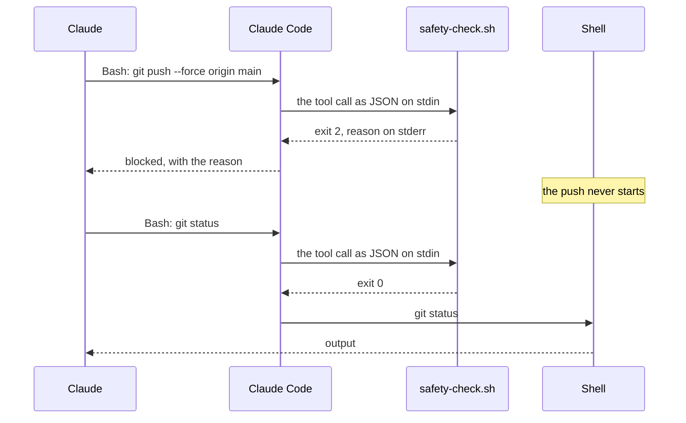
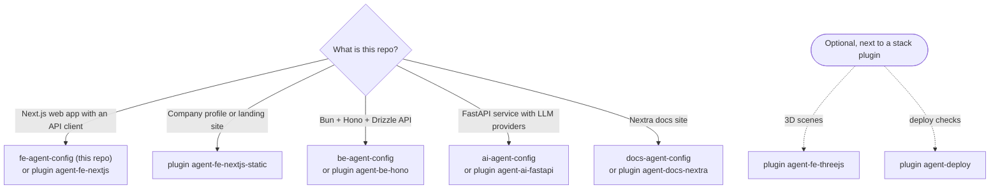
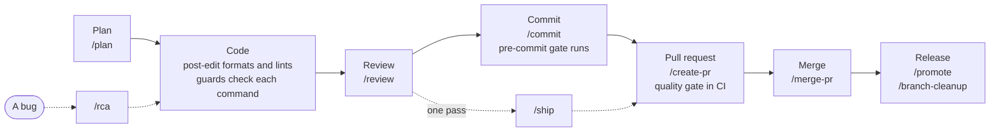
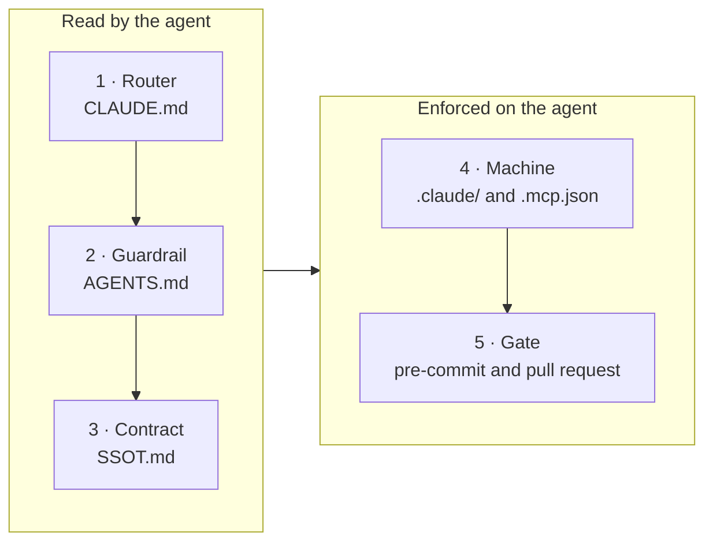
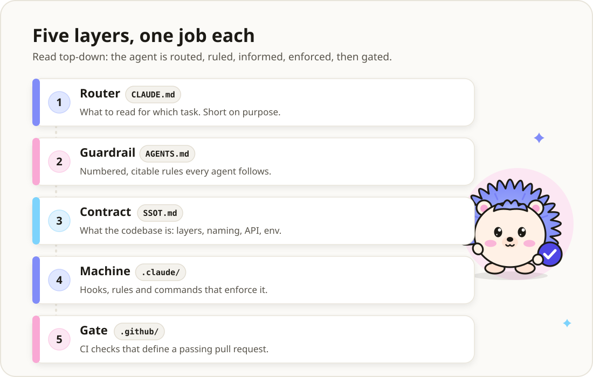

**English** | [Bahasa Indonesia](README.id.md)

<p align="center">
  <picture>
    <source media="(prefers-color-scheme: dark)" srcset="docs/assets/banner-fe-dark.svg">
    <source media="(prefers-color-scheme: light)" srcset="docs/assets/banner-fe-light.svg">
    
  </picture>
</p>

# fe-agent-config

[](LICENSE)
[](#cicd)
[](#requirements)
[](#prefer-plugins)

The Claude Code layer for a Next.js frontend: rules the agent reads, hooks that refuse, slash
commands for the daily flow, and gates that fail a commit. No application code. You copy it into
your repo, and every file is then yours to read and change.

> [!TIP]
> **TL;DR.** Copy seven folders and a few files into your Next.js repo ([Quick start](#quick-start)).
> From then on Claude Code cannot force-push to `dev` or `prod`, hand-edit the generated API client,
> read a `.env*` file into the chat, or write to the production database until *you* unlock it.
> Every refusal says what to do instead. Eighteen slash commands carry the work from `/plan` to
> `/merge-pr`, and before each commit a gate picks from 26 checks by what you staged. The hooks
> run on your machine with no network; CI runs only on pull requests.

**Prefer plugins?** The same layer installs in three steps, with no files to copy. Inside Claude
Code:

```text
/plugin marketplace add adhibuchori/agent-config-kit
/plugin install agent-fe-nextjs@agent-config-kit
/agent-fe-nextjs:setup
```

Installing `agent-fe-nextjs` also installs `agent-core`, which it depends on. Setup shows a dry run
and writes only when you reply **go**. [Prefer plugins?](#prefer-plugins) compares the two ways.

## Contents

1. [Why this exists](#why-this-exists), with a before and after
2. [See it in action](#see-it-in-action)
3. [Who it is for](#who-it-is-for)
4. [Which template or plugin?](#which-template-or-plugin) · [Prefer plugins?](#prefer-plugins)
5. [Quick start](#quick-start)
6. [A normal day with the template](#a-normal-day-with-the-template)
7. [What gets installed](#what-gets-installed) · [How it fits together](#how-it-fits-together)
8. [Everything this template ships](#everything-this-template-ships): [hooks](#hooks),
   [commands](#commands), [agents](#agents), [skills](#skills), [rules](#rules),
   [checks and gates](#checks-and-gates), [CI workflows](#ci-workflows),
   [config files](#config-files)
9. [Configuration](#configuration) · [Using RTK](#using-rtk) ·
   [What gets blocked, and how to get past it](#what-gets-blocked-and-how-to-get-past-it)
10. [Unlocking `.env` and the production DB](#unlocking-env-and-the-production-db)
11. [CI/CD](#cicd) · [GitHub repository configuration](#github-repository-configuration)
12. [Security model](#security-model) · [Cost and overhead](#cost-and-overhead)
13. [Upgrade, roll back, uninstall](#upgrade-roll-back-uninstall)
14. [Customize recipes](#customize-recipes)
15. [Requirements](#requirements) ·
    [Design decisions](#design-decisions-worth-knowing-before-you-edit) ·
    [Finished examples](#finished-examples-the-sibling-templates)
16. [FAQ and troubleshooting](#faq-and-troubleshooting)
17. [Glossary](#glossary) · [Out of scope](#out-of-scope) · [License](#license)

## Why this exists

A line in `CLAUDE.md` is a request. A hook that exits 2 is a wall. Written rules fail quietly:
nothing reports the day an agent ignores one, and on a frontend the miss ships to every visitor.
So each failure below has a mechanism in front of it.

1. **The agent hand-edits the generated API client.**
   *The problem:* a screen has a type error, and the agent "fixes" `src/lib/api/generated/client.ts`
   by hand. The next `bun generate:api` wipes the fix, and the bug is back.
   *The fix:* the edit is refused with the reason, and the agent changes the source and
   regenerates instead (Rule 29).
   *Handled by:* [generated-guard](#hooks), `generatedPaths` in
   [`.claude/agent-config.json`](#configuration).

2. **The agent force-pushes to `dev`.**
   *The problem:* a rebase went wrong, the agent "fixes" it with `git push --force origin dev`,
   and a teammate's merge is gone.
   *The fix:* a push to or a delete of `dev`, `prod`, `main` or `master` is refused, from the shell
   and from GitHub's MCP tools. Work reaches those branches through a pull request; a release push
   is handed to you as a `!` command.
   *Handled by:* [safety-check](#hooks), [mcp-guard](#hooks), the `deny` list in
   [`.claude/settings.json`](#config-files), [`/create-pr`](#commands).

3. **A secret lands in the transcript.**
   *The problem:* "let me check your config" becomes `cat .env.production`, and your API key is now
   in the chat log.
   *The fix:* no shell command may read or write a real `.env*` file. Claude lists the keys through
   a helper that masks every secret, and may change a value only after you unlock `env` yourself.
   The Bash sandbox blocks the same reads at the operating-system level.
   *Handled by:* [safety-check](#hooks), [`scripts/env/`](#checks-and-gates),
   [the unlock](#unlocking-env-and-the-production-db), the sandbox in
   [`.claude/settings.json`](#config-files).

4. **The agent writes to production.**
   *The problem:* while chasing a bug report, the agent runs `UPDATE users SET …` through the
   production database tool.
   *The fix:* one read-only statement passes; every write waits until you run `! bun unlock db`,
   and the lock closes itself after 15 minutes. The server itself also starts read-only.
   *Handled by:* [db-guard](#hooks), [the unlock](#unlocking-env-and-the-production-db),
   [`.mcp.json`](#config-files).

5. **A rule in `AGENTS.md` is ignored.**
   *The problem:* the rules say a component holds no logic (Rule 32) and both locale files change
   together (Rule 21). After a long session a component grows `useState`, and `id.json` misses
   three keys.
   *The fix:* each rule ends in a mechanism. `check:soc` and `check:i18n` fail the commit,
   `post-edit` tells Claude right after it edits `en.json` alone, and the rules load only when a
   matching file is open, so `CLAUDE.md` stays short enough to be read.
   *Handled by:* [checks and gates](#checks-and-gates), [post-edit](#hooks), [rules](#rules),
   [agents-i18n-guard](#agents).

6. **The agent wipes someone else's work.**
   *The problem:* two sessions share a checkout. One runs `git stash` or `git reset --hard` to
   "start clean", and the other session's work is gone.
   *The fix:* commands that wipe uncommitted work are refused unless they name their paths, and
   after every commit Claude is shown exactly which files it carried.
   *Handled by:* [safety-check](#hooks), [post-commit](#hooks), [`/checkpoint`](#commands),
   [`/commit`](#commands).

7. **Copies drift.**
   *The problem:* the commands and rules also exist as copies for a second tool, and CI YAML is
   copied into many repos. One copy gets a fix; the others do not, and nobody notices.
   *The fix:* every copy here is generated from one source, and a `--check` mode fails the commit
   when a copy drifted. Every action in CI is pinned to a commit and linted on the pull request that
   changes it. For many repos sharing one pinned gate, use the plugin.
   *Handled by:* [`scripts/sync/`](#checks-and-gates), [workflows-lint](#ci-workflows),
   [Prefer plugins?](#prefer-plugins).

<details>
<summary>Before and after: the same five minutes, without and with the template</summary>

**Without it:**

```text
You:     `bun run dev:prod` still calls the old API host, and the settings page has a type
         error. Fix both and push.
Claude:  Let me look at the env file.        $ cat .env.production      ← API_KEY is now in the chat
Claude:  The API host is wrong. Fixing it.   $ sed -i '' 's/api-old/api/' .env.production
Claude:  Patching the type in the client.    (edits src/lib/api/generated/client.ts by hand)
Claude:  Pushing the fix.                    $ git push --force origin dev
         (a teammate's merge is gone, and the next `bun generate:api` undoes the patch)
```

**With it:**

```text
You:     `bun run dev:prod` still calls the old API host, and the settings page has a type
         error. Fix both and push.
Claude:  $ cat .env.production
         [safety] BLOCKED: .env.production holds secrets, and the shell never reads or writes a
         real .env* file directly: its values would land in the transcript. List its keys with
         `bash scripts/env/show.sh .env.production` (secret values masked). …
Claude:  $ bash scripts/env/show.sh .env.production
         .env.production: 3 keys
           NEXT_PUBLIC_API_URL  https://api-old.example.com
           NEXT_PUBLIC_APP_URL  https://app.example.com
           API_KEY              sk_l…(40 chars)
         checked against .env.production.example: every key present; not in the template: API_KEY
         env is locked: to change a value, the user first runs `! bun unlock env`.
You:     ! bun unlock env
         🔓 .env unlocked until 16:36 (20 min) — lock now: bun unlock off env
Claude:  $ printf '%s' 'https://api.example.com' | bash scripts/env/set.sh .env.production NEXT_PUBLIC_API_URL
         ✓ NEXT_PUBLIC_API_URL updated in .env.production: https://api.example.com · backup …
Claude:  Edit src/lib/api/generated/client.ts
         [generated-guard] BLOCKED: src/lib/api/generated/client.ts is generated output
         (src/lib/api/generated in generatedPaths). Change its source and run the project's
         generator instead of editing it.
Claude:  The type comes from openapi.json; I'll regenerate the client, then run /ship and
         /create-pr for a pull request into dev.
```

The refusals and helper output above are the scripts' real output in a copy of this template with
the `unlock` alias in `package.json` and a Bun lockfile (wrapped, and shortened with `…`); the
lines around them show where they appear in a session.

</details>

## See it in action

<picture>
  <source media="(prefers-color-scheme: dark)" srcset="docs/assets/demo-blocked-dark.svg">
  <source media="(prefers-color-scheme: light)" srcset="docs/assets/demo-blocked-light.svg">
  
</picture>

This is what the hooks really send back, captured in a fresh copy of this template. Claude Code
hands each tool call to the hooks as JSON; a guard answers with exit code 2 and a reason on stderr,
which Claude reads and acts on:

```text
tool call  Bash  {"command": "git push --force origin main"}
exit 2     [safety] BLOCKED: pushing to a protected branch (dev/prod/main/master) is not allowed. Push your work branch and open a PR; when a release needs this push, the user runs it with `!`.

tool call  Edit  {"file_path": "src/lib/api/generated/client.ts"}
exit 2     [generated-guard] BLOCKED: src/lib/api/generated/client.ts is generated output (src/lib/api/generated in generatedPaths).
           Change its source and run the project's generator instead of editing it.

tool call  mcp__db-prod__execute_sql  {"sql": "UPDATE users SET plan = 'pro'"}
exit 2     [db-guard] BLOCKED: this SQL may change the production database (an UPDATE statement). Reads (one SELECT, SHOW, VALUES, EXPLAIN, or WITH ... SELECT) pass. For a write, the user runs `! ./scripts/ops/unlock.sh db` themselves and you try again, or you hand them the statement to run.

tool call  Bash  {"command": "git status"}
exit 0     (nothing: the command runs)
```

The illustrations on this page are animated: the hedgehog blinks, the sparkles twinkle, and the
commands type themselves in. If your system asks for reduced motion, they show a still picture
instead.

### Try it yourself

In your copy, pipe a tool call into a hook the way Claude Code does:

```bash
printf '%s' '{"tool_name":"Bash","tool_input":{"command":"git push --force origin main"}}' \
  | bash .claude/hooks/safety-check.sh; echo "exit $?"
```

```text
[safety] BLOCKED: pushing to a protected branch (dev/prod/main/master) is not allowed. Push your work branch and open a PR; when a release needs this push, the user runs it with `!`.
exit 2
```

```bash
printf '%s' '{"tool_name":"Edit","tool_input":{"file_path":"src/lib/api/generated/client.ts"}}' \
  | bash .claude/hooks/generated-guard.sh; echo "exit $?"
```

```text
[generated-guard] BLOCKED: src/lib/api/generated/client.ts is generated output (src/lib/api/generated in generatedPaths).
Change its source and run the project's generator instead of editing it.
exit 2
```

It is working if both print `exit 2`, and the first command with `git status` in place of the push
prints `exit 0`.

### How a hook decides

Claude Code hands every tool call to the hooks in `.claude/settings.json` before it runs. A
`PreToolUse` hook that exits **2** cancels the call, and its stderr is the reason Claude reads. Any
other exit code, `1` included, lets the call through. That is why every guard here exits 2, and
refuses when it cannot read its input.

<picture>
  <source media="(prefers-color-scheme: dark)" srcset="docs/assets/hook-flow-dark.svg">
  <source media="(prefers-color-scheme: light)" srcset="docs/assets/hook-flow-light.svg">
  
</picture>



## Who it is for

<picture>
  <source media="(prefers-color-scheme: dark)" srcset="docs/assets/mascot-dark.svg">
  <source media="(prefers-color-scheme: light)" srcset="docs/assets/mascot-light.svg">
  
</picture>

**A good fit if you:**

- use Claude Code (the CLI or an IDE extension) on a real frontend, alone or in a team;
- build a Next.js app with React, TanStack Query, next-intl and Tailwind v4 that calls one backend
  through a generated API client (Orval), with Bun as the package manager;
- want every file of the agent setup in your own repository, to read, review and change;
- work in branches that reach `dev` and `prod` through pull requests.

**Not a fit if you:**

- build a company profile or landing page with no backend: the static-site plugin fits better
  ([Which template or plugin?](#which-template-or-plugin));
- use Claude only on claude.ai or in Cowork: the hooks, commands and subagents run in Claude Code;
- want a security boundary against a hostile agent: the hooks read command text and guard against
  slips and injected instructions ([Security model](#security-model));
- want updates without copying files again: the plugin gives you versions and a `sync --check`
  ([Prefer plugins?](#prefer-plugins)).

## Which template or plugin?

Each stack has a template repo (files you copy) and a plugin (files a setup command installs). A
few stacks have only the plugin.



| Your repo | Template repo | Plugin |
| --- | --- | --- |
| Next.js web app with a generated API client | **fe-agent-config** (this repo) | `agent-fe-nextjs` |
| Company profile or landing site | none | `agent-fe-nextjs-static` |
| Bun + Hono + Drizzle API | [be-agent-config](https://github.com/adhibuchori/be-agent-config) | `agent-be-hono` |
| FastAPI service with LLM providers | [ai-agent-config](https://github.com/adhibuchori/ai-agent-config) | `agent-ai-fastapi` |
| Nextra documentation site | [docs-agent-config](https://github.com/adhibuchori/docs-agent-config) | `agent-docs-nextra` |
| Add-on: three.js or React Three Fiber scenes | none | `agent-fe-threejs` |
| Add-on: deploy smoke tests, any host | none | `agent-deploy` |

Every plugin lives in [agent-config-kit](https://github.com/adhibuchori/agent-config-kit).

## Prefer plugins?

<picture>
  <source media="(prefers-color-scheme: dark)" srcset="docs/assets/install-flow-dark.svg">
  <source media="(prefers-color-scheme: light)" srcset="docs/assets/install-flow-light.svg">
  :setup, which shows a dry run before it
    applies anything.">
</picture>

The same hooks, rules and checks also come as Claude Code plugins in
[agent-config-kit](https://github.com/adhibuchori/agent-config-kit): a setup command writes the
files for you, and a sync command tells you when they drift. Inside Claude Code:

```text
/plugin marketplace add adhibuchori/agent-config-kit
/plugin install agent-core@agent-config-kit
/plugin install agent-fe-nextjs@agent-config-kit
/agent-fe-nextjs:setup
```

| Plugin | For | Use it |
| --- | --- | --- |
| `agent-fe-nextjs` | A Next.js app with a generated API client: what this template covers | in place of this template |
| `agent-fe-nextjs-static` | A company profile, landing or marketing site built with Next.js, as a static export or SSG with form endpoints | in place of `agent-fe-nextjs` in the commands above |

Both build on `agent-core`. Setup asks one question at a time, shows a dry run of every file it
would write, and writes only when you reply **go**. The plugin repo's
[Quick start](https://github.com/adhibuchori/agent-config-kit#quick-start) has the rest.

- **Choose this template** to own every file in your repository, with no plugin runtime.
- **Choose a plugin** for versioned updates, a `/<plugin>:sync --check` that reports drift, and
  one pinned reusable CI gate for many repos.
- **Not both in one repo.** A copy of this template wires the hooks in `.claude/settings.json`, so
  the plugin would run them a second time; its `sync --check` reports that as `double-wired`.
  Delete the `hooks` entries from `.claude/settings.json` to switch.

## Quick start

**Before you start:** Claude Code, bash 3.2 or newer, git and python3 3.8 or newer (jq is
optional). The gates also need Bun, Node.js 20+, gitleaks and uv. [Requirements](#requirements)
has the full list.

1. **Clone the template next to your project**, and point a variable at it:

   ```bash
   git clone https://github.com/adhibuchori/fe-agent-config.git
   cd your-project
   CFG=../fe-agent-config
   ```

2. **Copy the layer in.** The tool configs overwrite yours of the same name, so merge by hand where
   you already have one:

   ```bash
   cp -R "$CFG"/{.claude,.agent,.agents,_workflow-source,.github,.husky,scripts} .
   cp "$CFG"/{CLAUDE.md,AGENTS.md,SSOT.md,.mcp.json,.skillspector-baseline.yaml} .
   cp "$CFG"/{oxlint.json,.oxlintignore,.oxfmtrc.json,knip.ts,doctor.config.json} .
   cp "$CFG"/{.gitleaks.toml,.dockerignore,.env.development.example,.env.production.example} .
   mkdir -p docs && cp "$CFG"/docs/unlock.md docs/   # CLAUDE.md and the unlock refusal cite it
   ```

3. **Merge `.gitignore` before your first commit.** `.claude/settings.local.json`,
   `.claude/state/`, `.skillspector/` and every real `.env*` file must be ignored; the
   `.env*.example` templates stay committed. Appending the template's file is the quick way
   (duplicate lines are harmless), and `git check-ignore` proves it:

   ```bash
   cat "$CFG"/.gitignore >> .gitignore
   git check-ignore -v .env.production .claude/state/unlock/env .claude/settings.local.json
   ```

   Each path should print the pattern that ignores it. A path with no line is not ignored yet.

4. **Add the package scripts** listed in [SETUP §5](SETUP.md#5-make-the-gates-runnable), the
   `"unlock": "bash scripts/ops/unlock.sh"` alias included, and install the tools it names:

   ```bash
   bun add -d husky knip oxfmt oxlint vitest @vitest/coverage-v8 jsdom typescript orval
   ```

5. **Fill every placeholder.** They are named, never blank:

   ```bash
   grep -rn --exclude-dir=hooks --exclude-dir=anti-patterns --exclude-dir=commands \
     --exclude-dir=skills --exclude=agent-config.example.json '<[a-zA-Z][a-zA-Z -]*>' \
     CLAUDE.md AGENTS.md SSOT.md .mcp.json .env.production.example .claude/ _workflow-source/
   ```

   The list also shows command syntax such as `<file>`, TypeScript generics and HTML tags; leave
   those. [SETUP §2](SETUP.md#2-fill-in-every-placeholder) says what goes where, and names the
   placeholders in `.github/` that the search skips.

6. **Keep or delete the three optional modules**: responsive layout, loading skeletons and dialog
   descriptions. Each is a rule, a standard and a gate line that come and go together
   ([SETUP §5](SETUP.md#5-make-the-gates-runnable)). A module kept by accident enforces a rule
   nobody on the team agreed to.

7. **Prove it on your machine:**

   ```bash
   bash scripts/check/hook-probes.sh        # every hook rule, both ways; about nine minutes
   bash scripts/check/ai-config.sh          # rule citations, context budget, hook wiring, MCP pins
   bash scripts/sync/workflows.sh --check   # the command mirrors match their sources
   bash scripts/sync/rules.sh --check       # the rule mirror matches .claude/rules/
   ```

   In a fresh copy the last three end like this:

   ```text
   Always-loaded context: 12789 bytes (budget 15000)
   AI config within budget
   ✓ All targets, orphans, and INDEX.md coverage are in sync with _workflow-source.
     ✓ Up to date. 16 rules, 0 excluded.
   ```

8. **Commit the layer as one commit of its own.** It makes an upgrade diff and a rollback one
   command each ([Upgrade, roll back, uninstall](#upgrade-roll-back-uninstall)).

**Then read [SETUP.md](SETUP.md)** for the tools, the MCP servers, the full gate list, GitHub and the
optional strip pipeline. Budget about an hour.

## A normal day with the template

Each step names the commands you type and the hooks and gates that help on their own.



| Step | You run | What helps by itself |
| --- | --- | --- |
| Plan | `/plan add a settings page`, or `/plan-fullstack add blog posts API` when the backend changes too | The plan writes no code and waits for your yes; rules load as it reads matching files |
| Code | nothing: just ask | [post-edit](#hooks) formats and lints each written file and notes an `en.json` change without `id.json`; [generated-guard](#hooks) refuses edits to the client; [safety-check](#hooks) judges every command |
| Review | `/review`; `/review-soc` for logic in components; `/a11y-audit src/` before a release | Ask for a [subagent](#agents) by name: "run agents-seo-validator" |
| Commit | `/commit`, then `git commit -- <paths>` | `.husky/pre-commit` runs `gates.sh --hook` for what is staged; [post-commit](#hooks) shows what landed; `--no-verify` is refused |
| Pull request | `/create-pr` | The [quality gate](#ci-workflows) runs 37 steps; React Doctor, the AI review, dependency review and CodeQL run too |
| Merge | `/merge-pr 42` | `scripts/ops/pr-ready.sh` reads checks, mergeability and open threads; a skipped check blocks until you confirm |
| Release | `/promote`, then `/branch-cleanup` | Pushes to `dev` and `prod` are handed to you as `!` commands; a merge into `prod` deploys and strips the AI layer |
| A bug | `/rca form submits twice on slow networks` (or `/debug …`) | [prompt-intent](#hooks) points `/debug` at `/rca` |
| A red gate | `/check-fix` | Runs every gate and the build, and fixes until all pass |
| End of session | `/checkpoint-summary`, `/learn-session` | The next session starts where this one ended |

## What gets installed

The copy in the Quick start brings 226 files. This is what each one is for:

```text
your-project/
├── CLAUDE.md                    Router: what to read for which task; loaded every session
├── AGENTS.md                    Guardrail: numbered, citable rules ("Rule 32")
├── SSOT.md                      Contract: stack, layers, naming, API contract, environment
├── .mcp.json                    5 MCP servers, pinned, env-var credentials only
├── .env.development.example     Env templates: every key, placeholder values only
├── .env.production.example
├── .gitignore                   Merged by you: state, local settings, real env files
├── .dockerignore                Keeps env files and the agent layer out of an image
├── .gitleaks.toml               Secret-scan settings, narrowed to exact values only
├── .skillspector-baseline.yaml  Triage record for the skill scan
├── oxlint.json · .oxlintignore  Lint: layer boundaries, import cycles, 150-line files
├── .oxfmtrc.json                Formatter settings
├── knip.ts                      Dead-code entry points
├── doctor.config.json           React Doctor settings: its dead-code pass is off, Knip owns it
│
├── .claude/
│   ├── settings.json            Hook wiring; allow, ask and deny lists; the Bash sandbox
│   ├── agent-config.json        This repo's hook settings (one key: localePairs)
│   ├── agent-config.example.json  Every hook setting with its default
│   ├── hooks/                   8 hooks + lib.sh + README.md
│   ├── rules/                   16 rules: common, typescript, web; 15 load by path
│   ├── agents/                  4 subagents + INDEX.md
│   ├── skills/                  react-doctor (with its vendor's LICENSE) · skeleton (optional)
│   ├── commands/                18 slash commands + INDEX.md (generated)
│   ├── anti-patterns/           30 documented traps + INDEX.md
│   ├── docs/                    Review checklist, pre-promote audit, 4 rule standards
│   ├── mcp/                     3 on-demand MCP server templates
│   ├── serena-errors.md         Tool-failure log with its recovery protocol
│   └── *.example.md             5 on-demand references to fill in or delete
│
├── _workflow-source/            18 command sources + INDEX.md: edit commands here
├── .agent/workflows/            Command mirror for a second tool (generated)
├── .agents/rules/               Rule mirror for Antigravity (generated)
│
├── .husky/pre-commit            Runs the gates on what you stage
├── scripts/
│   ├── check/                   The gates: gates.sh + gates.list, and 22 check files
│   ├── env/                     show.sh · set.sh · envfile.py: masked reads, unlocked writes
│   ├── ops/                     unlock.sh (you run it) · pr-ready.sh (can this PR merge?)
│   ├── sync/                    workflows.sh · rules.sh: the mirrors, each with --check
│   ├── next/env.ts              Creates and checks .env.<target> before dev, build and start
│   ├── lib/stylesheets.ts       The stylesheets the responsive check reads
│   └── measure/waterfall.ts     Optional: flags a request that waited on another
│
├── .github/
│   ├── workflows/               8 pull-request-only workflows
│   ├── scripts/                 The pull-request gate, the strip pipeline, the deploy trigger,
│   │                            and two comment checks
│   ├── PULL_REQUEST_TEMPLATE/   dev.md · promotion.md: only what the gate cannot decide
│   └── CODEOWNERS               Who reviews the guardrails
│
└── docs/unlock.md               How you open .env* and database writes; CLAUDE.md cites it
```

This repository also holds its own documents, which you do not copy: this README and its
Indonesian version, [SETUP.md](SETUP.md), [docs/RATIONALE.md](docs/RATIONALE.md), `docs/assets/`,
`LICENSE` and `.markdownlint-cli2.jsonc`. `PRODUCT.example.md` and `DESIGN.example.md` are for the
optional design skill ([Skills](#skills)).

## How it fits together

Five layers, each with one job. The first three are read by the agent; the last two are enforced on
it.



<picture>
  <source media="(prefers-color-scheme: dark)" srcset="docs/assets/layers-dark.svg">
  <source media="(prefers-color-scheme: light)" srcset="docs/assets/layers-light.svg">
  
</picture>

| Layer | Where | Job | Size |
| :-- | :-- | :-- | --: |
| **Router** | `CLAUDE.md` | What to read for which task. Loaded every session, so kept short | 156 lines |
| **Guardrail** | `AGENTS.md` | Numbered, citable rules: a review can say "Rule 32" and mean one thing | 428 lines |
| **Contract** | `SSOT.md` | What the codebase is: stack, layers, naming, API contract, environment | 326 lines |
| **Machine** | `.claude/`, `.mcp.json` | Hooks, path-scoped rules, subagents, skills, anti-patterns, commands, MCP | 105 files |
| **Gate** | `.husky/`, `scripts/check/`, `.github/` | The definition of "passing": before every commit and on every pull request | 26 gates · 37 steps · 8 workflows |

The split is about cost. `CLAUDE.md` is read in full at the start of every session, so every line
there is paid for on every task; `AGENTS.md` is read when a rule is in question, `SSOT.md` when
orientation is needed. `CLAUDE.md` plus the one rule that always loads come to 12,789 bytes, and
`ai-config.sh` holds that under 15,000
([RATIONALE §14](docs/RATIONALE.md#14-what-loads-every-session-has-a-byte-budget)).

## Everything this template ships

Each table answers three questions for every piece: what it does, how you use it, and why it
helps. Each name links to the file, and the file's own header is its documentation.

### Hooks

Hooks are scripts Claude Code runs by itself. **Guards** run before a tool call and can refuse it
with exit 2; **feedback hooks** only add a note for Claude and never block.
[`.claude/hooks/README.md`](.claude/hooks/README.md) has the full contract, every refusal and each
hook's fail mode. Each **It's working if** link opens that hook's page in the plugin repo, which
ends with a check you can run to see it work.

| Name | What it does | How to use | Why it helps |
| --- | --- | --- | --- |
| [safety-check](.claude/hooks/safety-check.sh) (guard) | Reads each shell command the way a shell does and refuses recursive deletes of protected paths, protected-branch pushes and deletes, `gh pr merge --delete-branch`, work-wiping git, a skipped pre-commit gate, git settings that run code, shell access to `.env*`, the agent running the unlock or changing `scripts/env/`, and anything it cannot resolve | Runs by itself before every `Bash` call. Check it: [Try it yourself](#try-it-yourself) · [It's working if](https://github.com/adhibuchori/agent-config-kit/blob/main/docs/agent-core/safety-check.md#its-working-if) | The one command you would regret never runs, and the refusal says what to do instead |
| [generated-guard](.claude/hooks/generated-guard.sh) (guard) | Refuses hand edits to generated output: the API client and the OpenAPI spec by default (`generatedPaths`) | Runs by itself before `Write`, `Edit`, `MultiEdit` and Serena's write tools · [It's working if](https://github.com/adhibuchori/agent-config-kit/blob/main/docs/agent-fe-nextjs/generated-guard.md#its-working-if) | A fix goes to the source, not to a file `bun generate:api` will overwrite |
| [db-guard](.claude/hooks/db-guard.sh) (guard) | Lets one read-only statement through `mcp__db-prod__execute_sql`; holds every write until you unlock `db` | Runs by itself before the production SQL tool · [It's working if](https://github.com/adhibuchori/agent-config-kit/blob/main/docs/agent-core/db-guard.md#its-working-if) | No surprise `UPDATE` or `DELETE` in production |
| [mcp-guard](.claude/hooks/mcp-guard.sh) (guard) | Refuses GitHub MCP pushes, file writes or deletes and branch creation on a protected branch | Runs by itself before those four GitHub MCP tools · [It's working if](https://github.com/adhibuchori/agent-config-kit/blob/main/docs/agent-core/mcp-guard.md#its-working-if) | Closes the route around the shell guard |
| [post-edit](.claude/hooks/post-edit.sh) (feedback) | Formats with oxfmt, then lints with oxlint, the file just written; notes an `en.json` change without its `id.json` pair (`localePairs`) | Runs by itself after each file write · [It's working if](https://github.com/adhibuchori/agent-config-kit/blob/main/docs/agent-core/post-edit.md#its-working-if) | Findings are fixed in the next edit, not at commit time; no half-translated screen |
| [post-commit](.claude/hooks/post-commit.sh) (feedback) | Shows what a commit carried, and warns about paths its pathspec did not name | Runs by itself after a `git commit` · [It's working if](https://github.com/adhibuchori/agent-config-kit/blob/main/docs/agent-core/post-commit.md#its-working-if) | Another session's staged work cannot ride along unseen |
| [prompt-intent](.claude/hooks/prompt-intent.sh) (feedback) | Points `/debug` at this repo's `/rca`; prunes the state of sessions idle for two days | Type `/debug <symptom>` · [It's working if](https://github.com/adhibuchori/agent-config-kit/blob/main/docs/agent-core/prompt-intent.md#its-working-if) | Debugging starts from a reproduction, not from Claude Code's own debug skill |
| [session-start](.claude/hooks/session-start.sh) (feedback) | Makes the zsh that runs Claude's commands behave like bash on unmatched globs, `=word` and word splitting | Runs by itself when a session starts · [It's working if](https://github.com/adhibuchori/agent-config-kit/blob/main/docs/agent-core/session-start.md#its-working-if) | Fewer confusing `no matches found` failures |
| [lib.sh](.claude/hooks/lib.sh) | Shared helpers, the config loader and the shell-command analyzer the guards use | Sourced by the hooks; never wired itself | One parser and one config reader for every guard |

### Commands

Type them in Claude Code. The sources live in `_workflow-source/`; `bash scripts/sync/workflows.sh`
mirrors them into `.claude/commands/` and `.agent/workflows/`. Every push to `dev` or `prod` is
handed to you as a `!` command.

| Name | What it does | How to use | Why it helps |
| --- | --- | --- | --- |
| [/plan](_workflow-source/plan.md) | Writes a plan (scope, tasks, risks, open questions) and waits for your yes; writes no code | `/plan add a settings page` | Scope and risks are agreed before anything changes |
| [/plan-fullstack](_workflow-source/plan-fullstack.md) | Checks the backend API, the OpenAPI contract, the generated client and existing components, then plans | `/plan-fullstack add blog posts API` | Contract changes are found in the plan, not in review |
| [/rca](_workflow-source/rca.md) | Reproduces the bug at the lowest rung, finds the line, and fixes it with a test that fails without the fix; no commit | `/rca form submits twice on slow networks` | Fixes that stay fixed, proven by a test |
| [/checkpoint](_workflow-source/checkpoint.md) | A local safety commit of this session's files, by pathspec, with a timestamp; never pushes | `/checkpoint before a folder move` | A cheap way back before a risky change |
| [/check-fix](_workflow-source/check-fix.md) | Writes the format, runs every gate and the build, and fixes what fails until all pass | `/check-fix` | A red gate turns green without guessing which one failed |
| [/review](_workflow-source/review.md) | Reviews the staged changes (or the branch against `origin/dev`) against the frontend rules and the security checklist, by severity; changes nothing until you pick an option | `/review` | Rule-cited findings before the commit |
| [/review-soc](_workflow-source/review-soc.md) | Runs the gates, then moves logic out of components into hooks, `lib/` and the constants homes | `/review-soc src/components/` | Components stay presentational (Rule 32) |
| [/a11y-audit](_workflow-source/a11y-audit.md) | Scans `.tsx` files for missing labels and alt text, focus styles, keyboard traps and ARIA roles, and flags colour contrast for a manual check | `/a11y-audit src/` | Accessibility gaps are found before a release |
| [/commit](_workflow-source/commit.md) | Runs the gates, reads the staged diff, and drafts a message in this repo's format; does not commit | `/commit` | A red gate never becomes a commit |
| [/ship](_workflow-source/ship.md) | Stages everything, runs `/review` and `/security-review`, fixes every Medium-or-higher and security finding, re-runs the gates, commits and pushes the work branch; refuses `dev` and `prod` | `/ship` | Finished work leaves the machine reviewed, in one command |
| [/create-pr](_workflow-source/create-pr.md) | Drafts a title and description from the PR template, then opens the pull request into `dev` | `/create-pr` | Consistent pull requests, never a push to a protected branch |
| [/resolve-pr-review](_workflow-source/resolve-pr-review.md) | Fetches review comments, triages them against the numbered rules, applies what holds up, and replies on each thread | `/resolve-pr-review 42` | A bot suggestion that breaks a rule is declined with the reason |
| [/merge-pr](_workflow-source/merge-pr.md) | Reads readiness with `pr-ready.sh`, confirms, merges with a merge commit, deletes the `internal/*` head by name | `/merge-pr 42` | Skipped checks and open threads are caught before a merge |
| [/promote](_workflow-source/promote.md) | Takes `internal/{scope}` through a pull request into `dev` and a promotion into `prod`, audits the production env and migrations, and verifies the deploy by time | `/promote` | "Merged" and "live" are never confused |
| [/promote-deploy](_workflow-source/promote-deploy.md) | The fallback when CI cannot run: proves CI is down, runs the gate locally, merges without pull requests (you push), strips, deploys, verifies, and logs what CI still owes | `/promote-deploy` | Production does not go stale during a CI outage |
| [/branch-cleanup](_workflow-source/branch-cleanup.md) | Deletes merged branches, remote and local, except `dev`, `prod`, the default branch and open pull-request heads, once you confirm | `/branch-cleanup` | A tidy remote; an unmerged branch is kept |
| [/checkpoint-summary](_workflow-source/checkpoint-summary.md) | Summarises the session for a handover; can write a gitignored local log | `/checkpoint-summary auth-sprint` | The next session starts where this one ended |
| [/learn-session](_workflow-source/learn-session.md) | Writes what the session taught into the check, rule, reference or anti-pattern that will load again | `/learn-session` | The same trap is not hit twice |

### Agents

Subagents review in their own context and report. No command calls them: ask for one by name, or
let Claude Code pick the one whose description fits
([`.claude/agents/INDEX.md`](.claude/agents/INDEX.md)). A subagent inherits the session's tools, so
"reports only" is an instruction, not a permission boundary.

| Name | What it does | How to use | Why it helps |
| --- | --- | --- | --- |
| [agents-reviewer](.claude/agents/agents-reviewer.md) | Checks a TypeScript diff against `AGENTS.md`: layer ownership, logic-free components, styling, the data layer, the React Compiler, file length, Rules 30–34, JSDoc | "Run agents-reviewer on my changes", after editing components, hooks or `lib/` | Findings that cite a rule number you can act on |
| [agents-i18n-guard](.claude/agents/agents-i18n-guard.md) | en/id key parity, hardcoded strings, namespaced translators, locale-aware navigation and formatting, hreflang | Ask after touching `src/messages/` or any `t()` call | No half-translated screen |
| [agents-security-guard](.claude/agents/agents-security-guard.md) | Headers and CSP, secret and env exposure, XSS sinks and unsafe URLs, request trust, server-side validation, edits to the guard files | Ask before committing config, route handlers, proxies, forms or rendered user content | Security regressions are flagged before the commit |
| [agents-seo-validator](.claude/agents/agents-seo-validator.md) | `metadataBase`, per-route titles and descriptions, canonical and hreflang, robots, sitemap, share images, JSON-LD | Ask after changing metadata, public pages, robots, the sitemap or share images | Pages stay findable and shareable |

### Skills

Skills load by themselves when the conversation matches their description.

| Name | What it does | How to use | Why it helps |
| --- | --- | --- | --- |
| [react-doctor](.claude/skills/react-doctor/SKILL.md) | Regression scans after React changes, and a local triage that fixes and proves each finding; CLI pinned to 0.9.14, results kept on your machine | "scan the React code", or `/react-doctor` | Security, performance and accessibility findings before the commit |
| [skeleton](.claude/skills/skeleton/SKILL.md) (optional module) | Derives a loading skeleton's heights from the real component, wires the preview switch, and measures the pair at four widths | "the skeleton jumps", "build a loading skeleton" | No layout shift when data arrives |
| [impeccable](https://github.com/pbakaus/impeccable) (by reference) | Interface design, critique and polish | Install it with its own tooling ([SETUP §7](SETUP.md#7-skills-two-ship-two-are-installed-by-reference)); fill `PRODUCT.md` and `DESIGN.md` from the templates | Design work from a written brief, with nothing vendored here |
| [ui-animation](https://github.com/mblode/agent-skills/tree/main/skills/ui-animation) (by reference) | Builds, reviews and measures UI motion: springs, gestures, scroll effects, easing | Install it with its own tooling ([SETUP §7](SETUP.md#7-skills-two-ship-two-are-installed-by-reference)); MIT, pinned by content hash | Motion that follows measured timing, with nothing vendored here |

`react-doctor` ships as an adapted copy under its vendor's license (`LICENSE` beside it). No
installed third-party skill tree is committed.

### Rules

Rules are Markdown files under `.claude/rules/` that Claude Code loads as instructions. Every rule
but one opens with a `paths:` list, so it loads only once the session reads a matching file. A rule
is text: the "Why it helps" column names the gate or guard that enforces it.

<details>
<summary>All 16 rule files</summary>

| Name | What it does | How to use | Why it helps |
| --- | --- | --- | --- |
| [common/working-agreements.md](.claude/rules/common/working-agreements.md) | How work is done: communicate, scope, evidence, order of work, shared checkouts | Loads in every session (4,278 bytes, the one unscoped rule) | Each correction is made once |
| [common/folder-shape.md](.claude/rules/common/folder-shape.md) | Folder shape, SHAPE-1 to SHAPE-4 | Loads for `src/`, `tests/`, `scripts/`, `components/`, `lib/` | Enforced by `folder-shape.mjs` |
| [common/error-codes.md](.claude/rules/common/error-codes.md) | Every API error code has a message; no silent `catch` | Loads for `src/lib/errors/`, hooks, modules, `openapi.json` | Enforced by `check:error-codes` and `check:error-catch` |
| [typescript/types.md](.claude/rules/typescript/types.md) | No `any`, no double assertion (Rule 31) | Loads for `*.ts`, `*.tsx`, `*.mts`, `*.cts` | Enforced by oxlint and `double-assertion.sh` |
| [typescript/dead-code.md](.claude/rules/typescript/dead-code.md) | Unused files, exports and dependencies | Loads for TypeScript and JavaScript, `knip.ts`, `package.json` | Enforced by `check:dead-code` (Knip) |
| [typescript/coverage.md](.claude/rules/typescript/coverage.md) | 100% on the logic layer; what may be exempt, and why | Loads for `src/`, `tests/`, `scripts/check/`, the Vitest config, `.husky/` | Enforced by `coverage-policy.mjs` and `test:coverage` |
| [typescript/conventions.md](.claude/rules/typescript/conventions.md) | The React Compiler note, JSDoc, naming | Loads for `src/**/*.ts` and `*.tsx` | The pull-request gate checks JSDoc presence (a warning) |
| [web/security.md](.claude/rules/web/security.md) | What the gate checks and what you check yourself: `NEXT_PUBLIC_`, trusted headers, safe URLs | Loads for `.tsx`, app routes, the security lib, the API client, `next.config.ts` | Enforced in part by the pull-request diff scans |
| [web/testing.md](.claude/rules/web/testing.md) | How to run and write frontend tests; tests mirror the source tree | Loads for `src/testing/`, `*.test.ts(x)`, `vitest.config.ts` | Enforced in part by `folder-shape.mjs` |
| [web/separation-of-concerns.md](.claude/rules/web/separation-of-concerns.md) | A component renders and holds no logic, S1 to S11 (Rule 32) | Loads for components, hooks, `lib/`, types | Enforced by `check:soc` |
| [web/file-organization.md](.claude/rules/web/file-organization.md) | Where hooks, components and tests live (Rule 30) | Loads for hooks, components, `src/testing/` | Enforced by `check:hooks` |
| [web/data-fetching.md](.claude/rules/web/data-fetching.md) | No request waterfalls, W1 to W8 | Loads for hooks, components, layouts and pages | Measured by the optional `measure:waterfall` |
| [web/ui-conventions.md](.claude/rules/web/ui-conventions.md) | Measure before guessing, one component per role, copy and styling | Loads for components, app `.tsx`, styles, `src/messages/*.json` | Enforced in part by `check:i18n` (button casing) and `check:tailwind` |
| [web/responsive.md](.claude/rules/web/responsive.md) (optional) | Named breakpoints and fluid widths | Loads for `*.tsx`, `*.css` | Enforced by `check:responsive` |
| [web/skeletons.md](.claude/rules/web/skeletons.md) (optional) | Skeletons match their screen, height first | Loads for skeleton files, `loading.tsx`, preview switches | Enforced by `check:skeleton-switch`; the `skeleton` skill does the work |
| [web/dialog-content.md](.claude/rules/web/dialog-content.md) (optional) | Every dialog has a description that says something | Loads for `*.tsx`, `src/messages/` | Enforced by `check:dialog-desc` |

</details>

`scripts/sync/rules.sh` writes the same rules into `.agents/rules/` for Antigravity, turning each
`paths:` list into the one comma-separated string that tool reads
([RATIONALE §1](docs/RATIONALE.md#1-one-rule-two-scope-dialects)). Worked examples for four rules
sit in `.claude/docs/standards/`; nothing loads them until a task reads them.

**Anti-patterns** are the rules' companions: 30 short files, one per trap that cost real debugging
time, each written as symptom, root cause, fix and how to catch it.
[`.claude/anti-patterns/INDEX.md`](.claude/anti-patterns/INDEX.md) lists them by the symptom that
should surface them (tooling and git, tests and coverage, React and data, styling and layout, i18n,
API errors and deploys). `/rca` reads the index before debugging, and `/learn-session` adds new
ones.

### Checks and gates

`.husky/pre-commit` runs `bash scripts/check/gates.sh --hook --fail-fast`, which picks the gates in
`scripts/check/gates.list` that the staged files need. `.github/scripts/quality-gate.sh` runs the
same checks and more, 37 steps, on every pull request into `dev` or `prod`. These are the ones you
run by hand:

| Name | What it does | How to use | Why it helps |
| --- | --- | --- | --- |
| [gates.sh](scripts/check/gates.sh) + [gates.list](scripts/check/gates.list) | Runs every gate in the list, one log each, and a table at the end | `bash scripts/check/gates.sh` (`--only TEXT`, `--paths P…`, `--fix P…`, `--fail-fast`) | One command answers "is this ready to commit?" |
| [.husky/pre-commit](.husky/pre-commit) | Runs the gates the staged files need | Runs by itself on `git commit` once `bun install` ran `prepare` | A red gate never becomes a commit |
| [quality-gate.sh](.github/scripts/quality-gate.sh) | The pull-request gate: the list above plus the audit, diff scans, full-history secret scan, skill scan and production build | `bash .github/scripts/quality-gate.sh origin/dev` (`--strict` fails on a check that could not run) | See the CI result before you push |
| [hook-probes.sh](scripts/check/hook-probes.sh) + [hook-probes.tsv](scripts/check/hook-probes.tsv) | Proves every hook rule both ways: 569 commands it must stop, 276 it must let through, plus each fail mode | `bash scripts/check/hook-probes.sh` (about nine minutes; `/bin/bash` proves bash 3.2) | A guard that silently stopped firing is caught |
| [ai-config.sh](scripts/check/ai-config.sh) | Cited rule numbers exist, the always-loaded context fits 15,000 bytes, hook wiring is sound, MCP servers are pinned | `bash scripts/check/ai-config.sh` | `CLAUDE.md` stays short enough to be read; no rule citation dangles |
| [unlock.sh](scripts/ops/unlock.sh) | Opens `env` or `db` for a few minutes, shows what is open, or locks it all | `! bun unlock env` (you only; see [Unlocking](#unlocking-env-and-the-production-db)) | Secrets and production writes open only when you say so |
| [show.sh](scripts/env/show.sh) · [set.sh](scripts/env/set.sh) | Lists a `.env*` file's keys with secrets masked; changes one value, from stdin, while `env` is unlocked | `bash scripts/env/show.sh .env.production` | The agent can work with env files without seeing a secret |
| [pr-ready.sh](scripts/ops/pr-ready.sh) | One read-only table: checks, mergeability, unresolved threads, the expected head branch | `bash scripts/ops/pr-ready.sh 42` (needs a signed-in `gh`) | Merge decisions from facts, not from polling |
| [workflows.sh](scripts/sync/workflows.sh) · [rules.sh](scripts/sync/rules.sh) | Write the command and rule mirrors; `--check` only compares | `bash scripts/sync/workflows.sh --check` | A copy for a second tool cannot drift unseen |

<details>
<summary>Every other check and script</summary>

| Name | What it does | How to use | Why it helps |
| --- | --- | --- | --- |
| [soc.ts](scripts/check/soc.ts) + [soc.allow.json](scripts/check/soc.allow.json) | Refuses state, effects, derived domain values or browser APIs in a component file (S1 to S11) | `bun run check:soc` | Rule 32 as a gate |
| [hooks.ts](scripts/check/hooks.ts) | A hook loose in `src/hooks/`, a hook folder with no component twin, a test at the wrong path (HOOK-1 to HOOK-4) | `bun run check:hooks` | Rule 30 as a gate |
| [no-reexport.ts](scripts/check/no-reexport.ts) | Refuses `export * from`, `export { a } from` and the same forwarding in two statements | `bun run check:reexport` | Rule 34 as a gate |
| [tailwind-classes.ts](scripts/check/tailwind-classes.ts) | Refuses a class Tailwind's own canonicalizer would rewrite, such as `mt-[15px]` | `bun run check:tailwind` | Rule 33 as a gate; the editor warning is no longer ignored |
| [i18n.ts](scripts/check/i18n.ts) · [i18n-casing.ts](scripts/check/i18n-casing.ts) | Key parity between locales, unused keys, unscoped translators; button labels in Title Case | `bun run check:i18n` | Rules 20 and 21 as a gate |
| [error-codes.ts](scripts/check/error-codes.ts) · [error-catch.ts](scripts/check/error-catch.ts) | Every API error code has a message; a bare `catch` in hooks or components says why | `bun run check:error-codes`, `bun run check:error-catch` | The UI never says "Something went wrong" for a named failure |
| [audit.ts](scripts/check/audit.ts) | Wraps `bun audit`: fails only on high and critical advisories that match an installed version | `bun run scripts/check/audit.ts` | Real advisories fail; noise does not |
| [coverage-policy.mjs](scripts/check/coverage-policy.mjs) | Fails when a coverage threshold, scope or exemption was weakened | `node scripts/check/coverage-policy.mjs` | The 100% bar cannot quietly drop |
| [folder-shape.mjs](scripts/check/folder-shape.mjs) | A file whose path does not say what it does (SHAPE-1 to SHAPE-4) | `node scripts/check/folder-shape.mjs` | Structure that scales |
| [double-assertion.sh](scripts/check/double-assertion.sh) | Refuses `x as unknown as T` | `bash scripts/check/double-assertion.sh` | The compiler's overlap check stays on |
| [ai-config-probes.sh](scripts/check/ai-config-probes.sh) | Proves the MCP pin rule of `ai-config.sh` both ways, in temp repos | `bash scripts/check/ai-config-probes.sh` | A pin check that lets a movable version through is caught |
| [skills.sh](scripts/check/skills.sh) + [.skillspector-baseline.yaml](.skillspector-baseline.yaml) | Scans skills, commands, subagents and hooks with a pinned SkillSpector | `bash scripts/check/skills.sh --staged` | A prompt-injection line is a supply-chain risk like any dependency |
| [dialog-desc.ts](scripts/check/dialog-desc.ts) (optional) | A dialog with no description, or an empty one | `bun run check:dialog-desc` | Screen readers announce what a dialog is for |
| [responsive.ts](scripts/check/responsive.ts) + [lib/stylesheets.ts](scripts/lib/stylesheets.ts) (optional) | A pixel breakpoint, an orphaned media-query class, a fixed width with no guard | `bun run check:responsive` | Screens hold at every width |
| [skeleton-switch.sh](scripts/check/skeleton-switch.sh) (optional) | A development switch left on that holds screens on a placeholder | `bun run check:skeleton-switch` | No screen ships stuck on its skeleton |
| [waterfall.ts](scripts/measure/waterfall.ts) (optional) | One fresh page load; flags a request that started as another ended | `bun run measure:waterfall --path '/en'` | Waterfalls are measured, not guessed |
| [envfile.py](scripts/env/envfile.py) | The parser behind `show.sh` and `set.sh`: masking, comparison with the template, backups | Called by the two helpers | One trusted place touches `.env*` files |
| [next/env.ts](scripts/next/env.ts) | Creates `.env.<target>` from its template and checks it is complete before `dev`, `build` and `start` | `bun run env:init`, `bun run env:check` | A missing key fails at start, not at runtime |
| [check-comment-style.ts](.github/scripts/check-comment-style.ts) | A `//` comment that is not a tool directive: prose goes in block comments | `bun run .github/scripts/check-comment-style.ts` | One comment style across the repo |
| [check-comment-blocks.sh](.github/scripts/check-comment-blocks.sh) | A comment run longer than two lines under `.github/` | `bash .github/scripts/check-comment-blocks.sh` | Reasoning lives in this README, not in YAML |
| [strip-paths.sh](.github/scripts/strip-paths.sh) · [strip-ai.sh](.github/scripts/strip-ai.sh) · [verify-strip.sh](.github/scripts/verify-strip.sh) · [back-merge-prod.sh](.github/scripts/back-merge-prod.sh) | The optional strip pipeline: one list of what leaves `prod`, the strip, its proof, and the merge back into `dev` | Run by `strip-ai-on-pr.yml` and `/promote-deploy` | `prod` carries no agent instructions |
| [trigger-deploy.sh](.github/scripts/trigger-deploy.sh) | Calls the deploy webhook for `refs/heads/prod` | Run by `ci-cd.yaml` with `DEPLOY_WEBHOOK_URL` | A deploy that names no vendor |

</details>

<details>
<summary>The 26 pre-commit gates, and when each one runs</summary>

| Pre-commit gate | Runs when you stage | Catches |
| --- | --- | --- |
| `@format` | anything | Unformatted or failing-lint files, checked read-only |
| `bash scripts/check/secrets.sh` | anything | A secret in the staged diff (gitleaks; a missing gitleaks fails the gate, a release off CI's pin warns) |
| `bun run type-check` | code | Type errors |
| `bun run check:dead-code` | code | Unused files, exports and dependencies (Knip) |
| `bash scripts/check/double-assertion.sh` | code | `x as unknown as T` |
| `node scripts/check/folder-shape.mjs` | code | A file whose path does not say what it does |
| `node scripts/check/coverage-policy.mjs` | code | A coverage threshold, scope or exemption that was weakened |
| `bun run test:coverage` | code | A failing test, or the logic layer below 100% |
| `bun run check:i18n` | code | Locale parity, unused keys, button casing |
| `bun run check:hooks` | code | Hook placement (HOOK-1 to HOOK-4) |
| `bun run check:reexport` | code | A re-export |
| `bun run check:soc` | code | Logic in a component (S1 to S11) |
| `bun run check:tailwind` | code | A non-canonical Tailwind class |
| `bun run check:error-codes` | code | An API error code with no message |
| `bun run check:error-catch` | code | A bare `catch` that does not say why |
| `bun run .github/scripts/check-comment-style.ts` | code | A `//` comment that is not a tool directive |
| `bash .github/scripts/check-comment-blocks.sh` | code | A comment run over two lines under `.github/` |
| `bun run check:dialog-desc` (optional) | code | A dialog with no description, or an empty one |
| `bun run check:responsive` (optional) | code | A pixel breakpoint, an orphaned media-query class, a fixed width with no guard |
| `bun run check:skeleton-switch` (optional) | code | A development switch left on |
| `bash scripts/check/ai-config.sh` | anything | A cited rule that is not defined, context over budget, bad hook wiring, MCP pins |
| `bash scripts/check/ai-config-probes.sh` | code | An MCP pin check that lets a movable version through, or rejects a real one |
| `bash scripts/sync/rules.sh --check` | docs | The rule mirror drifted from `.claude/rules/` |
| `bash scripts/sync/workflows.sh --check` | commands | A command mirror or `INDEX.md` row drifted from its source |
| `bash scripts/check/hook-probes.sh` | hooks | A hook rule that stopped blocking, or started blocking too much |
| `bash scripts/check/skills.sh --staged` | commands, hooks | Prompt injection or unsafe shell in a skill, command, subagent or hook |

"Code" is anything but docs, commands and hooks. Staging it runs every line except the hook
probes, which take minutes and run only when you stage a hooks file: a hook,
`.claude/settings.json`, the probes themselves, `scripts/ops/unlock.sh` or a file under
`scripts/env/`.

</details>

<details>
<summary>The 37 pull-request steps, in order</summary>

1. Install dependencies (`--frozen-lockfile --ignore-scripts`)
2. Format and lint
3. Folder shape
4. Coverage policy
5. Generate the API client, only when `orval.config.ts` exists: it is gitignored, and the next two
   steps import from it
6. Type check
7. Dead code
8. Comment style
9. Comment block length (at most two lines under `.github/`)
10. i18n parity and casing
11. Hook placement
12. No re-exports
13. Separation of concerns
14. Tailwind classes
15. Error code mapping
16. Error catch
17. Dialog descriptions, only when `gates.list` lists it
18. Responsive layout, only when `gates.list` lists it
19. Skeleton switches, only when `gates.list` lists it
20. Rules mirror drift
21. Command mirror drift
22. Dependency audit (`scripts/check/audit.ts`: high and critical advisories on installed versions)
23. No `.env` file committed
24. Dangerous JavaScript APIs (`eval`, `new Function`) in the diff
25. Unsafe React patterns (`dangerouslySetInnerHTML`) in the diff
26. Auth code in the diff, for a repository whose sign-in lives in another app
27. URL scheme injection in the diff
28. Secret scan over the full history (pinned gitleaks, verified by checksum)
29. Unit tests with coverage
30. JSDoc presence on the logic layer (a warning, never a failure)
31. AI config
32. AI config pin probes: the MCP pin check, proved both ways in temp repos
33. Hook probes
34. No double assertion
35. Skill security scan, only when a skill, command, subagent or hook changed
36. Production build
37. Source maps in the client bundle

</details>

### CI workflows

Every workflow starts from a pull-request event: nothing runs on a push or a schedule. The
[CI/CD](#cicd) section has the triggers, tokens and secrets.

| Name | What it does | How to use | Why it helps |
| --- | --- | --- | --- |
| [quality-gate.yaml](.github/workflows/quality-gate.yaml) | Runs `quality-gate.sh`, all 37 steps, in strict mode | Runs on every pull request into `dev` or `prod` | The same bar as your machine, on a clean runner |
| [react-doctor.yml](.github/workflows/react-doctor.yml) | React health findings as review comments, a summary comment and a commit status; advisory only | Runs on pull requests into `dev` or `prod` | Framework issues surface in review; never blocks |
| [deepseek-review.yml](.github/workflows/deepseek-review.yml) | An AI review comment from any OpenAI-compatible provider | Runs when a pull request into `dev` opens; comment `/ask-deepseek` for another | A second reader on every pull request; delete it if unused |
| [ci-cd.yaml](.github/workflows/ci-cd.yaml) | Calls the deploy webhook, then dispatches the docs changelog | Runs when a pull request into `prod` is merged | Deploys follow merges, never a direct push |
| [strip-ai-on-pr.yml](.github/workflows/strip-ai-on-pr.yml) | Strips the AI layer from `prod`, merges back into `dev`, verifies both | Runs when a pull request into `prod` is merged | Production carries no agent instructions (optional) |
| [workflows-lint.yml](.github/workflows/workflows-lint.yml) | actionlint, zizmor and pinact on the workflow files | Runs on a pull request that changes `.github/**` | A workflow change is checked for injection and unpinned actions |
| [dependency-review.yml](.github/workflows/dependency-review.yml) | Fails on a new or bumped dependency with a high or critical advisory | Runs on every pull request | A vulnerable dependency never merges unseen |
| [codeql.yml](.github/workflows/codeql.yml) | CodeQL for the workflows, and for the code once `tsconfig.json` exists | Runs on every pull request | Code scanning without a weekly schedule |

### Config files

| Name | What it does | How to use | Why it helps |
| --- | --- | --- | --- |
| [.claude/settings.json](.claude/settings.json) | Wires the 8 hooks; 11 allow, 4 ask and 14 deny rules; turns on the Bash sandbox | Edit it to change wiring or permissions; keep changes reviewed | The permission system and the sandbox back the hooks up |
| [.claude/agent-config.json](.claude/agent-config.json) | This repo's hook settings; ships with `localePairs` for `en.json` and `id.json` | Add only the keys you change ([Configuration](#configuration)) | Tune one rule without editing a hook |
| [.claude/agent-config.example.json](.claude/agent-config.example.json) | Every hook setting with its default and an explanation | Copy a key from here into `agent-config.json` | The defaults are written down, not guessed |
| [.mcp.json](.mcp.json) | Serena, GitHub, Context7, `db-dev` and `db-prod`, pinned, env-var credentials only | Set the env vars it names; delete the servers you do not use | The tools the commands expect, with no secret in git |
| [.claude/mcp/](.claude/mcp/deploy-platform.example.json) | Three on-demand server templates: deploy platform, VPS provider and Cloudflare | `claude --mcp-config .claude/mcp/<file>.json` once filled | Rare servers cost no context in every session |
| [CLAUDE.md](CLAUDE.md) · [AGENTS.md](AGENTS.md) · [SSOT.md](SSOT.md) | The router, the numbered rules and the codebase facts | Fill the placeholders ([Quick start](#quick-start) step 5) | Claude reads the right thing for each task |
| `.claude/*.example.md` | Five on-demand references: operations, CI runners, database, analytics, multi-repo Serena | Copy one without `.example` and fill it, or delete it and its `CLAUDE.md` row | Knowledge that loads only when a task needs it |
| [.claude/serena-errors.md](.claude/serena-errors.md) | A log of tool failures and their workarounds | Claude reads it after a Serena failure and adds new ones | The same failure is not debugged twice |
| [.claude/docs/](.claude/docs/code-review-checklist.md) | The human review checklist, the pre-promote audit, four rule standards | `/review` reads the checklist; ask for the audit before `/promote` | Worked examples without paying for them every session |
| [.env.development.example](.env.development.example) · [.env.production.example](.env.production.example) | Every key the app reads, placeholder values only | `bun run env:init` creates the real files from them | `show.sh` and `/promote` compare real files against them |
| [oxlint.json](oxlint.json) · [.oxlintignore](.oxlintignore) · [.oxfmtrc.json](.oxfmtrc.json) | Lint rules (layer boundaries, import cycles, `any`, 150-line files) and format settings | `bun run fl` | Layer rules enforced by the linter |
| [knip.ts](knip.ts) · [doctor.config.json](doctor.config.json) | Dead-code entry points; React Doctor with its dead-code pass off | `bun run check:dead-code` | One owner for dead code |
| [.gitignore](.gitignore) | Ignores `.claude/state/`, `.claude/settings.local.json`, `.skillspector/` and every real `.env*` file; keeps the `.env*.example` templates | Append it to yours ([Quick start](#quick-start) step 3) | `set.sh` refuses to run until `.claude/state/` is ignored, so no backup or unlock file is committed |
| [docs/unlock.md](docs/unlock.md) | How you open `.env*` edits and production writes, and what the locks still do not stop | Read it before your first unlock; `CLAUDE.md` and the refusal Claude gets when it tries to unlock point to it | You know what an unlock opens, for how long, and what it still does not stop |
| [.gitleaks.toml](.gitleaks.toml) | Secret-scan settings, narrowed to exact values only | Used by the pre-commit and pull-request scans | A broad allowlist cannot hide a real secret |
| [.dockerignore](.dockerignore) | Keeps env files and the agent layer out of an image build | Used by any `docker build` | No secret lands in an image layer |
| [.github/CODEOWNERS](.github/CODEOWNERS) | Requests a review for the guardrails, CI and secret config | Replace `@your-github-handle` | Changes to the guards get a deliberate look |
| [.github/PULL_REQUEST_TEMPLATE/](.github/PULL_REQUEST_TEMPLATE/dev.md) | `dev.md` and `promotion.md`: only what the gate cannot decide | `/create-pr` fills `dev.md`; `promotion.md` is for a `dev` → `prod` promotion | Reviewers check what no script can |
| [.agents/rules/00-read-first.md](.agents/rules/00-read-first.md) | The one hand-written file in the Antigravity rule mirror | Loads in every session of that tool (`trigger: always_on`) | The second tool starts from the same instructions |
| [PRODUCT.example.md](PRODUCT.example.md) · [DESIGN.example.md](DESIGN.example.md) | Inputs for the optional design skill | Copy to `PRODUCT.md` and `DESIGN.md`, or delete | The design skill works from your brief |

## Configuration

`.claude/agent-config.json` holds this repo's hook settings. Every key is optional, a key you set
replaces its default whole, and a malformed key falls back to its default with a warning to
Claude. [`.claude/agent-config.example.json`](.claude/agent-config.example.json) lists every key.

| Key | Used by | Default | What it changes |
| --- | --- | --- | --- |
| `protectedBranches` | safety-check, mcp-guard | `dev`, `prod`, `main`, `master` | Branches Claude may never push to, delete, or write to through GitHub's MCP tools |
| `protectedPaths` | safety-check | `src`, `app`, `components`, `content`, `tests`, `scripts`, `.claude`, `.agent`, `.agents`, `_workflow-source`, `.github`, `.git`, `AGENTS.md`, `SSOT.md`, `CLAUDE.md`, `PRODUCT.md`, `DESIGN.md` | What `rm -r` may never take |
| `generatedPaths` | generated-guard | `src/lib/api/generated`, `src/generated`, `openapi.json`, `openapi.yaml`, `openapi.yml` | Files and folders Claude may not edit by hand; `[]` turns the guard off |
| `commandWrappers` | safety-check | none beyond the built-in wrappers | Commands that run another command, peeled before judging |
| `localePairs` | post-edit | off (this repo sets `en.json` with `id.json`) | Files that change together |
| `dbWriteGuard.toolPattern` | db-guard | `mcp__db-prod__execute_sql` | The production SQL tool whose writes wait for `unlock db` |

`migrationsDirs` is in the example file too; it belongs to a hook this template does not ship.
Two environment variables are optional: `AGENT_WORKSPACE_ROOT` (one folder holding several repos)
and `AGENT_HOOK_STATE_DIR` (where per-session state lives). The
[hooks README](.claude/hooks/README.md#configuration) explains both.
[Customize recipes](#customize-recipes) shows these keys at work.

### Using RTK

[RTK](https://github.com/rtk-ai/rtk) is an optional command-line proxy that shortens command output
before the agent reads it; its Claude Code hook rewrites `git diff` into `rtk git diff`. This
template never installs it and works the same without it.

- **The guards see through it.** `safety-check.sh` reads `rtk <command>` and `rtk proxy <command>`
  as the command they run, so `rtk git push --force origin main` is refused like the plain push. 37
  rows in `scripts/check/hook-probes.tsv` prove it both ways.
- **Exact-output steps bypass it.** A step that decides from what a command prints (an empty diff,
  the whole diff a review reads, CI status) must see all of it, and RTK's summary can drop lines or
  print one for an empty diff. The gates run inside scripts (`gates.sh`, `pr-ready.sh`,
  `secrets.sh`), which RTK never rewrites; where a command or agent runs `git`, `grep` or `gh`
  itself, it says to use `rtk proxy <command>` when RTK is installed.

## What gets blocked, and how to get past it

`safety-check.sh` reads each command the way a shell does (quotes, heredocs, `$( )`, backticks,
`bash -c`, `eval`, pipes into a shell) and judges every command it finds. Wrappers such as `env`,
`sudo`, `timeout` and `xargs` are peeled, and so are package runners (`npx`, `bunx`, `pnpx`, and
`npm`, `pnpm`, `yarn` and `bun` `exec`, `dlx` and `x`): the command inside is judged.

| What | Blocked by | Why | Do this instead | How to turn it off |
| --- | --- | --- | --- | --- |
| A push to, or the deletion of, `dev`, `prod`, `main` or `master` | safety-check, mcp-guard, `deny` rules | Protected branches change through pull requests | Push a work branch and run `/create-pr`; a release push is yours, with `!` | `protectedBranches` |
| `gh pr merge --delete-branch` | safety-check | The head branch it deletes can be a protected one | Merge, then delete the work branch by name (`/merge-pr` does both) | none |
| `rm -r` of a protected path, the repo or home; `find -delete` | safety-check | It deletes work git may not hold | `git rm -r <path>`; a throwaway named `zz-*` stays deletable | `protectedPaths` |
| `reset --hard`, `clean -f`, `checkout .`, `stash` without paths | safety-check | It wipes other sessions' work too | Name your paths: `git stash push -- <paths>` | none: run it yourself with `!` |
| `--no-verify`, `commit -n`, `HUSKY=0`, `SKIP=` | safety-check | The gate is the bar | Fix what the gate reports (`/check-fix`) | none |
| Git settings that run or load code (`alias.*`, `core.sshCommand`, a proxy, `url.*.insteadOf`, …) | safety-check | They change what git runs or connects to | Set it yourself with `!` | none |
| A shell read or write of a real `.env*` file | safety-check, the sandbox, `Read`/`Edit` deny rules | Secrets would land in the transcript | `bash scripts/env/show.sh <file>`; `set.sh` after `! bun unlock env` | the sandbox: `"sandbox": {"enabled": false}`; the hook rule: none |
| Claude running the unlock, or writing under `.claude/state/unlock/` | safety-check, the sandbox | Only you unlock | You run `! bun unlock env` | none |
| Changing `scripts/env/` or `unlock.sh` from the shell | safety-check; the Edit tool asks you first | The hook trusts these helpers with `.env*` files | Read and copy them freely; you make the change | none |
| Changing a hook, `scripts/check/hook-probes.*` or the settings that turn the guards on from the shell | safety-check, the sandbox; the Edit tool asks you first | A guard Claude can rewrite guards nothing | Read, run and copy them out freely; change one with the Edit tool, or run the command yourself with `!` | none |
| A production SQL write | db-guard | Production data | `! bun unlock db`, or run the statement yourself | `dbWriteGuard.toolPattern`, or remove the entry |
| A hand edit to the generated client or the OpenAPI spec | generated-guard | The next `generate:api` overwrites it | Change the source and run `bun generate:api` | `"generatedPaths": []` |
| A command it cannot resolve (`curl … \| bash`, `eval "$x"`) | safety-check | It cannot tell what would run | Save the code to a file, read it, run the file | none: run it yourself with `!` |

Plain settings (`user.*`, `color.*`), a plain viewer as pager or editor, and config reads stay
open. Everyday forms such as `cat $(git ls-files '*.md')`, `git push origin internal/demo`,
`bash scripts/env/show.sh .env.production` and `cat .env.production.example` are allowed, and the
probes prove each one. [`.claude/hooks/README.md`](.claude/hooks/README.md) has the complete lists.

**Fail-closed, with one way through.** A crash, an analysis past 8 s, a payload that is not JSON
and a command the analyzer cannot resolve all end in a refusal, because any exit but 2 would let the
call run. Over-refusal is the price, and every refusal names the way past it: when the command is
meant, you run it yourself with `!` in front, which runs it as you, with your own access, outside
the hooks and (in an ordinary session) outside the sandbox. Without python3 only a few plain-text
rules stand in (protected pushes, recursive deletes, a hard reset, a forced `clean`,
`--no-verify`, `HUSKY=0`, `.env*` names, the unlock, `scripts/env/`, the files that turn the guards
on and the guard scripts), and Claude is told so; everything else runs unchecked there, so install
python3.

**A sandbox under the hooks, on by default.** `.claude/settings.json` sets `sandbox.enabled` to
`true` for [Claude Code's Bash sandbox](https://code.claude.com/docs/en/sandboxing), which the
operating system enforces on every sandboxed command and its children: no reads of `.env*` files or
the backups (templates excepted), and no writes under `.claude/state/unlock/` or `.claude/hooks/` or
to `scripts/ops/unlock.sh`. Only `show.sh` and `set.sh` run outside it.

- **Platforms**: macOS, or Linux and WSL2 with `bubblewrap` and `socat`; not WSL1 or native
  Windows. Where it cannot start, Claude Code warns and runs commands without it unless
  `sandbox.failIfUnavailable` is `true`; the hooks apply either way.
- **The retry outside it**: a command that fails inside the sandbox may be retried outside it,
  through Claude Code's normal permission prompt. Set `sandbox.allowUnsandboxedCommands` to `false`
  to forbid that.
- **Turn it off** with `"sandbox": {"enabled": false}` in `.claude/settings.json` or your own
  `.claude/settings.local.json`. The hooks keep running.

**What it does not catch.** The hooks read the command line before it runs: a guardrail against
slips and against instructions hidden in files the agent reads, not a security boundary.

- **Code in files is run, not read.** A script, Makefile target, test, build config or git hook the
  agent writes and then runs is executed unread, and so are settings git reads from a config file
  written with a file tool.
- **Programs that run commands of their own** (`watch`, `script`, `flock`, `parallel`, an editor, a
  task runner reading its own file) are judged by name only. List a wrapper you use under
  `commandWrappers`.
- **The app reads `.env` when it runs.** `bun dev` and `bun run build` need those values, so under
  the sandbox they fail once and Claude Code offers to rerun them outside it, which asks you first
  in the default mode. A program's own output can still show a value.
- **The Edit tool can change the hooks.** The shell cannot, but a file edit is how code changes:
  `.claude/settings.json` asks you before every edit to a hook, the probes, `unlock.sh` or
  `scripts/env/`; review changes under `.claude/` like any other code.
- **Inline code that hides both what it calls and the name it reaches** (a module name spelled in
  pieces, run outside the guarded folders) is judged by its text and can pass. The sandbox and
  review are the layers below it.

## Unlocking `.env` and the production DB

The hooks refuse the agent's shell reads and writes of `.env*` files, and hold its SQL writes to
production. Only you open either one, for a few minutes, with a command you type yourself: the `!`
prefix runs it as you, outside the hooks that refuse it from the agent (and, in an ordinary
session, outside the sandbox).

| Your repo uses | Open `.env*` edits (20 min) | Open production writes (15 min) | See what is open · lock it all |
| :-- | :-- | :-- | :-- |
| bun | `! bun unlock env` | `! bun unlock db` | `! bun unlock status` · `! bun unlock off` |
| npm | `! npm run unlock env` | `! npm run unlock db` | `! npm run unlock status` · `! npm run unlock off` |
| pnpm | `! pnpm unlock env` | `! pnpm unlock db` | `! pnpm unlock status` · `! pnpm unlock off` |
| yarn | `! yarn unlock env` | `! yarn unlock db` | `! yarn unlock status` · `! yarn unlock off` |
| no package.json | `! ./scripts/ops/unlock.sh env` | `! ./scripts/ops/unlock.sh db` | `! ./scripts/ops/unlock.sh status` · `! ./scripts/ops/unlock.sh off` |

The package manager forms need `"unlock": "bash scripts/ops/unlock.sh"` in `package.json`
`scripts`. Add minutes to choose the length (`bun unlock env 5`, any whole number from 1 to 240);
the lock closes itself when they run out.

<picture>
  <source media="(prefers-color-scheme: dark)" srcset="docs/assets/unlock-flow-dark.svg">
  <source media="(prefers-color-scheme: light)" srcset="docs/assets/unlock-flow-light.svg">
  
</picture>

A real round trip in a copy of this template (Bun also echoes each `$ bash scripts/ops/unlock.sh …`
line it runs; those lines are left out):

```text
$ bun unlock env
🔓 .env unlocked until 16:36 (20 min) — lock now: bun unlock off env
$ bun unlock status
🔓 env  .env open until 16:36 (20 min left) — lock now: bun unlock off env
🔒 db   db writes locked
$ bun unlock off
🔒 everything locked (env, db)
```

While `env` is locked the agent still lists a file's keys with `bash scripts/env/show.sh <file>`,
secrets masked, and sees which keys are missing against `.env.<target>.example`; while it is open,
it changes one value through `scripts/env/set.sh`, which backs the file up first. The production
database server also starts read-only (`--access-mode=restricted`), so `unlock db` matters only
once you give it write access. [docs/unlock.md](docs/unlock.md) explains the mechanism and lists
what it still does not stop.

## CI/CD

Every workflow starts from a pull-request event. The workflow files keep their comments to two
lines (`.github/scripts/check-comment-blocks.sh` enforces it); the reasoning they point at lives
here.

### Every trigger is a pull-request event

| Workflow | Runs when | Token | What it does |
| :-- | :-- | :-- | :-- |
| `quality-gate.yaml` | a pull request into `dev` or `prod` | `contents: read` | `.github/scripts/quality-gate.sh`, every step in strict mode |
| `react-doctor.yml` | a pull request into `dev` or `prod` | three write scopes on the job, commented | framework health checks, advisory only |
| `deepseek-review.yml` | a pull request into `dev` is opened or reopened; a `/ask-deepseek` comment | `pull-requests: write` on the job | an AI review comment |
| `ci-cd.yaml` | a pull request into `prod` is **merged** | `contents: read` | the deploy webhook, then the docs changelog dispatch |
| `strip-ai-on-pr.yml` | a pull request into `prod` is **merged** | `contents: write` on the job | strips the AI layer from `prod`, back-merges into `dev`, verifies both |
| `workflows-lint.yml` | a pull request changes `.github/**` | `contents: read` | actionlint, zizmor, pinact |
| `dependency-review.yml` | every pull request | `contents: read` | fails on a new or bumped dependency with a high or critical advisory |
| `codeql.yml` | every pull request | `security-events: write` on the analyze job | CodeQL for the workflows, and for the code once a `tsconfig.json` exists |

Nothing runs on a push, a schedule, `workflow_dispatch`, `workflow_run` or `pull_request_target`,
and nothing opens a pull request on its own: a push starts nothing, whoever makes it, and updates
happen in pull requests a person opens (`pinact run -u --min-age 7` for the pinned actions,
`bun update` for dependencies). Every `uses:` is pinned to a full commit SHA with its exact release
in a comment, the gate installs exact Bun and uv releases, the top-level token is `contents: read`,
every checkout drops its credentials except the strip job's (its scripts push with that token), and
no `${{ }}` expression reaches a `run:` block. The last three workflows document themselves in
their comments, so the comment check exempts them by exact path.
[SETUP §8](SETUP.md#8-github-pull-request-only-ci) explains why nothing runs on a timer.

### The review workflow and its secret

| Event | Workflow file from | `DEEPSEEK_CODE_REVIEW_TOKEN` | What happens |
| :-- | :-- | :-- | :-- |
| `pull_request` from a branch of this repository | the pull request's merge commit | available | reviews |
| `pull_request` from a fork | the pull request's merge commit | withheld | skipped by the job's `if:` |
| `issue_comment` on a pull request | the default branch | available | reviews, only for `/ask-deepseek` from an owner, member or collaborator |

No step checks out or runs the pull request's code: the action reads the diff over the API, which
is what keeps the comment path safe on a fork's pull request too. The prompt describes this stack
(`sys-prompt` in the workflow); edit it when yours differs.

### After a merge into `prod`

`ci-cd.yaml` and `strip-ai-on-pr.yml` fire on the same merged pull request, in separate concurrency
groups (`deploy-prod`, `prod-strip-ai`): a strip run queued behind a deploy in one shared group was
once cancelled silently. Neither is ever cancelled in progress. The deploy job fires the webhook
for the fixed ref `refs/heads/prod`; a pull request closed without merging, and any direct push to
`prod`, deploys nothing.

Neither commit the strip writes carries a skip-CI marker. The back-merge commit on `dev` can be the
head of the next promotion pull request, and a marker on a pull request's head commit starts no
checks at all ([RATIONALE §7](docs/RATIONALE.md#7-the-skip-ci-marker-that-disarms-gates-silently)).
No workflow, script or command writes the marker: every workflow starts from a pull request, so a
push has no run to skip, and `/promote-deploy`'s merges carry none either.

The strip pipeline is optional and comes last in [SETUP.md](SETUP.md), because it is the only part
that deletes files. `strip-paths.sh` is the one list of what goes: what an agent reads
(instructions, rules, hooks, commands and MCP config). Everything under `scripts/` and `docs/`
stays on `prod` on purpose; with `.claude/` gone those scripts guard and open nothing, and the
checks among them skip themselves
([SETUP §9](SETUP.md#9-the-ai-config-strip-pipeline-last-and-only-if-you-want-it)).

### Gate details

- **One list, two runners.** `scripts/check/gates.list` is what pre-commit runs;
  `quality-gate.sh` runs the same checks and adds what needs the whole branch: the dependency
  audit, the diff scans, the full-history secret scan, the skill scan on changed files and the
  production build. An optional module runs in the pull-request gate exactly when `gates.list`
  lists it, so deleting its line switches it off in both places.
- **The generated client is rebuilt, never read from git.** When `orval.config.ts` exists, the gate
  runs `bun run generate:api` before the type check and the dead-code check, which import from it.
- **The diff scans skip tests.** The eval, raw HTML, auth and URL-scheme scans read `src` and
  `scripts` minus `src/testing/`, where a test may name exactly what they refuse.
- **The gate runs locally too.** `bash .github/scripts/quality-gate.sh origin/dev` runs the same
  steps; add `--strict` to fail on a check that could not run, which is always on in CI.

## GitHub repository configuration

Everything the workflows need, in the order to set it up. **Nothing here is needed to clone and
read the layer**; it is for wiring the gate into a real repository. A frontend needs **one**
secret, plus one each for the AI review and the docs changelog if you keep them. Skip to
[the checklist](#checklist) if that is all you want.

<details>
<summary>What costs money, and what does not</summary>

**Everything required to make this layer work is free.** Only the enforcement on top of it depends
on the plan, and only for **private repositories**.

| Feature | Public repo | Private repo on the free plan |
| :-- | :-- | :-- |
| Actions minutes | Free, unmetered | Monthly allowance, then billed |
| Workflows, secrets, variables | Free | Free |
| Secret scanning + push protection | Free | Paid add-on |
| Dependency review + code scanning (CodeQL) | Free | Paid add-on (GitHub Code Security) |
| `CODEOWNERS` auto-review-request | Free | Paid: Pro, Team or Enterprise |
| **Branch protection / rulesets** | **Free** | **Paid: Pro, Team or Enterprise** |

- **Public repository:** every step below is available at no cost.
- **Private repository, free plan:** Steps 0–4 work. Dependency review and CodeQL skip themselves
  until you buy Code Security and set `CODE_SECURITY` (Step 2); secret scanning and branch
  protection are not available.

Plans and limits change. Check GitHub's current pricing before concluding a feature is out of
reach; this table is a snapshot, not a promise.

</details>

### Step 0: Create the branches (this is what turns the workflows on)

```bash
git checkout -b dev  && git push -u origin dev
git checkout -b prod && git push -u origin prod
```

No workflow starts on a push, a schedule or a clone: every trigger is a pull-request event. The
gate, deploy, strip and review workflows also wait for a pull request into `dev` or `prod`, so until
these branches exist only the three read-only checks (`workflows-lint`, `dependency-review`,
`codeql`) can run, and only on a pull request you open. Run these two pushes yourself: the safety
hook refuses them from the agent.

Then make `dev` the default branch in **Settings → General → Default branch**, and on the same page,
under **Pull Requests**, allow merge commits and **turn off squash merging**. The commands merge
with `--merge`, and `/branch-cleanup` can prove a branch merged only when its commits are still
there ([SETUP §8](SETUP.md#8-github-pull-request-only-ci)).

### Step 1: Repository secrets

Add them in **Settings → Secrets and variables → Actions → New repository secret**.

| Secret | Required for | How to get it |
| :-- | :-- | :-- |
| `GITHUB_TOKEN` | everything | **Do not create it.** GitHub injects it into each run |
| `DEPLOY_WEBHOOK_URL` | `ci-cd.yaml` deploy job | Your deployment platform's deploy webhook. Treat it as a credential: anyone holding it can trigger a deploy |
| `DEEPSEEK_CODE_REVIEW_TOKEN` | `deepseek-review.yml` | An API key from any OpenAI-compatible provider ([Step 3](#step-3-ai-review-token-optional)). **Or delete the workflow** |
| `APP_REPO_TOKEN` | the docs changelog step | A fine-grained token ([Step 4](#step-4-cross-repository-token-optional)). **Or leave it unset**: the step skips itself |

The `NEXT_PUBLIC_*` build values are not Actions secrets: your deployment platform builds from git
and holds them as build arguments (`.env.production.example` lists them). `quality-gate.yaml` sets
`http://localhost` values inline, because a gate that needs your backend up goes red for reasons
unrelated to the change under review.

### Step 2: Repository variables (not secrets)

Add them in the **Variables** tab of the same page. A runner label is not sensitive, so it is a
variable; variables show in logs, secrets are masked.

| Variable | Purpose |
| :-- | :-- |
| `CI_RUNNER` | Runner label. Every job reads `${{ vars.CI_RUNNER \|\| 'ubuntu-latest' }}`, so **leaving it unset is valid**; set it only for a self-hosted or third-party runner |
| `CI_RUNNER_FAST` | Optional label for the job a person waits on: the quality gate reads `vars.CI_RUNNER_FAST \|\| vars.CI_RUNNER \|\| 'ubuntu-latest'` (`.claude/CI-RUNNERS.example.md`) |
| `CODE_SECURITY` | `true` on a **private** repository with GitHub Code Security. Until then `dependency-review.yml` and `codeql.yml` skip their jobs instead of failing |

### Step 3: AI review token (optional)

`deepseek-review.yml` posts an AI review comment on pull requests into `dev`, and on demand when
someone with write access comments `/ask-deepseek`. It uses
[`hustcer/deepseek-review`](https://github.com/hustcer/deepseek-review), which accepts any
OpenAI-compatible endpoint. Add the key as `DEEPSEEK_CODE_REVIEW_TOKEN`, and check that
**Settings → Actions → General → Workflow permissions** allows pull-request writes. Two details are
deliberate: no `synchronize` trigger (the action has no sticky comment, so every push would add a
review), and `dev` only (a `dev → prod` diff re-adds the whole stripped layer and exceeds the
provider's limit). Not using it? Delete the workflow.

### Step 4: Cross-repository token (optional)

Only if a separate documentation repository should regenerate its changelog when this app deploys.
After the deploy, `ci-cd.yaml` fires a `repository_dispatch` at the repository in the step's
`DOCS_REPO` env.

1. Create a **fine-grained personal access token** (your avatar → **Settings → Developer settings
   → Personal access tokens → Fine-grained tokens**), for only the docs repository, with
   `Contents: Read and write`, which is the one permission `repository_dispatch` needs.
2. Add it here as `APP_REPO_TOKEN`, and set `DOCS_REPO` in `ci-cd.yaml` to `<org>/<docs-repo>`.

The step is guarded by `if: env.APP_REPO_TOKEN != ''`, so leaving the secret unset skips it rather
than failing the deploy. Set an expiry you will notice: a classic token scoped to `repo` could write
to every repository you can reach.

### Step 5: Dependency review, code scanning and secret scanning

Every check happens on the pull request that makes the change; nothing runs on a timer.

| Feature | Where | What it does |
| :-- | :-- | :-- |
| Dependency review | `dependency-review.yml` | Fails a pull request that adds or bumps a dependency with a known high or critical advisory |
| Code scanning | `codeql.yml` | CodeQL on every pull request, for the workflows and, once `tsconfig.json` exists, the code |
| Secret scanning + push protection | **Settings → Code security** | Stops a recognised credential **before** it reaches the remote; the gate's history scan can only say "rotate" |

### Nice to have: branch protection

Optional, and on a private repository a paid feature. Everything above works without it; what it
adds is the difference between the gate **reporting** a failure and **preventing** a merge. In
**Settings → Rules → Rulesets → New branch ruleset**, for `dev` and `prod`:

| Setting | Value | Why |
| :-- | :-- | :-- |
| Require a pull request before merging | on | The gate triggers on `pull_request`; a direct push bypasses it |
| Require status checks to pass | **Quality Gate**; add **Dependency Review** and **Analyze (…)** on a public repo or with `CODE_SECURITY=true` | Without it the gate reports and merges anyway. Never require **Workflows Lint**: it runs only when `.github/` changes |
| Require branches to be up to date | on | Otherwise the gate passes against a stale base |
| Block force pushes | on | The strip pipeline's history is not recoverable from a force push |

**React Doctor is advisory and must not be a required check**: it never fails a build, so requiring
it proves nothing. A skipped job also reports success, so requiring Dependency Review or CodeQL on a
private repository without Code Security proves nothing either.

<details>
<summary>Without branch protection</summary>

The gate still runs on every pull request and still shows red or green; only the block is missing.
Three things close most of the gap for free:

1. **The pre-commit hook already runs.** `.husky/pre-commit` runs `scripts/check/gates.sh --hook`
   on every commit. The agent's safety hook refuses `--no-verify`; a person can still skip it, so
   this is discipline rather than a wall, but it catches the ordinary case: forgetting.
2. **Run the pull-request gate before you push**: `bash .github/scripts/quality-gate.sh origin/dev`
   is the script CI runs.
3. **`CODEOWNERS` still requests reviewers.** Without branch protection it is a prompt, not a gate,
   and a prompt is still worth having.

If the repository can be public, that is the cheapest way to real enforcement: branch protection,
secret scanning and push protection all become free.

</details>

### Checklist

```text
□ Branches dev and prod created and pushed          ← nothing runs until this
□ Default branch set to dev
□ Squash merging turned off                        ← the merge commands use merge commits
□ Secret:   DEPLOY_WEBHOOK_URL           (or delete the deploy job)
□ Secret:   DEEPSEEK_CODE_REVIEW_TOKEN   (or delete deepseek-review.yml)
□ Secret:   APP_REPO_TOKEN               (or leave unset: the step skips itself)
□ Variable: CI_RUNNER                    (or leave unset: ubuntu-latest)
□ Variable: CI_RUNNER_FAST               (optional: the quality gate's pool)
□ Variable: CODE_SECURITY=true           (private repo with Code Security only)
□ NEXT_PUBLIC_* build values live in your deploy platform, NOT in Actions secrets

Nice to have (free on public repos, paid on private):
□ Branch ruleset on dev and prod; Quality Gate required
□ Secret scanning + push protection enabled
□ CODEOWNERS updated from @your-github-handle
```

To check it all without burning minutes, open one throwaway pull request into `dev` with a
whitespace change: it runs the gate, React Doctor, the AI review, dependency review and CodeQL
once. Do not test the deploy path that way; a merge into `prod` deploys and strips for real.

## Security model

- **The hooks run on your machine, offline.** They are bash scripts that read their JSON input and
  files in your repo, with python3 and jq. They open no network connection, send no telemetry and
  install nothing. The network is used by other tools you or the gates start: the MCP servers you
  configure, `gh` in the pull-request commands, the dependency audit, the pinned SkillSpector the
  skill scan installs through uv, and CI on a pull request.
- **Guards fail closed.** Only exit 2 blocks in Claude Code; a crash or a timeout would let a call
  through. So each guard refuses what it cannot check (bad input, missing python3, a hang), and
  each feedback hook stays silent when it fails. The
  [fail-mode table](.claude/hooks/README.md#fail-modes) lists every case.
- **Every rule is proven both ways.** `scripts/check/hook-probes.sh` feeds safety-check 569
  commands it must refuse and 276 it must allow ([`hook-probes.tsv`](scripts/check/hook-probes.tsv)),
  then proves the other guards, each fail mode and a linked git worktree: 2,362 probes in a fresh
  copy, all passing under macOS's `/bin/bash` 3.2. It runs in pre-commit when a hooks file is
  staged, and in every pull-request gate. Audit it by reading the table and running the script.
- **Layers, not one wall.** The hooks read command text; the `deny` rules in
  `.claude/settings.json` and Claude Code's Bash sandbox (which the operating system enforces) back
  them up. [What it does not catch](#what-gets-blocked-and-how-to-get-past-it) lists the gaps, and
  [docs/unlock.md](docs/unlock.md) has the full account.
- **Supply chain.** Every MCP server is pinned to one release (`ai-config.sh` fails otherwise), every
  CI action to a commit SHA, and every skill, command, subagent and hook is scanned with a pinned
  SkillSpector when it changes.
- **Report a way past a guard privately.** The guard scripts are the same files as the plugin's
  agent-core and agent-fe-nextjs guards, so report it as the plugin repo's
  [SECURITY.md](https://github.com/adhibuchori/agent-config-kit/blob/main/SECURITY.md) describes.

## Cost and overhead

| What | Cost |
| --- | --- |
| Always-loaded context (`CLAUDE.md` + the one unscoped rule) | 12,789 bytes (8,511 + 4,278); `ai-config.sh` fails above 15,000 |
| Descriptions Claude Code lists for commands, subagents and skills | 3,306 + 1,088 + 669 bytes |
| The other 15 rules | 45,080 bytes in total, each loaded only when a matching file is open |
| A hook, per call | 53 to 138 ms, median of 25 runs per hook: safety-check the slowest (118 ms before the guard-script rules, which add about 17%; old and new run side by side), session-start, post-edit and post-commit the fastest (Apple M5, `/bin/bash` 3.2, python3 3.14, load average about 5; post-edit before your formatter and linter run) |
| `post-edit` with your formatter and linter | their own time, up to its 60 s timeout |
| The hook probes | about ten minutes (594 s), only when a hooks file is staged |
| CI | only on pull requests: nothing on a push, nothing on a schedule |

## Upgrade, roll back, uninstall

**Upgrade.** The template has no version numbers or tags: `main` is the current version, and its
commit log is the change history. Note the commit you copied (`git -C "$CFG" rev-parse --short HEAD`)
in your copy commit, then later:

```bash
git -C "$CFG" pull
git -C "$CFG" log --oneline <copied-commit>..HEAD            # what changed, one line each
git -C "$CFG" diff --stat <copied-commit>..HEAD -- .claude scripts _workflow-source .github
```

Copy the changed files you never edited, merge the ones you did, and run the four checks from
[Quick start](#quick-start) step 7. There are no breaking-change markers: read the diff of
`.claude/settings.json`, `scripts/check/gates.list` and `.claude/agent-config.example.json` first,
because those change what is refused and what fails a commit.

**Roll back.** If you committed the copy on its own (Quick start step 8), `git revert <that
commit>` removes it in one step; `git checkout <commit> -- <paths>` restores single files.

**Uninstall.** Run these yourself (with `!` in Claude Code): the hooks protect these paths from the
agent's `rm -r`. Remove what the copy added, keep the tool configs you want, and remove the
package scripts and the husky `prepare` script from `package.json`:

```bash
git rm -r -q .claude .agent .agents _workflow-source .husky scripts/check scripts/env scripts/ops \
  scripts/sync CLAUDE.md AGENTS.md SSOT.md .mcp.json .skillspector-baseline.yaml docs/unlock.md
```

With `.claude/settings.json` gone, no hook runs. `.github/` holds workflows you may want to keep;
delete the ones you do not.

## Customize recipes

Each recipe was run against the hooks in a fresh copy of this template; the result is shown. The
keys are explained in [Configuration](#configuration).

**Protect another branch.** Keep the defaults and add yours:

```json
{ "protectedBranches": ["dev", "prod", "main", "master", "release"] }
```

`git push origin release` from Claude is then refused:

```text
[safety] BLOCKED: pushing to a protected branch (dev/prod/main/master/release) is not allowed. Push your work branch and open a PR; when a release needs this push, the user runs it with `!`.
```

**Guard another generated folder.** List the defaults you still want, then yours:

```json
{
  "generatedPaths": [
    "src/lib/api/generated", "src/generated", "openapi.json", "openapi.yaml", "openapi.yml",
    "src/gen"
  ]
}
```

```text
[generated-guard] BLOCKED: src/gen/schema.ts is generated output (src/gen in generatedPaths).
```

**Disable one hook.** For generated-guard, `"generatedPaths": []` switches it off, and an edit to
the client then exits 0. For any hook, delete its entry from `.claude/settings.json`: the hook no
longer runs, and `bash scripts/check/ai-config.sh` still passes. Delete the entry, not only the
script: a wired hook whose file is missing fails that check:

```text
::error::.claude/settings.json: PreToolUse runs .claude/hooks/generated-guard.sh, which does not exist
```

**Let a wrapper through to the command it runs:**

```json
{ "commandWrappers": ["dotenvx run -f= --env-file="] }
```

`dotenvx run -f .env.local -- git push origin main` is then judged as `git push origin main`, and
refused as a protected push.

**Write your own rule.** Add a Markdown file under `.claude/rules/` with a `paths:` list, so it
loads only for matching files, then rewrite the mirror:

```markdown
---
paths:
  - 'src/components/**/*-form.tsx'
---

# Forms

- Every form shows its error next to the field that caused it, never only in a toast.
```

```bash
bash scripts/sync/rules.sh --check   # ⚠ missing: web-forms.md  (source: web/forms.md) → exit 1
bash scripts/sync/rules.sh           # + added:   web-forms.md
bash scripts/sync/rules.sh --check   # ✓ Up to date. 17 rules, 0 excluded.
```

**Add an anti-pattern.** Copy a file in `.claude/anti-patterns/`, keep its shape (symptom, root
cause, fix, how to catch it), and add a row to `INDEX.md` under the symptom that should surface it.
Or run `/learn-session` at the end of the session that found the trap.

**Add or change a command.** Edit or add a file in `_workflow-source/` and a row in its
`INDEX.md`, then run `bash scripts/sync/workflows.sh`. Never edit the mirrors: `--check` fails on
them.

### Adapting it to your stack

The rules are written against a concrete stack (Next.js, React, TanStack Query, next-intl, Tailwind
v4) on purpose: a rule turned into `{{QUERY_LIBRARY}}` is unusable until filled in, and most people
never fill it in. Adapt by **file**, not by line:

- `.claude/rules/common/` is shared with every template, and `typescript/types.md`,
  `dead-code.md` and `coverage.md` with the other TypeScript templates. A rule whose advice differs
  by language lives in that language's folder, so no session loads advice for the wrong one.
- `typescript/conventions.md` and `web/` are this stack's. Replace a whole file when it does not
  apply, move its `paths:` list with it, and run `bash scripts/sync/rules.sh` to rewrite the
  mirror.
- Delete an optional module (responsive, skeletons, dialog descriptions) with its check and its
  gate line, never half of it.
- **Never renumber rules that several repositories share.** A review citing "Rule 12" would mean
  two different things depending on the reader. Only append.
- The `agents-` prefix is only a namespace, so project subagents sort together and never collide
  with a built-in name. Rename the `name:` field and the row in `.claude/agents/INDEX.md` together.

## Requirements

Nothing is mandatory. Every piece degrades to "delete this file" rather than breaking the rest.

| For | You need |
| :-- | :-- |
| Hooks, commands, subagents | Claude Code; bash 3.2 or newer, git and python3 3.8 or newer (jq optional) |
| The Bash sandbox | macOS, or Linux or WSL2 with `bubblewrap` and `socat` (not WSL1 or native Windows); without it the hooks still apply |
| The gates | Bun, Node.js 20+, gitleaks, uv for the skill scan, and the scripts in SETUP §5 |
| The generated-output guard | A generated folder at one of the `generatedPaths`, or yours listed there |
| `pr-ready.sh`, `/merge-pr`, `/promote` | `gh`, signed in |
| Deployment workflow | A deploy platform that builds from git source and exposes a deploy webhook |
| MCP servers | The env vars named in `.mcp.json`; delete the servers you do not use |
| Second-tool mirrors | A second tool that reads `.agent/` or `.agents/`. If none, delete them as SETUP §6 says |

## Design decisions worth knowing before you edit

[docs/RATIONALE.md](docs/RATIONALE.md) has 22 entries, each one something that cost real time. The
four that catch people most often:

- **Each rule is written once, in two scope dialects.** Claude Code reads a `paths:` list;
  Antigravity reads one comma-separated string, and a list there matches no file, with no error.
  `scripts/sync/rules.sh` writes that side.
- **`--check` mode exists because write mode cannot replace it.** A write-mode sync overwrites
  staleness before it can observe it. Wire `--check` into the gate and write mode into nothing.
- **The strip pipeline verifies both directions**, and merges rather than rebases on the way back.
- **Guards read commands like a shell, and fail closed.** Substring matching blocks harmless
  commands and misses real ones; a guard that crashes must refuse, because only exit 2 blocks, and
  so must one that cannot tell what a command touches. You run a refused command yourself with `!`.

## Finished examples: the sibling templates

This repository is itself the finished example: the same files your project holds after the Quick
start, with named placeholders. Its siblings show the same layer for other stacks:

| Template repo | Stack | Matching plugin |
| --- | --- | --- |
| **fe-agent-config** (this repo) | Next.js app with a generated API client | `agent-fe-nextjs` |
| [be-agent-config](https://github.com/adhibuchori/be-agent-config) | Bun + Hono + Drizzle API | `agent-be-hono` |
| [ai-agent-config](https://github.com/adhibuchori/ai-agent-config) | FastAPI service with LLM providers | `agent-ai-fastapi` |
| [docs-agent-config](https://github.com/adhibuchori/docs-agent-config) | Nextra documentation site | `agent-docs-nextra` |

A docs site is this layer with a smaller footprint, plus a content pipeline and a changelog
workflow that have no equivalent here.

## FAQ and troubleshooting

**A hook blocked something legitimate. How do I see why, and what do I do?**
The refusal is the hook's stderr, and Claude shows it: it names the rule and the way past it.
Reproduce it by piping the same call into the hook ([Try it yourself](#try-it-yourself)). Then pick
one: run the command yourself with `!` in front; name your paths (`git stash push -- <paths>`);
save piped code to a file and run the file; or, when a setting is too strict for your repo, change
the key in `.claude/agent-config.json` ([Customize recipes](#customize-recipes)). Never widen
`settings.json` from inside the session to get past a refusal, and if the refusal is a bug, add the
command as an `allow` row to `hook-probes.tsv` when you fix it.

**Does it work with macOS's bash 3.2?**
Yes. Every hook and script runs under `/bin/bash` 3.2, and `/bin/bash scripts/check/hook-probes.sh`
proves it. Where macOS has no `timeout` command, `lib.sh` stops a slow check itself.

**What if jq or python3 is missing?**
jq is optional: python3 reads the payloads. Without python3, db-guard refuses every call, the file
guards still work (a folder-wide Serena replace is refused), the feedback hooks go quiet, and
safety-check falls back to a few plain-text rules and tells Claude so. Install python3 3.8 or newer.

**I ran `! bun unlock env`, but `set.sh` still says locked.**
Check four things. `! bun unlock status` shows what is open and until when; the default is 20
minutes. The package-manager form needs the `unlock` alias in `package.json`; without it, run
`! ./scripts/ops/unlock.sh env`. `.claude/state/` must be in `.gitignore`, or `set.sh` refuses to
run. In a background session under strict sandbox mode, or on Linux with
`CLAUDE_CODE_SUBPROCESS_ENV_SCRUB` set, `!` commands are sandboxed too: run the unlock in your own
terminal.

**Will cloning this run any GitHub Actions?**
No. Every trigger is a pull-request event, and the gate, deploy, strip and review workflows also
wait for pull requests into `dev` or `prod`, which this repository does not have. The three
read-only checks run on a pull request you open; on a private repository, dependency review and
CodeQL skip themselves until `CODE_SECURITY` is set, and `/merge-pr` asks you to confirm those skips
before it merges.

**Do I have to adopt all of it?**
No. [SETUP.md](SETUP.md) §1–§5 is the useful minimum: copy, placeholders, tooling, hooks and the
gates. The strip pipeline is optional and comes last because it is the only part that deletes
files.

**Can the agent unlock `.env` or production writes by itself?**
Not by any route the hooks can read: `unlock.sh` run directly or through the package script,
through a shell, `source`, a copy or link, a glob, a known wrapper such as `timeout` or `sudo`, a
package runner (`npx`, `npm exec`, `pnpm dlx`, `bun exec`, `yarn exec`, their `-c` strings
included), a git alias or `find -exec`, and any write into the files that hold an unlock. A command
or file name that only exists at run time, built from another command's output, decoded, or piped
into a shell, is refused rather than guessed at. Two routes stay open to the text analyzer: a
script file the agent writes and then runs is executed, not read, and a program the hooks do not
know (`watch`, `flock`, `parallel`) is judged by name only. The Bash sandbox is the layer below
both: it denies every sandboxed write under `.claude/state/unlock/`.
[docs/unlock.md](docs/unlock.md) lists what the two layers still do not stop.

**Why is there no `package.json`?**
Because that would make this a starter project rather than a configuration layer.
[SETUP §5](SETUP.md#5-make-the-gates-runnable) lists exactly the scripts the gates call, plus the
`unlock` alias, so you can add them to whatever you already have.

**Is this specific to one agent runtime?**
The rules, gates and scripts are portable. The hook wiring in `.claude/settings.json` and the
`.mcp.json` format target Claude Code. The `.agent/` and `.agents/` mirrors exist for a second tool
that reads those paths; if you use only one tool, delete them with the lines
[SETUP §6](SETUP.md#6-slash-commands-and-their-mirrors) names.

## Glossary

The words this README uses, as the plugin repo's
[CONTEXT.md](https://github.com/adhibuchori/agent-config-kit/blob/main/CONTEXT.md) defines them:

- **Hook**: a script Claude Code runs by itself at a fixed moment (before or after a tool call, on
  a prompt, at session start). Not a git hook: `.husky/pre-commit` runs gates.
- **Guard**: a `PreToolUse` hook that can refuse a call with exit 2. Guards fail closed.
- **Feedback hook**: a hook that only adds a note for Claude and never blocks. Feedback hooks fail
  open.
- **Gate**: a check that decides whether a change may land: the pre-commit gate and the
  pull-request gate.
- **Rule**: a Markdown file under `.claude/rules/` that Claude loads as instructions; a gate or a
  guard is what enforces it.
- **Anti-pattern**: one short file per known trap, under `.claude/anti-patterns/`.
- **Mirror**: a generated copy for a second tool (`.agent/workflows/`, `.agents/rules/`), checked
  with `--check`.
- **Unlock**: your temporary, user-only opening of `env` or `db`.
- **Template repo**: one of the four `*-agent-config` repositories, this one included.

## Out of scope

What this template deliberately leaves out, and why. The plugin repo keeps its own list of rejected
ideas in [.out-of-scope](https://github.com/adhibuchori/agent-config-kit/tree/main/.out-of-scope).
This repository has no roadmap file: its commit log is the change history.

- **No application source**: no `src/`, generated client, `package.json`, lockfile or
  `Dockerfile`. This is configuration, not a starter project;
  [SETUP §5](SETUP.md#5-make-the-gates-runnable) lists the package scripts the gates call.
- **No secrets, and none required.** Every credential in `.mcp.json` is an environment-variable
  reference, and the two `.env.*.example` files hold placeholders only.
- **No vendored third-party skill tree.** A design skill is installed by its own tooling and pinned
  in a lock file; the one adapted skill that ships, `react-doctor`, is a few text files under its
  vendor's license.
- **No `/design:canvas` command.** It sketches a screen on a design canvas that not every Claude
  Code setup offers, so most copies could not run it. Design work in the code goes through
  `impeccable`. `scripts/sync/workflows.sh` still mirrors a namespaced command such as
  `_workflow-source/design/canvas.md` if you write one.
- **No `.vscode/` settings.** Editor settings are each team's choice, and a copied
  `.vscode/settings.json` would overwrite the one you have.

## License

MIT License. See [LICENSE](LICENSE).
